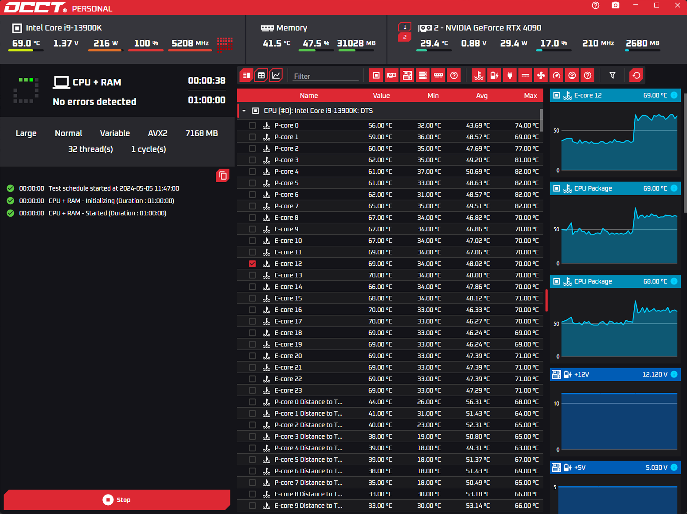
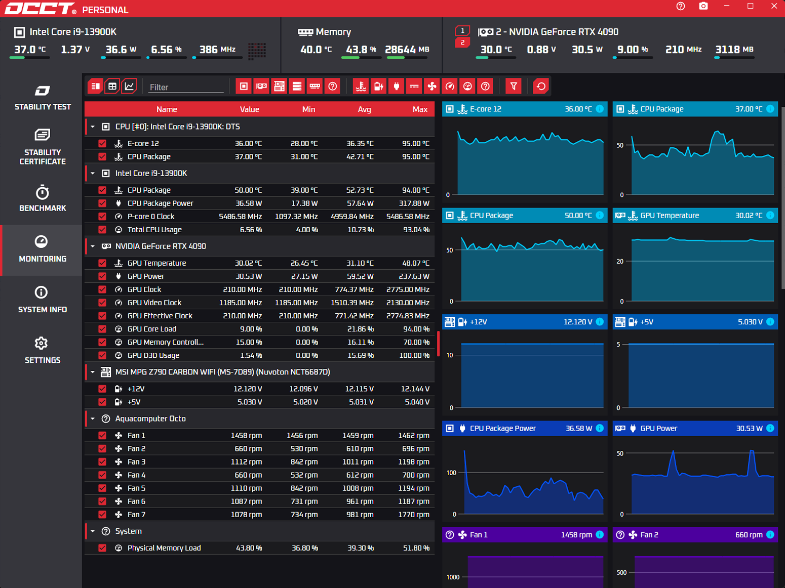

# 🖥️ Montaje y Mantenimiento de Equipos Informáticos

Repositorio del módulo **Montaje y Mantenimiento de Equipos Informáticos** del ciclo formativo de **Grado Medio en Sistemas Microinformáticos y Redes (SMR)**.

Aquí encontrarás **materiales de estudio organizados por unidades**, con contenidos de teoría, resúmenes y recursos técnicos orientados a comprender el hardware, la arquitectura básica de los equipos y el mantenimiento de sistemas.

El objetivo es ofrecer una **base clara y estructurada** para el aprendizaje del módulo, con contenidos actualizados y alineados con las competencias profesionales.

## Unidades destacadas

- [Unidad 11 - Utilidades para el mantenimiento](u11/index.md)

## Slides del modulo

- [Slides generales del modulo](slides/index.md)
- [Anexo 3 - PRL (slide de prueba)](A3/slides/PRL-slide-prueba.html)
- [U01 - Introducción a los sistemas informáticos](u01/slides/U01-slide-imagenes.html)
- [U02 - Componentes internos del PC](u02/slides/U02-slide-componentes.html)

## Anexos

- [Anexo 6 - BIOS, UEFI y proceso de encendido](A6/index.md)
- [Anexo 7 - Intel vs AMD](A7/index.md)

## 🌐 Recursos

### 🖥️ Sistemas operativos
- **Kali Linux**  
  [Abrir sitio](https://www.kali.org/){:target="_blank" rel="noopener"}

### 🎥 Canales y hardware
- **Rincón de Varo** – Canal de YouTube de hardware y montaje de PC  
  [Visitar canal](https://www.youtube.com/channel/UCnxubBCPlg0hHdZw_UehrTw){:target="_blank" rel="noopener"}

### 🧰 Herramientas útiles (por componente)

#### 🧠 CPU (procesador)
- **Intel Processor Diagnostic Tool** – Diagnóstico oficial para procesadores Intel  
  [Abrir sitio](https://www.intel.com/content/www/us/en/download/15951/intel-processor-diagnostic-tool.html){:target="_blank" rel="noopener"}
- **OCCT (Personal)** – Pruebas de estabilidad y estrés para CPU, GPU y PSU  
  [Abrir sitio](https://www.ocbase.com/occt/personal){:target="_blank" rel="noopener"}
- **AMD Ryzen Master** – Ajuste y monitorización para procesadores AMD Ryzen  
  [Abrir sitio](https://www.amd.com/en/products/software/ryzen-master.html){:target="_blank" rel="noopener"}

### 🔌 Mini manual: prueba de fuente de alimentación con OCCT

Para probar la fuente con OCCT, en realidad se somete al equipo a una carga combinada alta de CPU y GPU para comprobar si la alimentación se mantiene estable bajo estrés real.

<figure markdown>
  { width="120" }
  <figcaption>OCCT es una herramienta de estrés y monitorización útil para validar estabilidad.</figcaption>
</figure>

#### 1. Preparación previa

1. Descarga e instala OCCT desde su web oficial.
2. Cierra programas innecesarios para evitar interferencias.
3. Revisa que ventiladores, filtros y flujo de aire estén limpios.
4. Abre monitorización de sensores (OCCT, HWiNFO o HWMonitor).

Antes de empezar, conviene anotar temperaturas en reposo (CPU y GPU), voltajes reportados por placa y comportamiento acústico del equipo. Así tendrás una referencia para comparar.

#### 2. Selección de la prueba en OCCT

1. Abre OCCT.
2. En el panel de pruebas, elige `Power` o `Power Supply` (según versión).
3. Este modo carga CPU y GPU a la vez para exigir consumo elevado.

Ajustes recomendados:

- Duración inicial: 15-20 minutos.
- Si todo es estable: repetir entre 30 y 60 minutos.
- Modo: `Auto` o `Normal` (solo usar modos extremos para escenarios concretos de overclock).

<figure markdown>
  
  <figcaption>Vista de pruebas de OCCT para configurar carga y tiempo de ejecución.</figcaption>
</figure>

#### 3. Qué vigilar durante la prueba

OCCT mostrará gráficas de:

- Voltajes: 12 V, 5 V y 3.3 V (lectura de sensores de placa).
- Temperaturas: CPU, GPU y, si está disponible, placa base/VRM.
- Frecuencias y porcentaje de carga de CPU/GPU.

Señales de funcionamiento correcto:

- El equipo no se apaga, no reinicia y no se congela.
- No aparecen errores de cálculo ni alertas críticas.
- Las temperaturas se estabilizan sin sobrepasar límites seguros del fabricante.

Rangos de referencia habituales:

- 12 V: entre 11.4 V y 12.6 V.
- 5 V: entre 4.75 V y 5.25 V.
- 3.3 V: entre 3.14 V y 3.47 V.

Nota: las lecturas por software orientan, pero no sustituyen una comprobación con multímetro si hay sospecha de fallo eléctrico.

<figure markdown>
  
  <figcaption>Panel de monitorización de OCCT para revisar voltajes, temperatura y estabilidad.</figcaption>
</figure>

#### 4. Interpretación rápida de resultados

- Sin cuelgues, sin reinicios y sin caídas bruscas de voltaje: la fuente parece estable en carga.
- Reinicios, apagones, pantallazos o descenso acusado de 12 V: posible problema de PSU, VRM o placa.
- Si hay síntomas repetidos: repetir prueba y contrastar con otra fuente conocida o medición eléctrica.

#### 5. Seguridad y buenas prácticas

- No prolongues pruebas innecesariamente: 30-60 minutos suelen bastar.
- Si oyes ruidos eléctricos anómalos (chasquidos, zumbidos intensos) detén la prueba.
- Si aparece olor a quemado, para inmediatamente y corta alimentación.
- En equipos con fuente ajustada en potencia, usa pruebas más cortas y supervisadas.
- No dejes el test sin vigilancia continua.

#### 🧠 RAM (memoria)
- **MemTest86 (descarga oficial)** – Diagnóstico de memoria RAM  
  [Abrir sitio](https://www.memtest86.com/){:target="_blank" rel="noopener"}

#### 💾 Discos y almacenamiento
- **Samsung Magician** – Software de gestión y diagnóstico para SSD Samsung  
  [Abrir sitio](https://www.samsung.com/us/memory-storage/magician-software/){:target="_blank" rel="noopener"}
- **CrystalDiskInfo / CrystalDiskMark (descargas)** – Salud SMART y rendimiento de discos  
  [Abrir sitio](https://crystalmark.info/en/download/){:target="_blank" rel="noopener"}
- **Smartmontools (guía en español)** – Monitorización SMART de almacenamiento  
  [Abrir guía](https://weblinus.com/smartmontools-herramientas-de-monitoreo-smart-para-dispositivos-de-almacenamiento/){:target="_blank" rel="noopener"}
- **Clonezilla (descarga oficial)** – Clonado e imagen de discos  
  [Abrir descargas](https://clonezilla.org/downloads.php){:target="_blank" rel="noopener"}

#### 🛟 Rescate y recuperación
- **Hiren's BootCD PE (v15.2)** – Entorno de rescate y utilidades  
  [Abrir sitio](https://www.hirensbootcd.org/hbcd-v152/){:target="_blank" rel="noopener"}
- **Medicat USB** – Suite de herramientas de rescate en USB  
  [Abrir sitio](https://medicatusb.com/){:target="_blank" rel="noopener"}

#### 🔧 Diagnóstico y soporte general
- **Calculadora de Fuente de Alimentación (Geeknetic)** – Calculadora de potencia  
  [Abrir herramienta](https://www.geeknetic.es/calculadora-fuente-alimentacion/){:target="_blank" rel="noopener"}
- **iFixit (España)** – Guías de reparación y desmontaje  
  [Abrir sitio](https://es.ifixit.com/){:target="_blank" rel="noopener"}

### 📰 Noticias y guías (España)
- **GEEKNETIC** – Noticias y guías de hardware  
  [Abrir sitio](https://www.geeknetic.es/){:target="_blank" rel="noopener"}
- **ProfesionalReview** – Análisis y guías de hardware  
  [Abrir sitio](https://www.profesionalreview.com/){:target="_blank" rel="noopener"}
- **Xataka** – Noticias y novedades de tecnología  
  [Abrir sitio](https://www.xataka.com/){:target="_blank" rel="noopener"}
- **Computer Hoy** – Tecnología, análisis y tutoriales  
  [Abrir sitio](https://computerhoy.20minutos.es/){:target="_blank" rel="noopener"}
- **Genbeta** – Software, productividad e internet  
  [Abrir sitio](https://www.genbeta.com/){:target="_blank" rel="noopener"}
- **HardZone (Noticias)** – Noticias de hardware y PC  
  [Abrir sitio](https://hardzone.es/noticias/){:target="_blank" rel="noopener"}
- **Computerworld España** – Noticias TI para empresas  
  [Abrir sitio](https://www.computerworld.es/){:target="_blank" rel="noopener"}
- **Revista Byte TI** – Tecnología, informática y ciberseguridad  
  [Abrir sitio](https://revistabyte.es/){:target="_blank" rel="noopener"}
- **20bits (20minutos)** – Tecnología general  
  [Abrir sitio](https://www.20minutos.es/tecnologia/){:target="_blank" rel="noopener"}
- **elhacker.NET** – Portal de seguridad informática y tecnología  
  [Abrir sitio](https://elhacker.net/){:target="_blank" rel="noopener"}
- **Blog elhacker.NET** – Noticias y artículos  
  [Abrir sitio](https://blog.elhacker.net/){:target="_blank" rel="noopener"}
- **Foro elhacker.NET** – Comunidad técnica  
  [Abrir sitio](https://foro.elhacker.net/){:target="_blank" rel="noopener"}

### 🌍 Noticias y tecnología global
- **TechCrunch** – Startups y tecnología global  
  [Abrir sitio](https://techcrunch.com/){:target="_blank" rel="noopener"}
- **WIRED** – Tecnología, ciencia y cultura digital  
  [Abrir sitio](https://www.wired.com/){:target="_blank" rel="noopener"}
- **The Verge** – Noticias y análisis de tecnología  
  [Abrir sitio](https://www.theverge.com/){:target="_blank" rel="noopener"}
- **Engadget** – Noticias y reseñas de gadgets  
  [Abrir sitio](https://www.engadget.com/){:target="_blank" rel="noopener"}
- **TechRadar** – Noticias y reviews de consumo  
  [Abrir sitio](https://techradar.com/){:target="_blank" rel="noopener"}
- **TechNewsWorld** – Noticias y análisis TI  
  [Abrir sitio](https://www.technewsworld.com/){:target="_blank" rel="noopener"}
- **The Register** – Tecnología empresarial  
  [Abrir sitio](https://www.theregister.com/){:target="_blank" rel="noopener"}

### 📈 Agregadores
- **Techmeme** – Agregador de noticias tecnológicas  
  [Abrir sitio](https://techmeme.com/){:target="_blank" rel="noopener"}
- **RSS Feeds Tecnología España (FeedSpot)** – Listado de feeds  
  [Abrir sitio](https://rss.feedspot.com/spain_technology_rss_feeds/){:target="_blank" rel="noopener"}

---

📅 *Última actualización: Febrero 2026*  
✍️ *Profesor: José Manuel González Castillo*

**Fecha de actualización:** 17/02/2026
