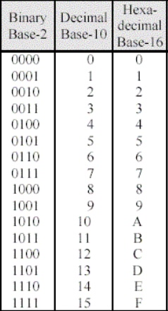
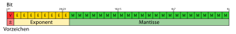

## 0.1. Sistemas de numeración

Los sistemas de numeración permiten representar cantidades usando símbolos y reglas. En informática son especialmente importantes porque los ordenadores almacenan y procesan información mediante bits, pero las personas solemos trabajar en decimal y también usamos bases compactas como octal y hexadecimal.

Comprender estos sistemas ayuda a interpretar direcciones de memoria, colores web, permisos, máscaras, valores de bajo nivel, formatos de datos y errores de representación numérica.

### Objetivos de aprendizaje

- Comprender qué es un sistema de numeración posicional.
- Aplicar el teorema fundamental de la numeración.
- Convertir números entre base 10, base 2, base 8 y base 16.
- Realizar conversiones con parte fraccionaria.
- Representar números negativos con signo y magnitud, complemento a 1, complemento a 2 y notación sesgada.
- Interpretar el formato básico de coma flotante.

### 1. Sistemas de numeración

Un **sistema de numeración** es un conjunto de símbolos y reglas que permiten representar números. En informática se usan sobre todo sistemas **posicionales**, donde el valor de cada cifra depende de dos cosas:

- El símbolo usado.
- La posición que ocupa dentro del número.

Por ejemplo, en `345₁₀`, el `3` no vale 3, sino 300, porque está en la posición de las centenas.

#### 1.1. Base de un sistema

La **base** indica cuántos símbolos diferentes se usan en un sistema de numeración posicional.

| Sistema | Base | Símbolos | Uso habitual |
|---|---:|---|---|
| Decimal | 10 | 0, 1, 2, 3, 4, 5, 6, 7, 8, 9 | Uso cotidiano. |
| Binario | 2 | 0, 1 | Representación interna en informática. |
| Octal | 8 | 0, 1, 2, 3, 4, 5, 6, 7 | Forma compacta relacionada con grupos de 3 bits. |
| Hexadecimal | 16 | 0-9, A, B, C, D, E, F | Forma compacta relacionada con grupos de 4 bits. |

En hexadecimal, las letras representan valores mayores que 9:

| Hexadecimal | Decimal |
|---|---:|
| A | 10 |
| B | 11 |
| C | 12 |
| D | 13 |
| E | 14 |
| F | 15 |

#### 1.2. Sistemas posicionales y no posicionales

En un sistema **posicional**, la posición cambia el valor de la cifra. En `111₂`, cada `1` vale algo distinto:

```text
111₂ = 1·2² + 1·2¹ + 1·2⁰ = 7₁₀
```

En un sistema **no posicional**, como el sistema romano, el valor depende de reglas de combinación, pero no de potencias de una base de la misma forma que en decimal o binario.

### 2. Teorema fundamental de la numeración

El **teorema fundamental de la numeración** explica cómo se interpreta cualquier número escrito en una base.

> En un sistema posicional de base `b`, cada cifra multiplica a una potencia de `b`. Las cifras situadas a la izquierda de la coma usan potencias positivas o cero, y las cifras situadas a la derecha usan potencias negativas.

#### 2.1. Forma general

Un número en base `b` puede escribirse así:

```text
(aₙ aₙ₋₁ ... a₂ a₁ a₀ , a₋₁ a₋₂ ... a₋ₘ)ᵦ
```

Su valor es:

```text
aₙ·bⁿ + aₙ₋₁·bⁿ⁻¹ + ... + a₁·b¹ + a₀·b⁰
+ a₋₁·b⁻¹ + a₋₂·b⁻² + ... + a₋ₘ·b⁻ᵐ
```

Cada cifra debe cumplir:

```text
0 ≤ cifra < base
```

Por eso en binario solo existen `0` y `1`, en octal no existe el dígito `8`, y en hexadecimal se usan letras para representar los valores de 10 a 15.

#### 2.2. Ejemplos

```text
234₁₀ = 2·10² + 3·10¹ + 4·10⁰
       = 200 + 30 + 4
       = 234₁₀
```

```text
1101₂ = 1·2³ + 1·2² + 0·2¹ + 1·2⁰
      = 8 + 4 + 0 + 1
      = 13₁₀
```

```text
3A₁₆ = 3·16¹ + A·16⁰
     = 3·16 + 10
     = 58₁₀
```

```text
12,25₁₀ = 1·10¹ + 2·10⁰ + 2·10⁻¹ + 5·10⁻²
         = 10 + 2 + 0,2 + 0,05
         = 12,25₁₀
```

### 3. Conversión desde cualquier base a decimal

Para pasar de una base cualquiera a decimal se aplica directamente el teorema fundamental de la numeración.

#### 3.1. Binario a decimal

```text
101101₂ = 1·2⁵ + 0·2⁴ + 1·2³ + 1·2² + 0·2¹ + 1·2⁰
        = 32 + 0 + 8 + 4 + 0 + 1
        = 45₁₀
```

#### 3.2. Octal a decimal

```text
725₈ = 7·8² + 2·8¹ + 5·8⁰
     = 448 + 16 + 5
     = 469₁₀
```

#### 3.3. Hexadecimal a decimal

```text
2F₁₆ = 2·16¹ + F·16⁰
     = 2·16 + 15
     = 47₁₀
```

#### 3.4. Método de Horner

El método de Horner permite convertir de forma ordenada leyendo las cifras de izquierda a derecha.

```text
valor = 0
para cada cifra:
    valor = valor · base + cifra
```

Ejemplo con `101101₂`:

```text
((((((0·2 + 1)·2 + 0)·2 + 1)·2 + 1)·2 + 0)·2 + 1) = 45₁₀
```

### 4. Conversión de decimal a otras bases

Para convertir la parte entera de un número decimal a otra base se usan **divisiones sucesivas** entre la base de destino. Los restos se leen desde el último hasta el primero.

#### 4.1. Decimal a binario

Ejemplo: convertir `45₁₀` a binario.

```text
45 ÷ 2 = 22 resto 1
22 ÷ 2 = 11 resto 0
11 ÷ 2 = 5  resto 1
5  ÷ 2 = 2  resto 1
2  ÷ 2 = 1  resto 0
1  ÷ 2 = 0  resto 1
```

Lectura de restos de abajo hacia arriba:

```text
45₁₀ = 101101₂
```

#### 4.2. Decimal a octal

Ejemplo: convertir `469₁₀` a octal.

```text
469 ÷ 8 = 58 resto 5
58  ÷ 8 = 7  resto 2
7   ÷ 8 = 0  resto 7
```

Resultado:

```text
469₁₀ = 725₈
```

#### 4.3. Decimal a hexadecimal

Ejemplo: convertir `255₁₀` a hexadecimal.

```text
255 ÷ 16 = 15 resto 15  → F
15  ÷ 16 = 0  resto 15  → F
```

Resultado:

```text
255₁₀ = FF₁₆
```

### 5. Conversiones entre binario, octal y hexadecimal

Octal y hexadecimal se usan mucho en informática porque se relacionan directamente con el binario:

- Un dígito octal equivale a **3 bits**.
- Un dígito hexadecimal equivale a **4 bits**.

<figure markdown>
  
  <figcaption>Tabla de correspondencias entre binario, hexadecimal y decimal. Fuente: Wikimedia Commons.</figcaption>
</figure>

#### 5.1. Binario a octal

Se agrupan los bits de tres en tres desde la derecha.

```text
111010101₂
111 010 101
 7   2   5
```

Resultado:

```text
111010101₂ = 725₈
```

#### 5.2. Octal a binario

Cada cifra octal se sustituye por tres bits.

```text
725₈
7 → 111
2 → 010
5 → 101
```

Resultado:

```text
725₈ = 111010101₂
```

#### 5.3. Binario a hexadecimal

Se agrupan los bits de cuatro en cuatro desde la derecha.

```text
1101011011111001₂
1101 0110 1111 1001
 D    6    F    9
```

Resultado:

```text
1101011011111001₂ = D6F9₁₆
```

#### 5.4. Hexadecimal a binario

Cada cifra hexadecimal se sustituye por cuatro bits.

```text
3A₁₆
3 → 0011
A → 1010
```

Resultado:

```text
3A₁₆ = 00111010₂
```

Los ceros iniciales pueden omitirse si no se necesita una longitud fija:

```text
00111010₂ = 111010₂
```

### 6. Conversiones con parte fraccionaria

Los números con parte fraccionaria también pueden representarse en distintas bases. La parte situada a la derecha de la coma usa potencias negativas de la base.

#### 6.1. De binario fraccionario a decimal

Ejemplo:

```text
101,101₂ = 1·2² + 0·2¹ + 1·2⁰ + 1·2⁻¹ + 0·2⁻² + 1·2⁻³
         = 4 + 0 + 1 + 0,5 + 0 + 0,125
         = 5,625₁₀
```

#### 6.2. De decimal fraccionario a binario

Para convertir la parte fraccionaria decimal a binario se multiplica repetidamente por 2. La parte entera de cada resultado se convierte en el siguiente bit.

Ejemplo: convertir `0,625₁₀` a binario.

```text
0,625 · 2 = 1,25  → bit 1
0,25  · 2 = 0,5   → bit 0
0,5   · 2 = 1,0   → bit 1
```

Resultado:

```text
0,625₁₀ = 0,101₂
```

#### 6.3. Conversión mixta con parte entera y fraccionaria

Ejemplo: convertir `13,25₁₀` a binario.

Primero convertimos la parte entera:

```text
13₁₀ = 1101₂
```

Después convertimos la parte fraccionaria:

```text
0,25 · 2 = 0,5  → bit 0
0,5  · 2 = 1,0  → bit 1
```

Resultado:

```text
13,25₁₀ = 1101,01₂
```

#### 6.4. Fracciones que no terminan

No todas las fracciones tienen una representación finita en todas las bases. Por ejemplo, `0,1₁₀` no puede representarse de forma exacta con un número finito de bits en binario.

```text
0,1₁₀ = 0,00011001100110011...₂
```

Esto explica por qué algunos cálculos con decimales en los ordenadores pueden producir pequeños errores de redondeo.

#### 6.5. Conversión de fracciones en octal y hexadecimal

El procedimiento es el mismo, pero multiplicando por la base de destino.

Ejemplo: convertir `0,625₁₀` a octal.

```text
0,625 · 8 = 5,0 → cifra 5
```

Resultado:

```text
0,625₁₀ = 0,5₈
```

Ejemplo: convertir `0,625₁₀` a hexadecimal.

```text
0,625 · 16 = 10,0 → cifra A
```

Resultado:

```text
0,625₁₀ = 0,A₁₆
```

### 7. Representación de números negativos

Un ordenador trabaja con una cantidad fija de bits. Por eso, para representar números negativos, hay que decidir cómo interpretar esos bits.

En los ejemplos siguientes se usarán 8 bits para que las representaciones sean fáciles de leer.

#### 7.1. Signo y magnitud

En **signo y magnitud**, el primer bit indica el signo:

- `0` representa positivo.
- `1` representa negativo.

El resto de bits guarda la magnitud.

Ejemplo con 8 bits:

```text
+13₁₀ = 00001101
-13₁₀ = 10001101
```

Ventaja:

- Es fácil de entender.

Problemas:

- Existen dos ceros: `00000000` y `10000000`.
- La suma y la resta son más incómodas para el hardware.

#### 7.2. Complemento a 1

En **complemento a 1**, un número negativo se obtiene invirtiendo todos los bits del número positivo.

Ejemplo con 8 bits:

```text
+13₁₀ = 00001101
-13₁₀ = 11110010
```

Ventajas:

- Obtener el negativo es sencillo.

Problemas:

- También existen dos ceros:

```text
+0 = 00000000
-0 = 11111111
```

- Algunas sumas necesitan tratar el acarreo final de forma especial.

#### 7.3. Complemento a 2

El **complemento a 2** es el método más usado para representar enteros con signo.

Para obtener el negativo de un número:

1. Se escribe el número positivo en binario.
2. Se invierten todos los bits.
3. Se suma 1.

Ejemplo con 8 bits:

```text
+13₁₀ = 00001101
Invertir bits = 11110010
Sumar 1       = 11110011

-13₁₀ = 11110011
```

Ventajas:

- Solo existe un cero.
- La suma y la resta funcionan de forma natural con el mismo circuito.
- Es el sistema habitual en procesadores modernos.

#### 7.4. Rango en complemento a 2

Con `n` bits, el rango de complemento a 2 es:

```text
Desde -2ⁿ⁻¹ hasta 2ⁿ⁻¹ - 1
```

Con 8 bits:

```text
Desde -128 hasta +127
```

La asimetría aparece porque el cero ocupa una combinación y no existe un `+128` con 8 bits.

#### 7.5. Suma en complemento a 2

Ejemplo: `25 + (-13)` con 8 bits.

```text
  00011001   (+25)
+ 11110011   (-13)
----------
1 00001100
```

Se descarta el acarreo que queda fuera de los 8 bits:

```text
00001100₂ = 12₁₀
```

#### 7.6. Extensión de signo

Cuando se aumenta el número de bits, hay que conservar el signo. Para ello se copia el bit más significativo.

Ejemplo: pasar `-13` de 8 bits a 16 bits.

```text
8 bits:  11110011
16 bits: 11111111 11110011
```

Si el número es positivo, se rellenan ceros a la izquierda.

#### 7.7. Desbordamiento

Hay **desbordamiento** cuando el resultado real no cabe en los bits disponibles.

En complemento a 2, al sumar dos números del mismo signo, hay desbordamiento si el resultado aparece con signo contrario.

Ejemplo con 8 bits:

```text
  01111111   (+127)
+ 00000001   (+1)
----------
  10000000   (interpretado como -128)
```

El resultado matemático sería `128`, pero no cabe en 8 bits con signo.

### 8. Notación sesgada

La **notación sesgada** representa números usando un desplazamiento fijo llamado **sesgo** o **bias**.

La idea es guardar el valor así:

```text
Valor almacenado = valor real + sesgo
```

Y recuperar el valor real así:

```text
Valor real = valor almacenado - sesgo
```

#### 8.1. Ejemplo con sesgo 127

La notación sesgada se usa en el exponente de IEEE 754 de precisión simple, donde el sesgo es 127.

Ejemplo:

```text
Exponente real = 3
Sesgo = 127
Exponente almacenado = 3 + 127 = 130
130₁₀ = 10000010₂
```

Si se lee el exponente almacenado `10000010₂`:

```text
10000010₂ = 130₁₀
130 - 127 = 3
```

#### 8.2. Por qué se usa

La notación sesgada permite guardar exponentes negativos y positivos usando un campo binario sin signo. Es útil cuando se quiere ordenar o comparar valores de forma más cómoda a nivel de hardware.

### 9. Coma fija y coma flotante

Los ordenadores también necesitan representar números con decimales. Hay dos enfoques importantes: **coma fija** y **coma flotante**.

#### 9.1. Coma fija

En **coma fija**, se decide de antemano cuántos bits pertenecen a la parte entera y cuántos a la parte fraccionaria.

Ejemplo con 8 bits, usando 4 bits para la parte entera y 4 para la fraccionaria:

```text
0011,0100₂
```

Interpretación:

```text
0011₂ = 3₁₀
0,0100₂ = 0,25₁₀

0011,0100₂ = 3,25₁₀
```

Ventajas:

- Es sencilla y rápida.
- Es útil cuando se conoce bien el rango de valores.

Limitaciones:

- Tiene poco rango si se reserva mucha parte fraccionaria.
- Tiene poca precisión fraccionaria si se reserva mucha parte entera.

#### 9.2. Coma flotante

La **coma flotante** permite representar números muy grandes y muy pequeños usando una idea parecida a la notación científica.

En decimal podemos escribir:

```text
1250 = 1,25 · 10³
```

En binario se usa una forma similar:

```text
1101,01₂ = 1,10101₂ · 2³
```

La coma “flota” porque se mueve para dejar el número normalizado.

### 10. IEEE 754 de precisión simple

El estándar IEEE 754 define formatos habituales para representar números en coma flotante. En **precisión simple** se usan 32 bits.

<figure markdown>
  
  <figcaption>Distribución de bits en IEEE 754 de precisión simple: signo, exponente y fracción. Fuente: Wikimedia Commons.</figcaption>
</figure>

#### 10.1. Campos principales

| Campo | Bits | Función |
|---|---:|---|
| Signo | 1 | Indica si el número es positivo o negativo. |
| Exponente | 8 | Guarda el exponente usando notación sesgada con sesgo 127. |
| Fracción o mantisa | 23 | Guarda la parte significativa del número normalizado. |

Para números normalizados, el valor se interpreta así:

```text
(-1)ˢ · 1,mantisa · 2^(exponente almacenado - 127)
```

El `1` inicial de la mantisa no se almacena porque se supone en los números normalizados. Por eso se llama **bit implícito**.

#### 10.2. Conversión de 13,25 a IEEE 754

Paso 1. Convertir a binario:

```text
13,25₁₀ = 1101,01₂
```

Paso 2. Normalizar:

```text
1101,01₂ = 1,10101₂ · 2³
```

Paso 3. Calcular el exponente sesgado:

```text
Exponente real = 3
Sesgo = 127
Exponente almacenado = 3 + 127 = 130
130₁₀ = 10000010₂
```

Paso 4. Obtener signo y mantisa:

```text
Signo = 0
Mantisa = 10101 y ceros hasta completar 23 bits
```

Resultado:

```text
0 10000010 10101000000000000000000
```

En hexadecimal:

```text
0x41540000
```

#### 10.3. Casos especiales

IEEE 754 reserva algunas combinaciones para casos especiales.

| Exponente | Mantisa | Significado |
|---|---|---|
| Todo a 0 | Todo a 0 | Cero positivo o negativo. |
| Todo a 0 | Distinta de 0 | Número subnormal. |
| Todo a 1 | Todo a 0 | Infinito positivo o negativo. |
| Todo a 1 | Distinta de 0 | NaN, valor no numérico. |

#### 10.4. Errores de redondeo

La coma flotante no representa todos los decimales de forma exacta. Por ejemplo, `0,1₁₀` no tiene una representación binaria finita.

Por eso, en programación, expresiones aparentemente sencillas pueden producir resultados con pequeños errores.

Ejemplo conceptual:

```text
0,1 + 0,2 puede no almacenarse exactamente como 0,3
```

En cálculos con coma flotante se suele comparar usando una tolerancia, no igualdad exacta.

### 11. Aritmética binaria básica

Aunque la unidad se centra en representación y conversión, conviene conocer las reglas básicas de operación binaria.

#### 11.1. Suma binaria

Reglas:

| Operación | Resultado |
|---|---|
| 0 + 0 | 0 |
| 0 + 1 | 1 |
| 1 + 0 | 1 |
| 1 + 1 | 10 |

Ejemplo:

```text
  101101
+ 011011
--------
 1001000
```

#### 11.2. Resta binaria

Cuando no se puede restar directamente, se pide préstamo a la columna de la izquierda.

Ejemplo:

```text
  101001
- 011110
--------
  001011
```

#### 11.3. Multiplicación binaria

La multiplicación binaria es similar a la decimal, pero solo se multiplica por 0 o por 1.

```text
    1101
  × 0101
  ------
    1101
   0000
  1101
  ------
 1000001
```

### 12. Aplicaciones en informática

Los sistemas de numeración aparecen continuamente en informática:

- **Binario**: representación interna de datos, instrucciones, máscaras y registros.
- **Octal**: permisos en sistemas tipo Unix, como `755` o `644`.
- **Hexadecimal**: direcciones de memoria, colores web, volcados de datos y códigos de error.
- **Complemento a 2**: representación habitual de enteros con signo.
- **Notación sesgada**: exponentes en coma flotante.
- **IEEE 754**: representación de números reales aproximados en procesadores y lenguajes de programación.

### Resumen final

- Un sistema de numeración posicional usa una base y potencias de esa base para dar valor a cada cifra.
- El teorema fundamental de la numeración permite interpretar cualquier número escrito en una base.
- Las conversiones enteras se realizan con divisiones sucesivas o aplicando potencias de la base.
- Las conversiones fraccionarias usan potencias negativas o multiplicaciones sucesivas por la base.
- Los negativos pueden representarse con signo y magnitud, complemento a 1, complemento a 2 o notación sesgada.
- La coma flotante representa valores reales aproximados mediante signo, exponente y mantisa.

### Fuentes consultadas

- Knuth, D. E. *The Art of Computer Programming, Vol. 2*.
- Tanenbaum, A. S. *Structured Computer Organization*.
- [IEEE 754-2019 - Standard for Floating-Point Arithmetic](https://standards.ieee.org/standard/754-2019.html)
- [NIST - Prefixes for binary multiples](https://www.physics.nist.gov/cuu/Units/binary.html)
- [Wikimedia Commons - Binary to Hexadecimal or Decimal](https://commons.wikimedia.org/wiki/File:Binary_to_Hexadecimal_or_Decimal.jpg)
- [Wikimedia Commons - IEEE 754 single precision](https://commons.wikimedia.org/wiki/File:IEEE_754_single_precision.svg)

### Fuentes de imágenes

- [Binary to Hexadecimal or Decimal](https://commons.wikimedia.org/wiki/File:Binary_to_Hexadecimal_or_Decimal.jpg). Fuente: Wikimedia Commons.
- [IEEE 754 single precision](https://commons.wikimedia.org/wiki/File:IEEE_754_single_precision.svg). Fuente: Wikimedia Commons.

**Fecha de actualización:** 30/04/2026
