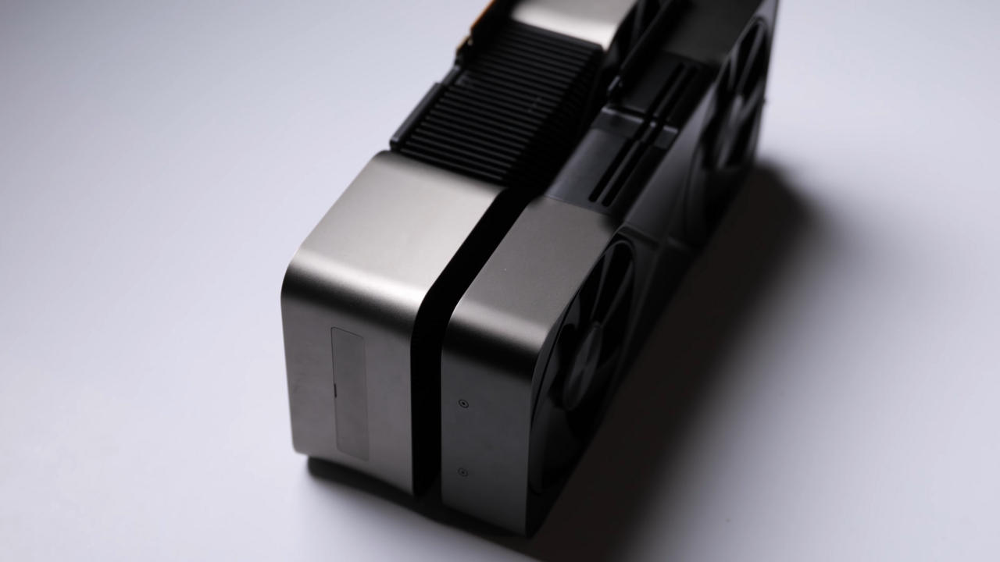
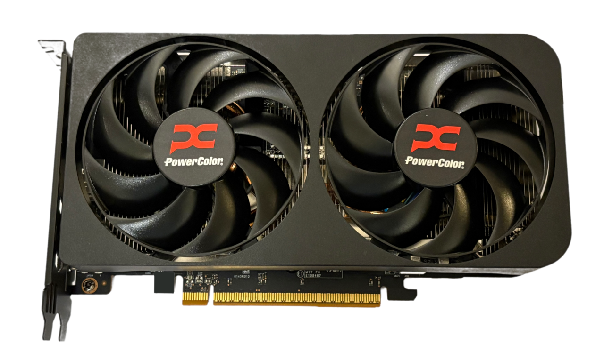

## TEMA 9. TARJETAS GRÁFICAS

---

# Objetivos de aprendizaje

- Comprender el papel de la GPU en un sistema informático.
- Identificar los componentes básicos de una tarjeta gráfica.
- Explicar el flujo general de renderizado 2D/3D.
- Diferenciar interfaces y salidas de vídeo habituales.
- Aplicar criterios de selección, montaje y mantenimiento.

---

# 1. Qué es una tarjeta gráfica

La **tarjeta gráfica** (o **GPU**) es el componente encargado de **procesar y generar imágenes** para la pantalla. Realiza millones de operaciones en paralelo para dibujar píxeles, aplicar texturas, calcular luces y sombras y mostrar vídeo con fluidez.

Puede presentarse en dos formas:

- **GPU integrada**: está dentro del procesador o la placa base y comparte la memoria RAM del sistema.
- **GPU dedicada**: tarjeta independiente con su propia memoria de vídeo (VRAM) y mayor potencia.

<figure>
  
  <figcaption style="font-size:0.85em;color:#666;text-align:center;">Tarjeta gráfica NVIDIA reciente (ejemplo RTX 50). Fuente: Wikimedia Commons.</figcaption>
</figure>

---

# 2. Componentes principales

## 2.1 GPU (procesador gráfico)

Es el chip principal. Contiene cientos o miles de unidades de ejecución en paralelo, optimizadas para cálculos gráficos y de coma flotante.

## 2.2 Memoria de vídeo (VRAM)

Almacena texturas, buffers y datos necesarios para el renderizado. Su capacidad y velocidad influyen en el rendimiento, especialmente en resoluciones altas.

## 2.3 VRM y alimentación

El **módulo regulador de voltaje (VRM)** convierte la energía de la fuente a niveles estables para la GPU y la VRAM. Las tarjetas potentes requieren conectores de alimentación adicionales.

## 2.4 Interfaz con la placa base

La conexión más habitual es **PCI Express (PCIe)** en formato x16. Esta interfaz permite comunicar la GPU con la CPU, la memoria y el resto del sistema.

<figure>
  
  <figcaption style="font-size:0.85em;color:#666;text-align:center;">Ranura PCI Express x16 en placa base reciente. Fuente: Wikimedia Commons.</figcaption>
</figure>

## 2.5 Salidas de vídeo

Las más comunes son **HDMI** y **DisplayPort**. También se encuentran DVI (digital) y VGA (analógica) en modelos antiguos o adaptadores.

## 2.6 Refrigeración

La GPU genera calor intenso. Por eso se usan disipadores, heatpipes, ventiladores y, en equipos de alto rendimiento, refrigeración líquida.

---

# 3. Funcionamiento básico del renderizado

El proceso grafico simplificado sigue estas fases:

1. **Entrada de datos**: la CPU envía geometría y comandos de dibujo a la GPU.
2. **Procesado de vértices**: transformación de modelos 3D al espacio de pantalla.
3. **Rasterización**: conversión de primitivas (triángulos) a píxeles.
4. **Shaders de fragmento**: cálculo de color, iluminación, sombras y efectos.
5. **Salida de imagen**: el frame final se guarda en un buffer y se envía al monitor.

---

# 4. VRAM, ancho de banda y resolución

La **VRAM** no es solo cantidad. También importa la **velocidad de transferencia** (ancho de banda), porque determina cuántos datos pueden moverse por segundo entre GPU y memoria.

Ejemplo:
- Una GPU con **8 GB** puede rendir mejor que otra de **12 GB** si su VRAM es más rápida y el bus es más ancho.

---

# 5. Interfaces y estándares de vídeo

## 5.1 HDMI

Interfaz digital muy extendida en televisores y monitores. Soporta vídeo y audio en un único cable y es habitual en equipos domésticos.

## 5.2 DisplayPort

Estándar creado por **VESA**. Muy usado en monitores de PC por su enfoque profesional y su soporte de altas tasas de refresco.

## 5.3 Compatibilidad y adaptadores

- Existen adaptadores HDMI <-> DisplayPort.
- DVI y VGA siguen presentes en equipos antiguos, pero son tecnologías en desuso.

---

# 6. APIs gráficas y drivers

Para que los programas usen la GPU, se emplean **APIs gráficas**:

- **Direct3D (DirectX)**: estandar en Windows para juegos y software multimedia.
- **OpenGL**: API multiplataforma con amplio historial.
- **Vulkan**: API moderna de bajo nivel, también multiplataforma.

Los **drivers** son esenciales: traducen las llamadas de la API a instrucciones que entiende la GPU.

---

# 7. Panorama actual (2025-2026): NVIDIA y AMD

## 7.1 NVIDIA (GeForce RTX 50 Series - Blackwell)

En **enero de 2025**, NVIDIA anunció la **serie GeForce RTX 50** basada en la arquitectura **Blackwell**, con mejoras en trazado de rayos, IA y renderizado neuronal. Esta generación introduce **DLSS 4** y nuevas funciones de renderizado asistido por IA orientadas a juegos y creación de contenido.

## 7.2 AMD (Radeon RX 9000 - RDNA 4)

AMD presentó en **febrero de 2025** la arquitectura **RDNA 4** con la serie **Radeon RX 9000**, incorporando mejoras en **raytracing** y aceleradores de IA, así como **FSR 4** (reescalado con IA) para mejorar rendimiento en juegos. La disponibilidad inicial se anunció para **marzo de 2025**.

<figure>
  
  <figcaption style="font-size:0.85em;color:#666;text-align:center;">Tarjeta gráfica AMD reciente (ejemplo RX 9000). Fuente: Wikimedia Commons.</figcaption>
</figure>

## 7.3 Comparativa rápida (NVIDIA vs AMD, generación actual)

| Fabricante | Arquitectura (2025) | Serie actual | Enfoque principal | Tecnologías destacadas |
|-----------|----------------------|-------------|-------------------|------------------------|
| NVIDIA | Blackwell | GeForce RTX 50 | Renderizado neuronal e IA en juegos y creación | DLSS 4, RT Cores y Tensor Cores avanzados |
| AMD | RDNA 4 | Radeon RX 9000 | Rendimiento y valor en gaming con IA integrada | FSR 4, aceleradores de IA y raytracing mejorado |

**Nota:** las características y rendimiento exactos dependen del modelo concreto.

---

# 8. Criterios de selección de una tarjeta gráfica

## 8.1 Uso previsto

- **Ofimatica**: integrada suele ser suficiente.
- **Gaming 1080p**: GPU dedicada de gama media.
- **Edición de vídeo/3D**: GPU potente con buena VRAM y ancho de banda.
- **Multimonitor**: comprobar número de salidas y compatibilidad.

## 8.2 Consumo y fuente

Verificar la potencia de la fuente (PSU), el número de conectores necesarios y la eficiencia energética.

## 8.3 Tamaño físico

Comprobar longitud y grosor: algunas tarjetas ocupan 2 o 3 ranuras.

## 8.4 Refrigeración y ruido

Una mejor refrigeración aumenta la vida útil y reduce el thermal throttling.

---

# 9. Mantenimiento básico

- Limpiar polvo de disipadores y ventiladores.
- Verificar temperaturas con software de monitorización.
- Actualizar drivers con regularidad.

---

# Ejemplos prácticos

**Caso 1: Aula de ofimática**
- Requisitos: navegación web, ofimática, vídeo básico.
- Solución: GPU integrada, bajo consumo y coste mínimo.

**Caso 2: Taller de edición de vídeo**
- Requisitos: renderizado acelerado, filtros en tiempo real.
- Solución: GPU dedicada con buena VRAM y soporte de APIs actuales.

**Caso 3: Equipo gaming**
- Requisitos: 1080p/1440p, altas tasas de refresco.
- Solución: GPU dedicada con salidas DisplayPort y buena refrigeración.

---

# Resumen (ideas clave)

- La GPU es el motor del procesamiento gráfico en el PC.
- Una tarjeta gráfica integra GPU, VRAM, VRM, interfaz PCIe y salidas de vídeo.
- El rendimiento depende de la potencia de la GPU y del ancho de banda de la VRAM.
- HDMI y DisplayPort son las interfaces digitales más habituales.
- Los drivers y las APIs gráficas son esenciales para el funcionamiento.

---

# Referencias y enlaces

- [Wikibooks - Mantenimiento y Montaje de Equipos Informáticos (Tema 2: La tarjeta gráfica)](https://es.wikibooks.org/wiki/Mantenimiento_y_Montaje_de_Equipos_Inform%C3%A1ticos/Tema_2/La_tarjeta_gr%C3%A1fica)
- [NVIDIA - Blackwell GeForce RTX 50 Series (nota de prensa, 2025)](https://investor.nvidia.com/news/press-release-details/2025/NVIDIA-Blackwell-GeForce-RTX-50-Series-Opens-New-World-of-AI-Computer-Graphics/default.aspx)
- [AMD - RDNA 4 y Radeon RX 9000 Series (nota de prensa, 2025)](https://www.amd.com/en/newsroom/press-releases/2025-2-28-amd-unveils-next-generation-amd-rdna-4-architectu.html)
- [PCI-SIG - PCI Express Base Specification](https://pcisig.com/specifications/pciexpress)
- [HDMI - HDMI Specification](https://www.hdmi.org/spec)
- [VESA - DisplayPort Standard](https://www.displayport.org/)
- [Microsoft Learn - Direct3D](https://learn.microsoft.com/en-us/windows/win32/direct3d)
- [Khronos - OpenGL](https://www.opengl.org/)
- [Khronos - Vulkan](https://www.khronos.org/vulkan/)

## Créditos de imágenes

- rtx5090_fe.png - ZMASLO, CC BY 3.0, Wikimedia Commons (captura de vídeo de Founders Edition).
- amd_radeon_rx9060xt.png - Akb432, CC BY-SA 4.0, Wikimedia Commons.
- pcie5_trx50_slot.png - PantheraLeo1359531, CC BY 4.0, Wikimedia Commons.
