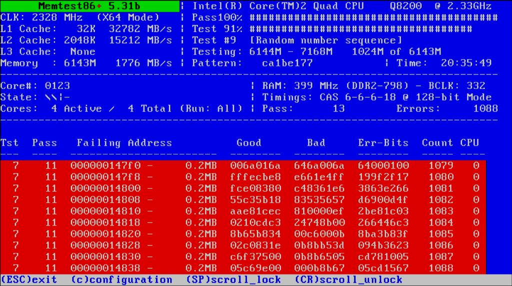
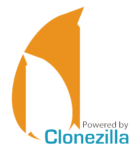
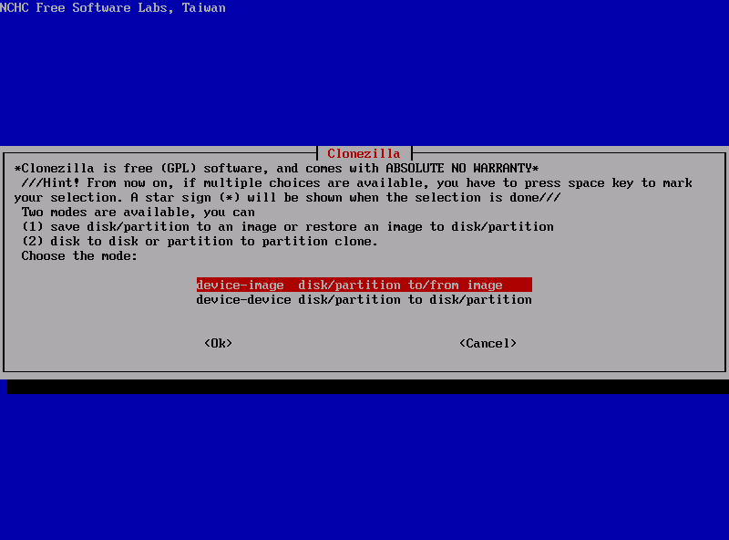
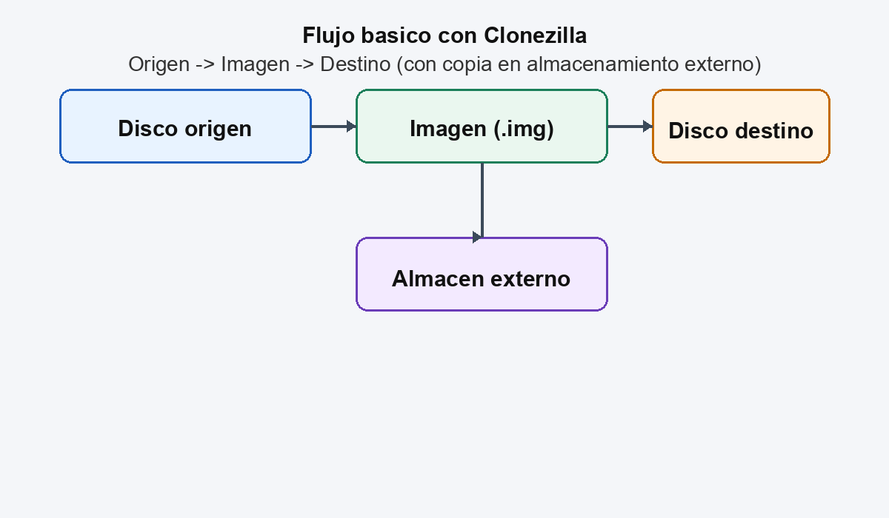
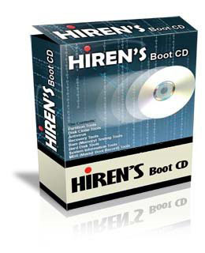
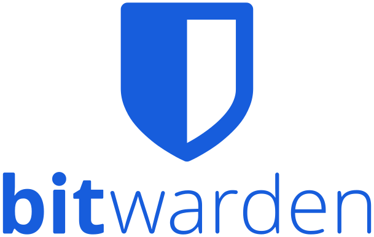

## 11.1. Utilidades para el mantenimiento

En un taller real, el software de mantenimiento es tan importante como las herramientas fisicas. Esta unidad recopila utilidades actuales, tanto libres como con licencia, y explica cuando usarlas y como instalarlas de forma segura.

### 1. Concepto y objetivo

Las utilidades de mantenimiento permiten:

- Diagnosticar fallos de hardware y software.
- Verificar estado de discos y memoria.
- Crear copias, imagenes y medios de arranque.
- Auditar seguridad y redes.
- Documentar el estado del equipo.

#### 1.1. Clasificacion rapida

- **Diagnostico y monitorizacion:** identificar fallos y temperaturas.
- **Almacenamiento y backup:** clonado, imagenes y recuperacion.
- **Seguridad y cifrado:** proteccion de datos y contraseñas.
- **Redes:** analisis de trafico y puertos.
- **Productividad tecnica:** edicion, ofimatica y soporte.

### 2. Diagnostico y monitorizacion

Herramientas actuales y recomendadas:

- **HWiNFO**: inventario completo de sensores, temperaturas y estado del sistema.
- **CPU-Z**: identifica CPU, RAM, placa base y perfiles de memoria.
- **CrystalDiskInfo**: estado SMART y salud de discos.
- **MemTest86**: pruebas de memoria RAM desde USB de arranque.

**Instruccion basica (Windows):**

- Descarga desde el sitio oficial.
- Ejecuta la version portable si no necesitas instalar.
- Guarda un informe del estado para el cliente.

#### 2.1 MemTest86 (errores de memoria)

MemTest86 permite detectar errores de RAM. Si aparecen errores, **la memoria no es fiable** y el equipo puede sufrir reinicios, cuelgues o corrupcion de datos.

**Salida correcta (ejemplo sin errores):**

```text
Pass complete, no errors, press Esc to exit
```

**Salida con problemas (ejemplo con errores):**

```text
Errors: 12
Test: 7  Address: 0003f2a8c  Expected: ffffffff  Actual: fff7ffff
```

<figure markdown>
  
  <figcaption>Ejemplo de MemTest con errores: los campos "Errors" y la lista de direcciones con valores "Expected/Actual" indican fallos de memoria.</figcaption>
</figure>

### 3. Almacenamiento, backup y arranque

Utilidades actuales para taller:

- **Rufus** (libre): crea USB booteables desde ISOs.
- **Ventoy** (libre): permite copiar varias ISO en un USB y arrancar sin reinstalar.
- **Clonezilla** (libre): clonado e imagen de discos completos.
- **7-Zip** (libre): compresion y extraccion de archivos.

**Ejemplo de flujo en taller:**

1. Crear USB con **Ventoy**.
2. Copiar ISO de **MemTest86** y **Clonezilla** al USB.
3. Arrancar el equipo y ejecutar pruebas o clonar el disco.

**Comandos utiles en Linux:**

```bash
sudo smartctl -a /dev/sda
sudo dd if=imagen.iso of=/dev/sdX bs=4M status=progress
```

**Salida correcta (ejemplo SMART sin problemas):**

```text
SMART overall-health self-assessment test result: PASSED
Reallocated_Sector_Ct: 0
Current_Pending_Sector: 0
Offline_Uncorrectable: 0
```

**Salida con problemas (ejemplo SMART):**

```text
SMART overall-health self-assessment test result: FAILED
Reallocated_Sector_Ct: 124
Current_Pending_Sector: 8
Offline_Uncorrectable: 3
```

**Salida correcta (ejemplo dd):**

```text
104857600 bytes (105 MB, 100 MiB) copied, 1.2 s, 87.4 MB/s
```

**Salida con problemas (ejemplo dd):**

```text
dd: failed to open '/dev/sdX': Permission denied
```

<figure markdown>
  
  <figcaption>Logo de 7-Zip (software libre de compresion).</figcaption>
</figure>

#### 3.1 Clonezilla en taller (clonacion e imagenes)

Clonezilla permite crear **imagenes completas** o **clonar discos** sector a sector. Es ideal para migraciones, copias de seguridad y recuperacion rapida.

**Ejemplo de uso (clonado disco a disco):**

1. Arrancar con USB de Clonezilla.
2. Seleccionar **device-device** para clonar directo.
3. Elegir disco origen y destino (verificar con cuidado).
4. Ejecutar clonacion y comprobar el arranque en el nuevo disco.

**Salida correcta (ejemplo de resumen de clonacion):**

```text
Clonezilla: Clone finished successfully.
Copied 512000 MB from /dev/sda to /dev/sdb.
```

**Salida con problemas (ejemplo):**

```text
Clonezilla: Failed to read sector 2048 on /dev/sda.
```

**Ejemplo de uso (imagen):**

1. Arrancar con Clonezilla.
2. Seleccionar **device-image** para crear imagen.
3. Guardar la imagen en un disco USB externo o red.
4. Restaurar la imagen en caso de fallo.

**Salida correcta (ejemplo de imagen creada):**

```text
Image saved to /home/partimag/PC_Cliente_2026-02-04
```

**Salida con problemas (ejemplo):**

```text
No space left on device while writing image.
```

<figure markdown>
  
  <figcaption>Logo de Clonezilla.</figcaption>
</figure>

<figure markdown>
  
  <figcaption>Interfaz de Clonezilla en modo texto.</figcaption>
</figure>

<figure markdown>
  
  <figcaption>Flujo basico: origen -> imagen -> destino. Leyenda: azul = origen, verde = imagen, naranja = destino, morado = almacen externo.</figcaption>
</figure>

<figure markdown>
  
  <figcaption>Logo de Rufus (creacion de USB booteables).</figcaption>
</figure>

### 4. Particionado, recuperacion y discos

- **GParted** (libre): particionado grafico de discos, ideal para ajustes rapidos en taller.
- **Rescuezilla** (libre): clonacion y restauracion con interfaz amigable basada en Clonezilla.
- **CrystalDiskMark** (libre): pruebas de rendimiento de SSD y HDD.
- **Hiren's BootCD PE** (gratuito para uso personal): entorno de arranque con multiples utilidades.

**Flujo tipico en taller:**

1. Arrancar con USB creado con Rufus o Ventoy.
2. Revisar SMART y rendimiento con CrystalDiskMark.
3. Ajustar particiones con GParted.
4. Clonar o restaurar con Rescuezilla si es necesario.

**Salida correcta (ejemplo CrystalDiskMark):**

```text
SEQ1M Q8T1 Read: 3500 MB/s  Write: 3000 MB/s
RND4K Q1T1 Read: 55 MB/s    Write: 180 MB/s
```

**Salida con problemas (ejemplo CrystalDiskMark):**

```text
SEQ1M Q8T1 Read: 120 MB/s  Write: 90 MB/s
Warning: Performance below expected range for NVMe.
```

**Salida correcta (ejemplo GParted):**

```text
Applied pending operations successfully.
```

**Salida con problemas (ejemplo GParted):**

```text
Error: Unable to apply operation. The drive is busy or mounted.
```

<figure markdown>
  
  <figcaption>Logo de GParted (particionado de discos).</figcaption>
</figure>

<figure markdown>
  
  <figcaption>Logo de Hiren's BootCD PE (entorno de rescate).</figcaption>
</figure>

### 5. Seguridad y gestion de credenciales

- **Malwarebytes**: deteccion y limpieza de malware.
- **Bitwarden**: gestor de contraseñas con opciones gratuitas y de pago.

**Buenas practicas:**

- Usar versiones oficiales y actualizadas.
- Explicar al cliente que los gestores de contraseñas requieren una clave maestra segura.

<figure markdown>
  
  <figcaption>Logo de Bitwarden (gestor de contraseñas).</figcaption>
</figure>

### 6. Redes y diagnostico de conectividad

- **Wireshark**: analisis de trafico de red.
- **Nmap**: deteccion de equipos y servicios en red.

**Ejemplo de uso de Nmap:**

```bash
nmap -sV 192.168.1.0/24
```

**Salida correcta (ejemplo resumen):**

```text
Nmap scan report for 192.168.1.25
Host is up (0.0030s latency).
PORT   STATE SERVICE VERSION
22/tcp open  ssh     OpenSSH 8.9p1
80/tcp open  http    Apache httpd 2.4.57
```

**Salida con problemas (ejemplo):**

```text
Note: Host seems down. If it is really up, but blocking our ping probes, try -Pn
```

<figure markdown>
  
  <figcaption>Logo de Wireshark (analisis de trafico).</figcaption>
</figure>

### 7. Productividad tecnica y soporte

- **LibreOffice**: documentacion de informes y presupuestos.
- **GIMP**: edicion de imagenes para informes o manuales.

<figure markdown>
  
  <figcaption>Logo de LibreOffice (suite ofimatica libre).</figcaption>
</figure>

### 8. Herramientas del sistema (Windows y Linux)

En muchas incidencias, las herramientas integradas son suficientes:

- **Windows**: `sfc /scannow`, `DISM /Online /Cleanup-Image /RestoreHealth`, `chkdsk /f`.
- **Linux**: `journalctl`, `dmesg`, `smartctl`.

**Ejemplo de uso en Windows (CMD como administrador):**

```bat
sfc /scannow
DISM /Online /Cleanup-Image /RestoreHealth
chkdsk C: /f
```

**Salida correcta (ejemplo sfc):**

```text
Beginning system scan. This process will take some time.
Windows Resource Protection did not find any integrity violations.
```

**Salida con problemas (ejemplo sfc):**

```text
Windows Resource Protection found corrupt files and was unable to fix some of them.
```

**Salida correcta (ejemplo DISM):**

```text
The restore operation completed successfully.
The component store corruption was repaired.
```

**Salida con problemas (ejemplo DISM):**

```text
Error: 0x800f081f
The source files could not be found.
```

**Salida correcta (ejemplo chkdsk):**

```text
Windows has scanned the file system and found no problems.
```

**Salida con problemas (ejemplo chkdsk):**

```text
Windows has made corrections to the file system.
```

### 9. Criterios de seleccion en un taller

A la hora de elegir software, se recomienda:

- Priorizar herramientas con soporte activo y comunidad.
- Verificar requisitos del equipo del cliente.
- Elegir licencias compatibles con el uso profesional.
- Mantener un repositorio interno con instaladores verificados.

### 10. Buenas practicas en la instalacion

- Descargar siempre desde **sitios oficiales**.
- Verificar hashes si el fabricante los ofrece.
- Documentar versiones usadas en el parte de trabajo.

### 11. Resumen final (ideas clave)

- Las utilidades de mantenimiento permiten diagnosticar y documentar problemas reales.
- Herramientas como HWiNFO, CPU-Z y CrystalDiskInfo son basicas en taller.
- Rufus, Ventoy y Clonezilla facilitan la recuperacion y el clonado.
- Wireshark y Nmap ayudan a resolver incidencias de red.
- La seguridad y la licencia son criterios obligatorios en cualquier herramienta.

### 12. Referencias y enlaces

- Tema 8 (Wikibooks): https://es.wikibooks.org/wiki/Mantenimiento_y_Montaje_de_Equipos_Inform%C3%A1ticos/Tema_8/Texto_completo
- Rufus: https://rufus.ie/
- Ventoy: https://www.ventoy.net/
- Clonezilla: https://clonezilla.org/
- MemTest86: https://www.memtest86.com/
- HWiNFO: https://www.hwinfo.com/
- CPU-Z: https://www.cpuid.com/softwares/cpu-z.html
- CrystalDiskInfo: https://crystalmark.info/en/software/crystaldiskinfo/
- CrystalDiskMark: https://crystalmark.info/en/software/crystaldiskmark/
- GParted: https://gparted.org/
- Rescuezilla: https://rescuezilla.com/
- Hiren's BootCD PE: https://www.hirensbootcd.org/
- Wireshark: https://www.wireshark.org/
- Nmap: https://nmap.org/
- Bitwarden: https://bitwarden.com/
- LibreOffice: https://www.libreoffice.org/download/download/
- GIMP: https://www.gimp.org/
- 7-Zip: https://www.7-zip.org/
- Malwarebytes: https://www.malwarebytes.com/
- Logo 7-Zip (imagen): https://commons.wikimedia.org/wiki/File:7ziplogo.svg
- MemTest86+ errores (imagen): https://commons.wikimedia.org/wiki/File:Memtest86%2B_memory_errors.png
- Logo Clonezilla (imagen): https://commons.wikimedia.org/wiki/File:CZLogo2.png
- Captura Clonezilla (imagen): https://commons.wikimedia.org/wiki/File:Clonezilla.png
- Logo Rufus (imagen): https://commons.wikimedia.org/wiki/File:Rufus-logo.png
- Logo GParted (imagen): https://commons.wikimedia.org/wiki/File:Scalable_gparted.svg
- Logo Wireshark (imagen): https://commons.wikimedia.org/wiki/File:Logo_wireshark.jpg
- Logo LibreOffice (imagen): https://commons.wikimedia.org/wiki/File:LibreOffice_logo.svg
- Logo Bitwarden (imagen): https://commons.wikimedia.org/wiki/File:Bitwarden_logo.svg
- Logo Hiren's BootCD PE (imagen): https://www.hirensbootcd.org/


**Fecha de actualización:** 04/02/2026
