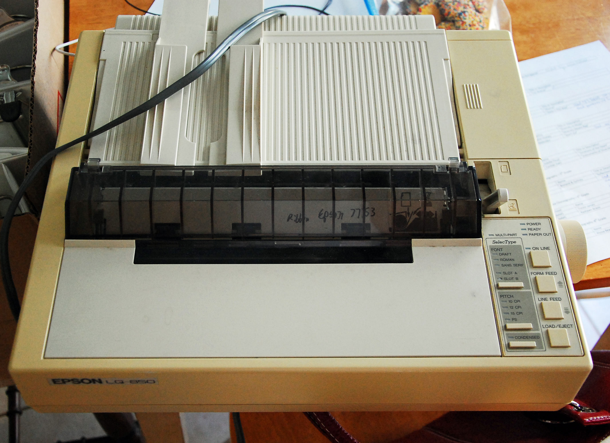
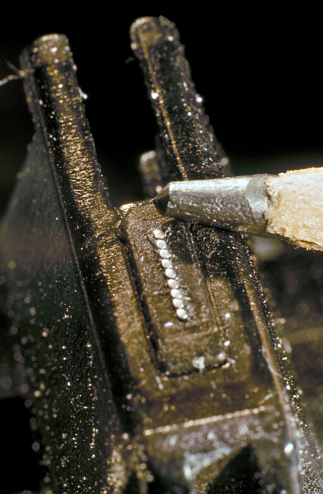
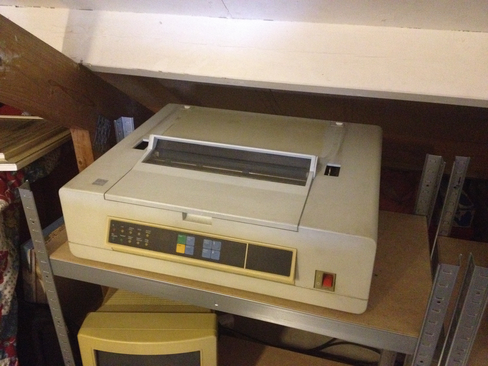
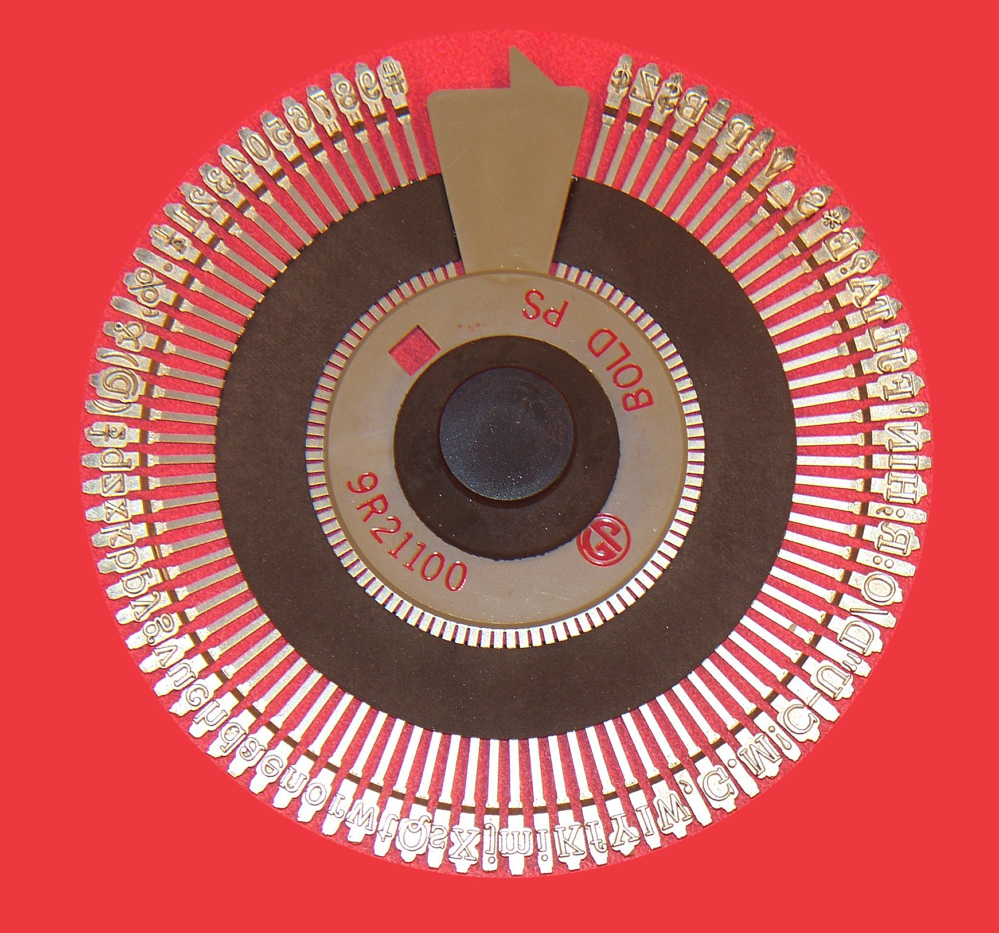

## 12.1. Impresoras

Las impresoras son perifericos de salida que transforman la informacion digital en texto o imagen sobre papel u otros soportes. Aunque hoy predominan las impresoras de inyeccion, laser o termicas, las tecnologias de impacto siguen siendo importantes para entender la evolucion del hardware y para reconocer equipos que todavia aparecen en almacenes, talleres, administraciones o entornos industriales.

### Introducción

Una forma sencilla de clasificar las impresoras es fijarse en **como transfieren la informacion al papel**:

- **Impresoras de impacto**: imprimen golpeando una cinta entintada contra el papel. En este grupo destacan las **impresoras de agujas** y las **impresoras de margarita**.
- **Impresoras de inyeccion de tinta**: expulsan microgotas de tinta sobre la hoja. Son habituales en hogares y pequeñas oficinas porque ofrecen color y buena calidad grafica.
- **Impresoras laser o LED**: usan toner en polvo, carga electrostatica y calor para fijar la imagen al papel. Son muy comunes en oficinas por su rapidez y nitidez en texto.
- **Impresoras termicas**: generan la impresion por calor, bien actuando directamente sobre papel termico o bien transfiriendo tinta desde una cinta. Son frecuentes en tickets, etiquetas y TPV.
- **Impresoras de sublimacion**: vaporizan el colorante y lo fijan al soporte. Se emplean en fotografia, carnets o impresion textil.

En la practica, la gran division es esta:

1. **Impacto**: mas ruidosas, mecanicas y utiles cuando se necesita copiar sobre formularios continuos o papel autocopiativo.
2. **No impacto**: mas silenciosas, rapidas y adecuadas para documentos con mejor acabado grafico.

<figure markdown="1">
  
  <figcaption>Impresora matricial de agujas con papel continuo, un ejemplo clasico de impresora de impacto.</figcaption>
</figure>

### 1. Impresoras de impacto de agujas

Las impresoras de agujas, tambien llamadas **matriciales** o **dot matrix**, forman letras y dibujos mediante una **matriz de puntos**. Para ello usan un cabezal con varias agujas metalicas que avanzan y retroceden muy rapidamente.

#### 1.1. Como funcionan

El proceso de impresion sigue esta secuencia:

1. El papel se desplaza por medio de un tractor o rodillo.
2. El cabezal recorre horizontalmente la linea de impresion.
3. Las agujas del cabezal golpean una cinta entintada.
4. Cada impacto deja un punto sobre el papel.
5. La suma de muchos puntos construye caracteres, simbolos o graficos sencillos.

Este sistema explica bien los elementos que aparecen en tus imagenes de referencia: **cabezal**, **agujas**, **cinta**, **carro de arrastre** y **movimiento del papel**.

<figure markdown="1">
  
  <figcaption>Cabezal de 9 agujas de una impresora matricial. Cada aguja impacta de forma independiente para crear puntos sobre el papel.</figcaption>
</figure>

#### 1.2. Caracteristicas principales

- Son impresoras de impacto y, por tanto, producen un ruido mecanico apreciable.
- Pueden imprimir en **papel continuo** y en **formularios autocopiativos** con varias copias.
- Son resistentes y adecuadas para trabajos repetitivos en entornos de gestion, logistica o industria.
- Su calidad grafica es limitada frente a una laser o una de inyeccion.
- La velocidad y la definicion dependen, entre otros factores, del numero de agujas del cabezal, como 9 o 24 agujas.

#### 1.3. Ventajas y limitaciones

**Ventajas**

- Permiten generar varias copias de un mismo documento por impacto.
- Toleran bien jornadas largas de trabajo.
- El coste por pagina puede ser bajo en tareas administrativas repetitivas.

**Limitaciones**

- Hacen mas ruido que otras tecnologias.
- El texto y los graficos presentan menor calidad.
- No son la mejor opcion para fotografias o documentos con acabado visual cuidado.

### 2. Impresoras de margarita

La impresora de margarita es otra impresora de impacto, pero su mecanismo es diferente. En lugar de un cabezal de agujas, utiliza una **rueda con brazos**. En el extremo de cada brazo hay un caracter en relieve. La forma del conjunto recuerda a una flor, de ahi su nombre.

#### 2.1. Como funcionan

Cuando se va a imprimir un caracter:

1. La rueda gira hasta colocar la letra adecuada frente al papel.
2. Un martillo golpea la parte posterior del brazo seleccionado.
3. El caracter impacta sobre la cinta entintada.
4. La tinta se transfiere al papel con una forma muy nitida, similar a la de una maquina de escribir.

El resultado es un texto de gran calidad para su epoca, pero con una limitacion clara: al trabajar caracter a caracter, esta tecnologia es lenta y poco flexible para graficos.

<figure markdown="1">
  
  <figcaption>Ejemplo de impresora de margarita, basada en el golpeo de una rueda de caracteres contra la cinta y el papel.</figcaption>
</figure>

<figure markdown="1">
  
  <figcaption>Rueda de margarita o disco de caracteres. Cada brazo contiene un simbolo o letra en relieve.</figcaption>
</figure>

#### 2.2. Caracteristicas principales

- Imprimen con calidad de letra muy alta para texto.
- Funcionan bien cuando la prioridad es escribir documentos limpios, no imprimir imagenes.
- Son ruidosas, porque tambien trabajan por impacto.
- Cambiar el tipo de letra puede requerir sustituir la rueda.
- Apenas sirven para graficos complejos.

#### 2.3. Ventajas y limitaciones

**Ventajas**

- La forma de cada caracter queda muy definida.
- Fueron muy valoradas en oficinas donde se buscaba una presentacion similar a la maquina de escribir.

**Limitaciones**

- Son lentas comparadas con otras soluciones posteriores.
- Tienen poca versatilidad para simbolos, diseños o imagenes.
- Han quedado desplazadas por impresoras laser e inyeccion, mucho mas practicas para uso general.

### Comparacion rapida entre agujas y margarita

| Aspecto | Agujas | Margarita |
|---|---|---|
| Tipo de impresion | Matriz de puntos | Caracteres prefijados |
| Calidad de texto | Media | Alta |
| Graficos | Basicos | Muy limitados |
| Formularios multicopia | Muy adecuada | Adecuada |
| Ruido | Alto | Alto |
| Uso actual | Nichos administrativos e industriales | Muy residual |

### Ideas clave

- Las **impresoras de impacto** golpean una cinta entintada contra el papel.
- Las **impresoras de agujas** crean caracteres a partir de puntos.
- Las **impresoras de margarita** imprimen caracteres completos con una rueda de letras.
- Las tecnologias de **no impacto** dominan hoy el mercado por su silencio, velocidad y calidad grafica.

### Fuentes consultadas

- [Encyclopaedia Britannica. Printer](https://www.britannica.com/technology/printer)
- [Encyclopaedia Britannica. Ink-jet printer](https://www.britannica.com/technology/ink-jet-printer)
- [Wikipedia. Dot matrix printing](https://en.wikipedia.org/wiki/Dot_matrix_printing)
- [Wikipedia. Daisy wheel printing](https://en.wikipedia.org/wiki/Daisy_wheel_printing)
- [Wikimedia Commons. Epson dot matrix printer](https://commons.wikimedia.org/wiki/File:Epson_dot_matrix_printer.jpg)
- [Wikimedia Commons. Dot matrix print head](https://commons.wikimedia.org/wiki/File:9_nadel_druckkopf-star_nl10--hinnerk_ruemenapf_vs01-p50.jpg)
- [Wikimedia Commons. Daisy wheel printer](https://commons.wikimedia.org/wiki/File:Daisy_Wheel_printer.JPG)
- [Wikimedia Commons. Daisy wheel print wheel](https://commons.wikimedia.org/wiki/File:Daisy_Wheel_Printer_Print_Wheel.jpg)

**Fecha de actualización:** 07/04/2026
