## 12.1. Impresoras

Las impresoras son perifericos de salida que transforman la informacion digital en texto o imagen sobre papel u otros soportes. Aunque hoy predominan las impresoras de inyeccion, laser o termicas, las tecnologias de impacto siguen siendo importantes para entender la evolucion del hardware y para reconocer equipos que todavia aparecen en almacenes, talleres, administraciones o entornos industriales.

### Introducción

Una forma sencilla de clasificar las impresoras es fijarse en **como transfieren la informacion al papel**:

- **Impresoras de impacto**: imprimen golpeando una cinta entintada contra el papel. En este grupo destacan las **impresoras de agujas** y las **impresoras de margarita**.
- **Impresoras de inyeccion de tinta**: expulsan microgotas de tinta sobre la hoja. Son habituales en hogares y pequeñas oficinas porque ofrecen color y buena calidad grafica.
- **Impresoras laser o LED**: usan toner en polvo, carga electrostatica y calor para fijar la imagen al papel. Son muy comunes en oficinas por su rapidez y nitidez en texto.
- **Impresoras termicas**: generan la impresion por calor, bien actuando directamente sobre papel termico o bien transfiriendo tinta desde una cinta. Son frecuentes en tickets, etiquetas y TPV.
- **Impresoras de sublimacion**: vaporizan el colorante y lo fijan al soporte. Se emplean en fotografia, carnets o impresion textil.

En la practica, la gran division es esta:

1. **Impacto**: mas ruidosas, mecanicas y utiles cuando se necesita copiar sobre formularios continuos o papel autocopiativo.
2. **No impacto**: mas silenciosas, rapidas y adecuadas para documentos con mejor acabado grafico.

<figure markdown="1">
  
  <figcaption>Impresora matricial de agujas con papel continuo, un ejemplo clasico de impresora de impacto.</figcaption>
</figure>

### 1. Impresoras de impacto de agujas

Las impresoras de agujas, tambien llamadas **matriciales** o **dot matrix**, forman letras y dibujos mediante una **matriz de puntos**. Para ello usan un cabezal con varias agujas metalicas que avanzan y retroceden muy rapidamente.

#### 1.1. Como funcionan

El proceso de impresion sigue esta secuencia:

1. El papel se desplaza por medio de un tractor o rodillo.
2. El cabezal recorre horizontalmente la linea de impresion.
3. Las agujas del cabezal golpean una cinta entintada.
4. Cada impacto deja un punto sobre el papel.
5. La suma de muchos puntos construye caracteres, simbolos o graficos sencillos.

Este sistema explica bien los elementos que aparecen en tus imagenes de referencia: **cabezal**, **agujas**, **cinta**, **carro de arrastre** y **movimiento del papel**.

<figure markdown="1">
  
  <figcaption>Cabezal de 9 agujas de una impresora matricial. Cada aguja impacta de forma independiente para crear puntos sobre el papel.</figcaption>
</figure>

#### 1.2. Caracteristicas principales

- Son impresoras de impacto y, por tanto, producen un ruido mecanico apreciable.
- Pueden imprimir en **papel continuo** y en **formularios autocopiativos** con varias copias.
- Son resistentes y adecuadas para trabajos repetitivos en entornos de gestion, logistica o industria.
- Su calidad grafica es limitada frente a una laser o una de inyeccion.
- La velocidad y la definicion dependen, entre otros factores, del numero de agujas del cabezal, como 9 o 24 agujas.

#### 1.3. Ventajas y limitaciones

**Ventajas**

- Permiten generar varias copias de un mismo documento por impacto.
- Toleran bien jornadas largas de trabajo.
- El coste por pagina puede ser bajo en tareas administrativas repetitivas.

**Limitaciones**

- Hacen mas ruido que otras tecnologias.
- El texto y los graficos presentan menor calidad.
- No son la mejor opcion para fotografias o documentos con acabado visual cuidado.

### 2. Impresoras de margarita

La impresora de margarita es otra impresora de impacto, pero su mecanismo es diferente. En lugar de un cabezal de agujas, utiliza una **rueda con brazos**. En el extremo de cada brazo hay un caracter en relieve. La forma del conjunto recuerda a una flor, de ahi su nombre.

#### 2.1. Como funcionan

Cuando se va a imprimir un caracter:

1. La rueda gira hasta colocar la letra adecuada frente al papel.
2. Un martillo golpea la parte posterior del brazo seleccionado.
3. El caracter impacta sobre la cinta entintada.
4. La tinta se transfiere al papel con una forma muy nitida, similar a la de una maquina de escribir.

El resultado es un texto de gran calidad para su epoca, pero con una limitacion clara: al trabajar caracter a caracter, esta tecnologia es lenta y poco flexible para graficos.

<figure markdown="1">
  
  <figcaption>Ejemplo de impresora de margarita, basada en el golpeo de una rueda de caracteres contra la cinta y el papel.</figcaption>
</figure>

<figure markdown="1">
  
  <figcaption>Rueda de margarita o disco de caracteres. Cada brazo contiene un simbolo o letra en relieve.</figcaption>
</figure>

#### 2.2. Caracteristicas principales

- Imprimen con calidad de letra muy alta para texto.
- Funcionan bien cuando la prioridad es escribir documentos limpios, no imprimir imagenes.
- Son ruidosas, porque tambien trabajan por impacto.
- Cambiar el tipo de letra puede requerir sustituir la rueda.
- Apenas sirven para graficos complejos.

#### 2.3. Ventajas y limitaciones

**Ventajas**

- La forma de cada caracter queda muy definida.
- Fueron muy valoradas en oficinas donde se buscaba una presentacion similar a la maquina de escribir.

**Limitaciones**

- Son lentas comparadas con otras soluciones posteriores.
- Tienen poca versatilidad para simbolos, diseños o imagenes.
- Han quedado desplazadas por impresoras laser e inyeccion, mucho mas practicas para uso general.

### 3. Impresoras de inyeccion de tinta

Las impresoras de inyeccion de tinta pertenecen al grupo de **no impacto**. No golpean el papel, sino que **expulsan microgotas de tinta** a traves de boquillas muy pequeñas situadas en el cabezal de impresion. Gracias a ello pueden trabajar con mas silencio y ofrecer buena calidad en texto, color e imagen.

#### 3.1. Elementos principales

En una impresora de inyeccion de tinta suelen intervenir estos elementos:

- **Cartuchos o depositos** de tinta.
- **Cabezal de impresion**, donde se encuentran las boquillas.
- **Carro**, que desplaza el cabezal de lado a lado.
- **Rodillos**, que avanzan el papel.
- **Electronica de control**, que decide cuando y donde expulsar cada gota.

<figure markdown="1">
  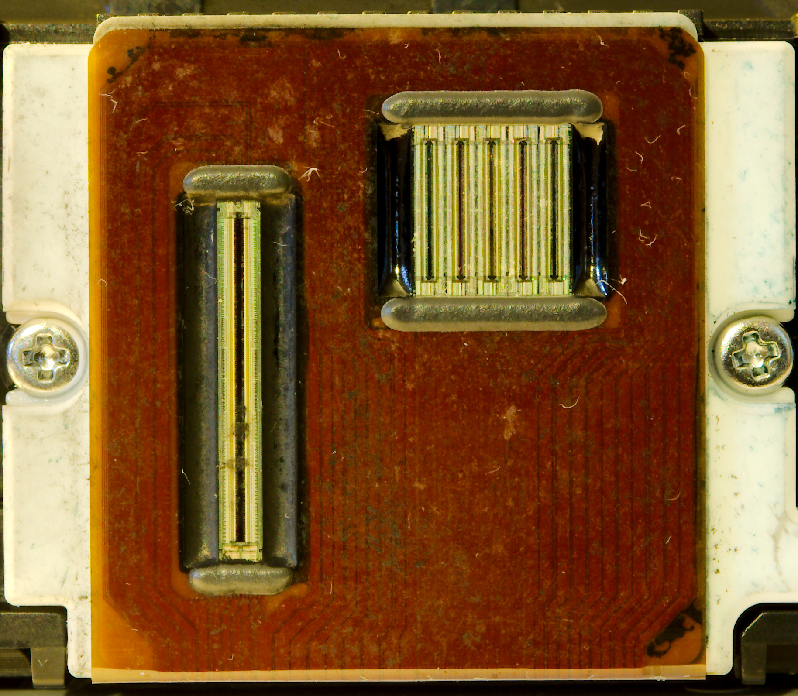
  <figcaption>Cabezal real de una impresora de inyección de tinta Canon. En el cabezal se concentran las boquillas por las que sale la tinta.</figcaption>
</figure>

#### 3.2. Como funciona el sistema de inyeccion

El funcionamiento general puede resumirse asi:

1. El papel avanza una pequeña distancia.
2. El carro mueve el cabezal a gran velocidad de un lado a otro.
3. Las boquillas expulsan gotas diminutas en posiciones muy precisas.
4. La combinacion de miles de gotas forma letras, lineas, sombras y colores.

La precision del sistema depende del tamaño de las gotas, del numero de boquillas y del control electronico del disparo. Por eso estas impresoras pueden producir documentos a color y fotografias con mucho mas detalle que una impresora de impacto.

#### 3.3. Principales sistemas de inyeccion

Las impresoras de inyeccion no trabajan todas del mismo modo. Existen **tres sistemas principales** para controlar la salida y el recorrido de la tinta:

- **Sistema termico**: una resistencia calienta rapidamente la tinta y genera una burbuja que empuja la gota hacia fuera.
- **Sistema piezoelectrico**: un cristal piezoelectrico cambia ligeramente de forma al recibir corriente y presiona la tinta para expulsarla por la boquilla.
- **Sistema con carga electrica**: la tinta puede salir como un chorro continuo, dividirse en gotas, cargarse electricamente y desviarse mediante un campo electrico hacia el papel o hacia un sistema de recuperacion.

<figure markdown="1">
  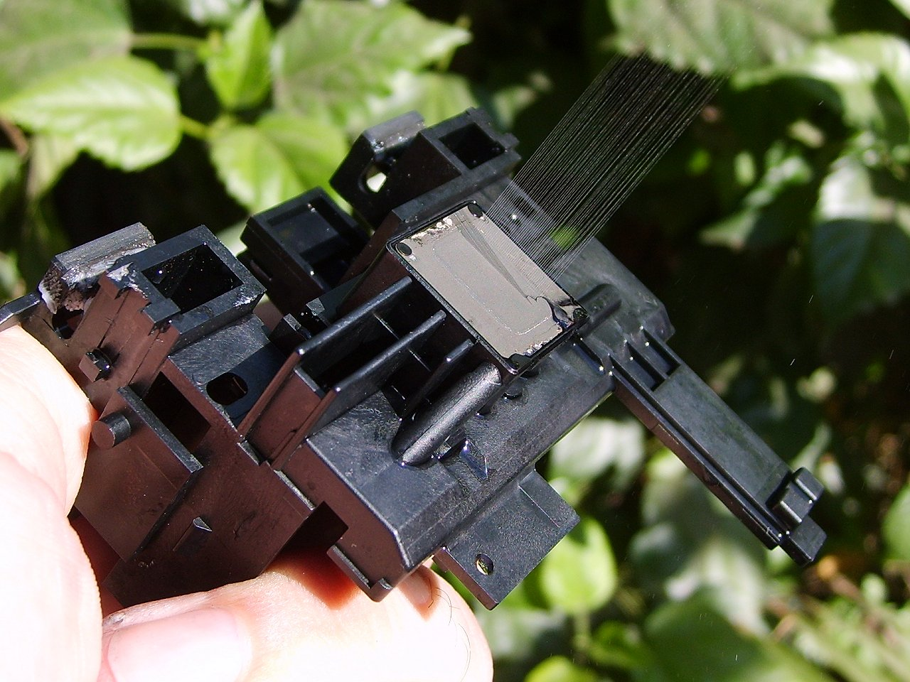
  <figcaption>Ejemplo de boquilla piezoeléctrica de Epson. El cambio de forma del actuador ayuda a expulsar la gota de tinta con gran precisión.</figcaption>
</figure>

#### 3.4. Sistema con carga electrica

El sistema con carga electrica se emplea sobre todo en equipos de **inyeccion continua de tinta**. En este caso, la tinta no sale gota a gota desde el principio, sino como un **chorro continuo** que despues se fragmenta.

<figure markdown="1">
  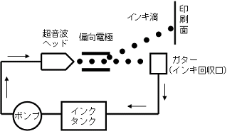
  <figcaption>Esquema de inyección continua de tinta. El chorro se divide en gotas y un campo eléctrico ayuda a dirigirlas hacia el soporte o hacia el circuito de recuperación.</figcaption>
</figure>

El proceso puede resumirse asi:

1. La tinta sale en un chorro continuo.
2. Ese chorro se divide en gotas muy pequeñas.
3. Las gotas se cargan electricamente.
4. Un campo electrico desvía cada gota.
5. Algunas gotas se dirigen hacia el papel y otras se desvían para ser recogidas o descartadas.

Este sistema permite un control muy preciso del recorrido de las gotas y se emplea especialmente en entornos industriales, codificacion de productos, embalajes y lineas de produccion.

<figure markdown="1">
  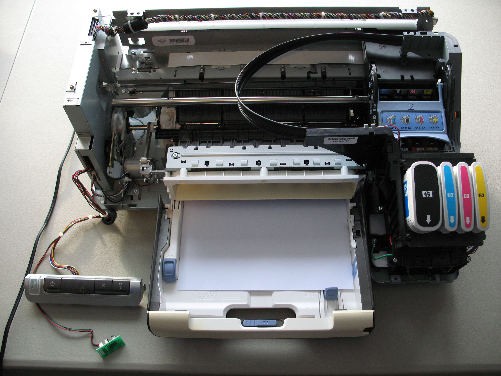
  <figcaption>Vista interna de un sistema de tinta continua, útil para entender que la gestión de la tinta y su circulación forman parte del mecanismo completo de impresión.</figcaption>
</figure>

#### 3.5. Ventajas y limitaciones

**Ventajas**

- Permiten imprimir en color con buena calidad.
- Son silenciosas comparadas con las impresoras de impacto.
- Resultan adecuadas para texto, apuntes, graficos y fotografia domestica.

**Limitaciones**

- Los cartuchos y cabezales requieren mantenimiento para evitar secados y obstrucciones.
- El coste por pagina puede ser alto si se imprime mucho.
- La velocidad suele ser menor que en muchas impresoras laser de oficina.

### Comparacion rapida entre agujas, margarita e inyeccion
| Aspecto | Agujas | Margarita | Inyeccion |
|---|---|---|---|
| Tipo de impresion | Matriz de puntos | Caracteres prefijados | Microgotas de tinta |
| Calidad de texto | Media | Alta | Alta |
| Graficos | Basicos | Muy limitados | Buenos |
| Formularios multicopia | Muy adecuada | Adecuada | No adecuada |
| Ruido | Alto | Alto | Bajo |
| Uso actual | Nichos administrativos e industriales | Muy residual | Hogar, educacion y pequeña oficina |

### 4. Impresoras laser

Las impresoras laser tambien pertenecen al grupo de **no impacto**. En lugar de tinta liquida, emplean **toner**, un polvo muy fino que se adhiere al papel gracias a procesos electrostaticos y que despues se fija por calor. Son muy utilizadas en oficinas, centros educativos y entornos donde se imprimen grandes cantidades de documentos.

#### 4.1. Elementos principales

Los componentes mas importantes de una impresora laser son:

- **Tambor fotoconductor**, donde se forma la imagen electrostatica.
- **Laser o sistema LED**, que dibuja la informacion sobre el tambor.
- **Toner**, polvo fino que se adhiere a las zonas activadas del tambor.
- **Rodillo de transferencia**, que lleva el toner al papel.
- **Fusor**, conjunto que aplica calor y presion para fijar el toner.

<figure markdown="1">
  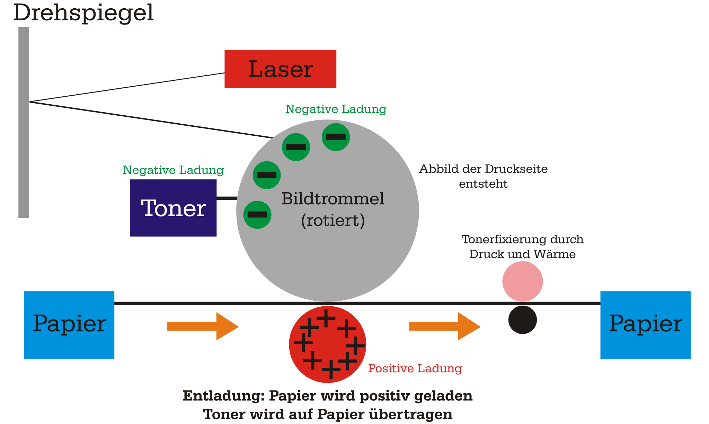
  <figcaption>Esquema general del funcionamiento de una impresora láser: carga del tambor, escritura de la imagen, atracción del tóner, transferencia al papel y fijación.</figcaption>
</figure>

#### 4.2. Como funciona una impresora laser

El proceso se puede resumir en estas fases:

1. El tambor fotoconductor recibe una carga electrica uniforme.
2. El laser descarga selectivamente ciertas zonas del tambor y dibuja la imagen.
3. El toner se adhiere a esas zonas marcadas.
4. El papel pasa junto al tambor y recoge el toner.
5. El fusor aplica calor y presion para fijar definitivamente el polvo al papel.

Gracias a este sistema, las impresoras laser ofrecen texto nitido, buena velocidad y un rendimiento alto en trabajos repetitivos.

<figure markdown="1">
  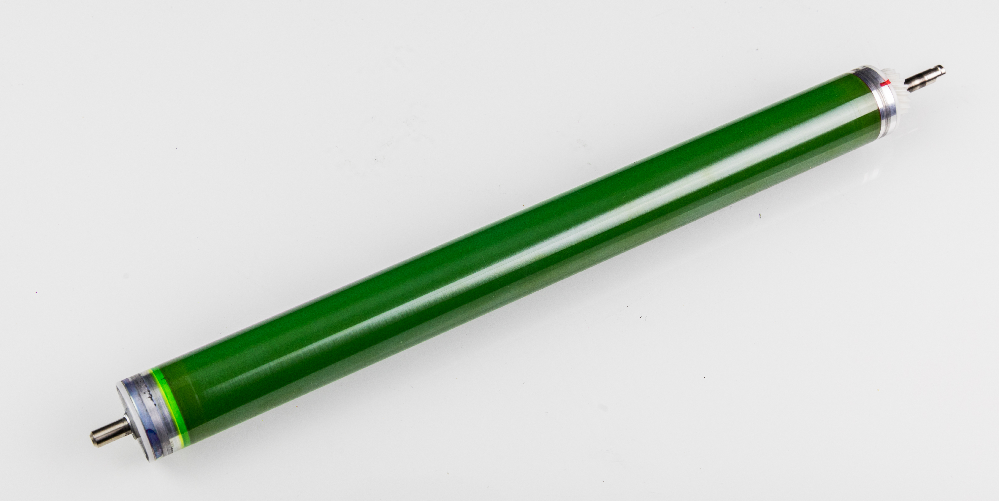
  <figcaption>Tambor fotoconductor de una impresora láser. Sobre esta pieza se crea la imagen electrostática que atraerá el tóner.</figcaption>
</figure>

<figure markdown="1">
  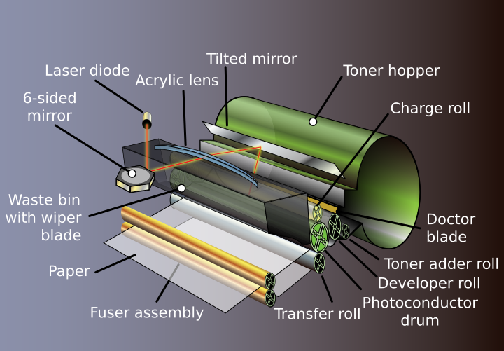
  <figcaption>Esquema simplificado de un cartucho de tóner. El tóner es el material en polvo que se deposita sobre el papel.</figcaption>
</figure>

#### 4.3. Impresora laser monocromo

La impresora laser monocromo trabaja normalmente con **un solo toner negro**. Esta solucion se centra en imprimir texto y documentos con rapidez, nitidez y menor coste por pagina.

Suele ser la opcion mas adecuada cuando:

- Se imprimen apuntes, examenes o documentos administrativos.
- No se necesita color.
- Se busca un equipo rapido y sencillo de mantener.

<figure markdown="1">
  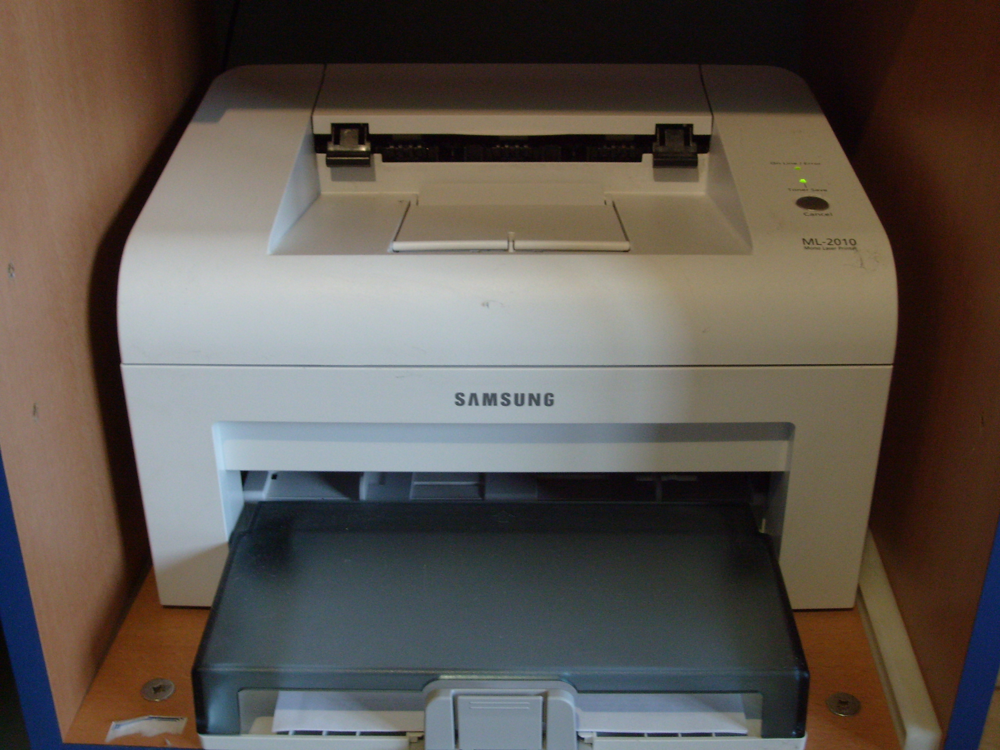
  <figcaption>Ejemplo de impresora láser monocromo. Está orientada sobre todo a documentos en blanco y negro.</figcaption>
</figure>

#### 4.4. Impresora laser a color

La impresora laser a color utiliza normalmente **cuatro toner**: cian, magenta, amarillo y negro. Al combinar esos colores puede producir materiales con graficos, esquemas, portadas o presentaciones.

Frente a una monocromo, la laser color:

- Tiene un mecanismo interno mas complejo.
- Requiere mas consumibles.
- Resulta mas adecuada para documentos mixtos con texto e imagen.

<figure markdown="1">
  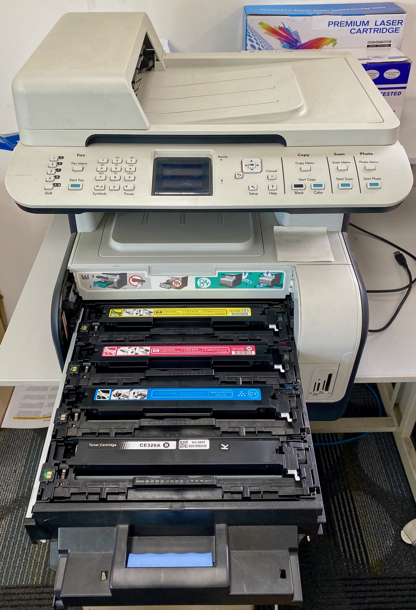
  <figcaption>Ejemplo de impresora láser a color multifunción. Este tipo de equipo es habitual en oficinas y centros donde se imprimen documentos con texto y gráficos.</figcaption>
</figure>

<figure markdown="1">
  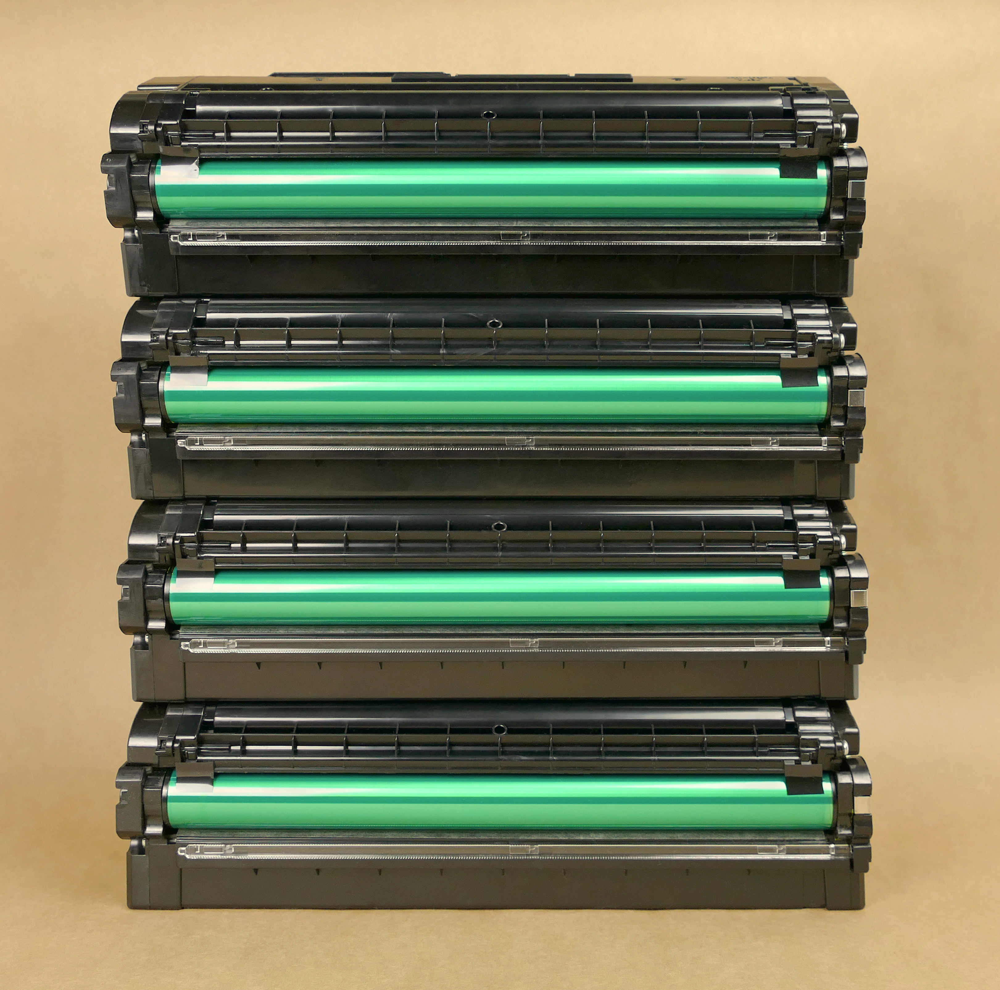
  <figcaption>Juego de tóner CMYK para impresora láser color. La combinación de cian, magenta, amarillo y negro permite formar imágenes a color.</figcaption>
</figure>

#### 4.5. Diferencias entre laser monocromo y laser color

| Aspecto | Laser monocromo | Laser color |
|---|---|---|
| Toner | Negro | Cian, magenta, amarillo y negro |
| Coste por pagina | Menor | Mayor |
| Complejidad interna | Menor | Mayor |
| Uso habitual | Texto y documentos | Texto, graficos y presentaciones |
| Mantenimiento | Mas simple | Mas exigente |

#### 4.6. Ventajas y limitaciones

**Ventajas**

- Muy buena calidad en texto.
- Alta velocidad en documentos largos.
- Menor riesgo de secado que en la inyeccion de tinta.

**Limitaciones**

- Los equipos color son mas caros y complejos.
- No suelen ser la mejor opcion para fotografia domestica.
- El fusor trabaja con calor, por lo que consume energia y requiere componentes internos especificos.

### 5. Impresoras termicas

Las impresoras termicas son impresoras de **no impacto** que generan la impresion aplicando calor. Son muy frecuentes en comercios, TPV, cajeros, logistica, etiquetado y sistemas de tickets. Dentro de este grupo conviene distinguir dos sistemas principales: la **impresion termica directa** y la **transferencia termica**.

#### 5.1. Elementos principales

En una impresora termica suelen intervenir estos elementos:

- **Cabezal termico**, que calienta puntos concretos.
- **Rodillo de arrastre**, que mueve el papel o la etiqueta.
- **Papel termico** o **cinta de transferencia**, segun el sistema.
- **Electronica de control**, que decide que zonas deben calentarse.

<figure markdown="1">
  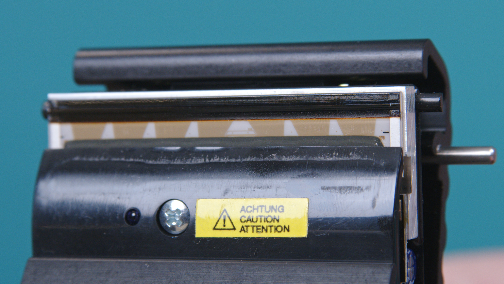
  <figcaption>Cabezal térmico. Este componente aplica calor en puntos muy concretos para formar texto, códigos o gráficos sencillos.</figcaption>
</figure>

#### 5.2. Impresion termica directa

En la impresion termica directa no se utiliza tinta ni toner. El cabezal calienta directamente un **papel termico especial**, que se oscurece en las zonas donde recibe calor.

El proceso es sencillo:

1. El papel termico avanza.
2. El cabezal calienta puntos concretos.
3. El recubrimiento del papel reacciona al calor.
4. Aparecen letras, numeros, codigos o graficos simples.

Este sistema se utiliza mucho en tickets de compra, recibos, turnos y comprobantes breves.

<figure markdown="1">
  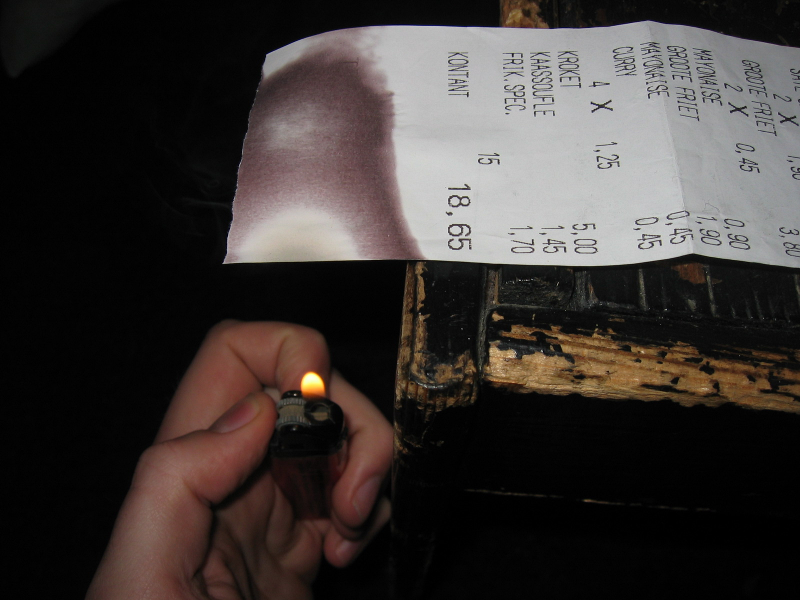
  <figcaption>Rollos de papel térmico, utilizados en tickets, recibos y terminales de punto de venta.</figcaption>
</figure>

<figure markdown="1">
  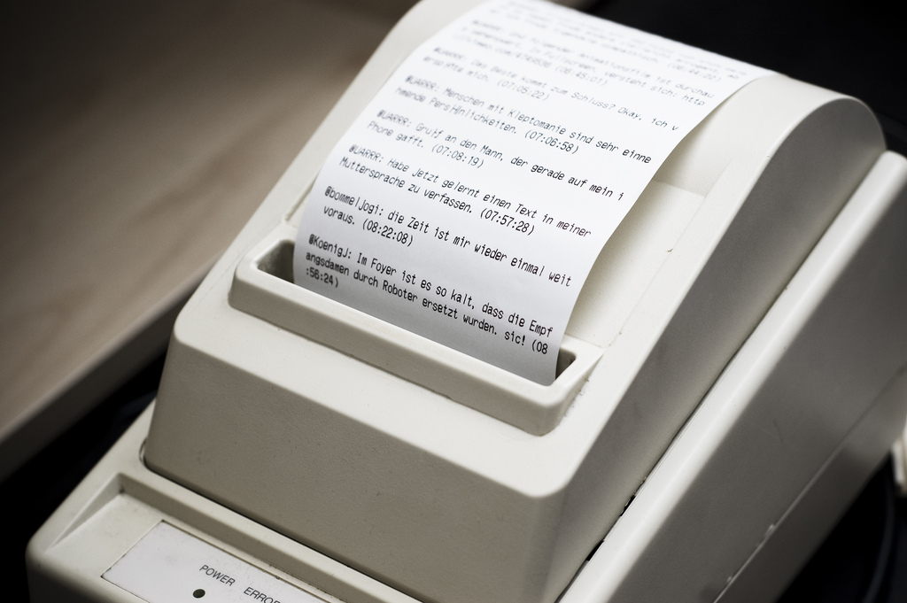
  <figcaption>Ejemplo de impresora térmica de tickets. Es un formato muy habitual en comercios y sistemas TPV.</figcaption>
</figure>

#### 5.3. Transferencia termica

En la transferencia termica tampoco se imprime por impacto, pero aqui el calor no actua directamente sobre el papel. El cabezal calienta una **cinta entintada** y esa tinta se transfiere al soporte, que puede ser papel, plastico o material para etiquetas.

El proceso general es este:

1. El cabezal termico calienta zonas concretas.
2. La cinta de transferencia libera tinta en esas zonas.
3. La tinta pasa al soporte.
4. Se obtiene una impresion mas estable y duradera.

Este sistema es habitual en etiquetas de almacen, codigos de barras, identificacion de productos y entornos industriales.

#### 5.4. Diferencias entre termica directa y transferencia termica

| Aspecto | Termica directa | Transferencia termica |
|---|---|---|
| Consumible principal | Papel termico | Cinta de transferencia y soporte |
| Uso de tinta | No | Si, mediante cinta |
| Durabilidad | Menor | Mayor |
| Uso habitual | Tickets y recibos | Etiquetas y entornos industriales |
| Resistencia | Mas limitada | Mas alta |

#### 5.5. Ventajas y limitaciones

**Ventajas**

- Son silenciosas y rapidas.
- Tienen mecanismos sencillos.
- Resultan muy utiles para tickets, etiquetas y codigos de barras.

**Limitaciones**

- La termica directa depende de papel especial.
- Los tickets termicos pueden deteriorarse con calor, roce o luz.
- La transferencia termica necesita cinta y consumibles especificos.

### Ideas clave

- Las **impresoras de impacto** golpean una cinta entintada contra el papel.
- Las **impresoras de agujas** crean caracteres a partir de puntos.
- Las **impresoras de margarita** imprimen caracteres completos con una rueda de letras.
- Las **impresoras de inyeccion de tinta** expulsan microgotas de tinta mediante boquillas muy precisas.
- Las **impresoras laser** usan toner, tambor fotoconductor y fusor para fijar la imagen al papel.
- Las **impresoras termicas** imprimen aplicando calor, bien sobre papel termico o bien mediante transferencia desde una cinta.
- Las tecnologias de **no impacto** dominan hoy el mercado por su silencio, velocidad y calidad grafica.

### Fuentes consultadas

- [Encyclopaedia Britannica. Printer](https://www.britannica.com/technology/printer)
- [Encyclopaedia Britannica. Ink-jet printer](https://www.britannica.com/technology/ink-jet-printer)
- [Wikipedia. Dot matrix printing](https://en.wikipedia.org/wiki/Dot_matrix_printing)
- [Wikipedia. Daisy wheel printing](https://en.wikipedia.org/wiki/Daisy_wheel_printing)
- [Wikipedia. Inkjet printing](https://en.wikipedia.org/wiki/Inkjet_printing)
- [Wikimedia Commons. Epson dot matrix printer](https://commons.wikimedia.org/wiki/File:Epson_dot_matrix_printer.jpg)
- [Wikimedia Commons. Dot matrix print head](https://commons.wikimedia.org/wiki/File:9_nadel_druckkopf-star_nl10--hinnerk_ruemenapf_vs01-p50.jpg)
- [Wikimedia Commons. Daisy wheel printer](https://commons.wikimedia.org/wiki/File:Daisy_Wheel_printer.JPG)
- [Wikimedia Commons. Daisy wheel print wheel](https://commons.wikimedia.org/wiki/File:Daisy_Wheel_Printer_Print_Wheel.jpg)
- [Wikimedia Commons. Canon iP3500 Print Head](https://commons.wikimedia.org/wiki/File:Canon_iP3500_Print_Head.jpg)
- [Wikimedia Commons. EPSON Piezoelectric InkJet Print Nozzle](https://commons.wikimedia.org/wiki/File:EPSON_Piezoelectric_InkJet_Print_Nozzle.jpg)
- [Wikimedia Commons. Ij continuous](https://commons.wikimedia.org/wiki/File:Ij_continuous.png)
- [Wikimedia Commons. HP Business Inkjet 1200n - Continuous Ink System - Interior overview](https://commons.wikimedia.org/wiki/File:HP_Business_Inkjet_1200n_-_Continuous_Ink_System_-_Interior_overview.jpg)
- [Wikimedia Commons. Aufbau Laserdrucker](https://commons.wikimedia.org/wiki/File:Aufbau_Laserdrucker.svg)
- [Wikimedia Commons. Laser toner cartridge](https://commons.wikimedia.org/wiki/File:Laser_toner_cartridge.svg)
- [Wikimedia Commons. Xerox WorkCentre 6605 - photoconductor drum](https://commons.wikimedia.org/wiki/File:Xerox_WorkCentre_6605_-_photoconductor_drum-8998.jpg)
- [Wikimedia Commons. Samsung ML-2010 (monochrome laser printer)](https://commons.wikimedia.org/wiki/File:Samsung_ML-2010_(monochrome_laser_printer).jpg)
- [Wikimedia Commons. HP Color LaserJet CM1312nfi Multifunction Printer](https://commons.wikimedia.org/wiki/File:HP_Color_LaserJet_CM1312nfi_Multifunction_Printer.jpg)
- [Wikimedia Commons. Four Samsung laser toner cartridges front view](https://commons.wikimedia.org/wiki/File:Four_Samsung_laser_toner_cartridges_front_view.jpg)
- [Wikimedia Commons. Thermal paper](https://commons.wikimedia.org/wiki/File:Thermal_paper.jpg)
- [Wikimedia Commons. Twitter receipt printer](https://commons.wikimedia.org/wiki/File:Twitter_receipt_printer.jpg)
- [Wikimedia Commons. Thermal printhead](https://commons.wikimedia.org/wiki/File:Thermal_printhead.jpg)
- [Wikimedia Commons. Thermal transfer](https://commons.wikimedia.org/wiki/File:Thermal_transfer_(9598971195).jpg)

**Fecha de actualización:** 07/04/2026
