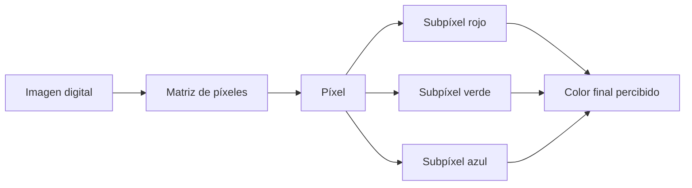

## 13.1. Pantallas y monitores

Las pantallas y monitores son periféricos de salida que convierten la información digital del equipo en imágenes visibles. En un ordenador de sobremesa, un portátil, una tableta o un terminal táctil, la pantalla condiciona de forma directa la comodidad de trabajo, la precisión visual, el consumo energético y la experiencia de uso.

Para elegir, montar o diagnosticar una pantalla no basta con fijarse en su tamaño. También conviene entender cómo se forman las imágenes, qué significan sus especificaciones y qué diferencias existen entre las tecnologías de panel.

### Objetivos de aprendizaje

- Comprender los conceptos básicos que definen la calidad de imagen de una pantalla.
- Interpretar características como resolución, brillo, contraste, color, refresco y tiempo de respuesta.
- Comparar tecnologías de visualización habituales en informática y electrónica de consumo.
- Identificar tecnologías táctiles y sus ventajas en distintos entornos.
- Relacionar cada tipo de pantalla con usos reales: oficina, diseño, juegos, reparación, TPV o dispositivos móviles.

### 0. Vocabulario básico

Antes de estudiar las tecnologías de pantalla conviene manejar algunos términos que aparecerán durante toda la unidad:

| Concepto | Significado |
|---|---|
| **Monitor** | Pantalla externa que se conecta a un equipo para mostrar imagen. |
| **Pantalla** | Superficie o dispositivo que presenta información visual al usuario. |
| **Panel** | Parte física de la pantalla donde se forma la imagen. |
| **Píxel** | Punto mínimo de una imagen digital mostrada en pantalla. |
| **Subpíxel** | Parte de un píxel encargada de un color básico, normalmente rojo, verde o azul. |
| **Resolución** | Número de píxeles horizontales y verticales que tiene la pantalla. |
| **Densidad de píxeles** | Cantidad de píxeles por pulgada; influye en la nitidez. |
| **Brillo** | Cantidad de luz que puede emitir la pantalla. |
| **Contraste** | Diferencia entre las zonas más claras y más oscuras de la imagen. |
| **Tasa de refresco** | Veces por segundo que la pantalla actualiza la imagen. |
| **FPS** | Fotogramas por segundo generados por el equipo, el juego o el vídeo. |
| **Tiempo de respuesta** | Tiempo que tarda un píxel en cambiar de estado. |
| **Latencia de entrada** | Retardo entre una acción del usuario y su aparición en pantalla. |
| **Retroiluminación** | Fuente de luz trasera usada en muchas pantallas LCD. |
| **HDR** | Técnica que busca mostrar más diferencia entre luces y sombras, si la pantalla tiene brillo y contraste suficientes. |
| **Panel táctil** | Capa o sistema que permite usar la pantalla como dispositivo de entrada. |

Estos conceptos ayudan a leer fichas técnicas de monitores y a interpretar problemas habituales, como falta de nitidez, colores poco fieles, poca fluidez o fallos táctiles.

### 1. Conceptos básicos de una pantalla

Una pantalla muestra imágenes mediante una matriz de puntos luminosos. Cada punto recibe información de color e intensidad para formar textos, iconos, fotografías, vídeos o interfaces gráficas.

#### 1.1. Píxel

Un **píxel** es la unidad mínima de una imagen digital mostrada en pantalla. La palabra procede de *picture element*, es decir, elemento de imagen.

En una pantalla en color, cada píxel suele estar formado por subpíxeles de colores primarios:

- **Rojo**.
- **Verde**.
- **Azul**.

Al variar la intensidad de cada subpíxel, el monitor puede generar muchos colores diferentes. Por ejemplo, si los tres subpíxeles emiten mucha luz, se obtiene un tono cercano al blanco; si emiten poca o ninguna luz, se obtiene negro o una zona muy oscura.

#### 1.2. Resolución

La **resolución** indica cuántos píxeles tiene una pantalla en horizontal y en vertical. Por ejemplo, una resolución de 1920 x 1080 significa que hay 1920 columnas y 1080 filas de píxeles.

Una mayor resolución permite mostrar más detalle, pero también exige más trabajo a la tarjeta gráfica y al sistema operativo. En monitores grandes, una resolución baja puede provocar una imagen poco definida. En pantallas pequeñas, una resolución alta puede ofrecer mucha nitidez, aunque los textos necesiten escalado.

#### 1.3. Densidad de píxeles

La **densidad de píxeles** expresa cuántos píxeles hay en una pulgada de pantalla. Suele medirse en **PPP** o **PPI**.

Una pantalla con mayor densidad puede mostrar bordes más suaves y texto más nítido. Este dato es especialmente importante en portátiles, tabletas y teléfonos, donde el usuario mira la pantalla desde poca distancia.

#### 1.4. Tamaño y relación de aspecto

El tamaño de una pantalla se mide en pulgadas, tomando la diagonal del panel. La **relación de aspecto** describe la proporción entre ancho y alto. Las más habituales son:

- **16:9**: muy común en monitores, portátiles y televisión.
- **16:10**: útil para productividad porque ofrece algo más de altura.
- **21:9**: frecuente en monitores panorámicos.
- **3:2**: habitual en algunos portátiles orientados a trabajo con documentos.

#### 1.5. Brillo

El **brillo** indica la cantidad de luz que puede emitir una pantalla. Suele expresarse en nits. Un brillo alto ayuda en espacios iluminados, pero también puede aumentar el consumo y cansar la vista si se usa sin ajustar.

#### 1.6. Contraste

El **contraste** mide la diferencia entre las zonas más claras y las más oscuras de la imagen. Un buen contraste permite distinguir mejor detalles en sombras, textos sobre fondos oscuros y escenas con mucha diferencia de iluminación.

En tecnologías como OLED, el contraste puede ser muy alto porque cada píxel puede apagarse de forma individual. En pantallas LCD, el negro depende de cuánto consiga bloquear la luz de fondo el panel.

### 2. Color y calidad de imagen

El color de una pantalla depende de la combinación de subpíxeles, del panel, de la electrónica de control y de la calibración.

#### 2.1. Profundidad de color

La **profundidad de color** indica cuántos niveles puede representar cada canal de color. Una pantalla de 8 bits por canal puede representar muchos tonos, suficiente para la mayoría de usos generales. En diseño, fotografía o vídeo puede interesar mayor precisión.

#### 2.2. Espacio de color

Un **espacio de color** define el conjunto de colores que una pantalla puede representar. Algunos espacios habituales son:

- **sRGB**: referencia común para web, ofimática y uso general.
- **Adobe RGB**: usado en fotografía e impresión.
- **DCI-P3**: frecuente en vídeo, cine digital y pantallas modernas.

No siempre interesa el espacio de color más amplio. Para un aula o una oficina, puede ser más importante que el color sea estable y cómodo. Para edición gráfica, sí importa que el monitor cubra bien el espacio de color necesario.

#### 2.3. Calibración

La **calibración** ajusta la pantalla para que los colores, el brillo y el punto blanco se parezcan lo máximo posible a un estándar. En tareas de diseño, fotografía o impresión, una pantalla sin calibrar puede mostrar colores distintos a los que luego aparecen en otro monitor o en papel.

### 3. Refresco, respuesta y fluidez

Las pantallas no muestran una imagen fija para siempre. Actualizan su contenido muchas veces por segundo. Esta actualización influye en la sensación de fluidez.

#### 3.1. Tasa de refresco

La **tasa de refresco** indica cuántas veces por segundo se actualiza la imagen. Se mide en hercios.

Una pantalla de 60 Hz actualiza la imagen 60 veces por segundo. Una de 144 Hz lo hace 144 veces por segundo. A mayor refresco, la imagen puede percibirse más fluida, especialmente en juegos, movimiento rápido o desplazamiento de ventanas.

No debe confundirse con los **FPS**. La tasa de refresco depende del monitor; los FPS dependen del contenido, la tarjeta gráfica, el procesador y el programa que está generando la imagen. Para aprovechar bien un monitor de alta tasa de refresco, el equipo debe ser capaz de entregar suficientes fotogramas.

#### 3.2. Tiempo de respuesta

El **tiempo de respuesta** indica cuánto tarda un píxel en cambiar de un estado a otro. Si es alto, pueden aparecer estelas o desenfoque en objetos en movimiento.

No debe confundirse con la latencia de entrada. El tiempo de respuesta afecta al cambio físico de los píxeles; la latencia de entrada se refiere al retraso entre una acción del usuario y su reflejo en pantalla.

En fichas técnicas pueden aparecer medidas como **GtG** (*gray to gray*) o **MPRT** (*moving picture response time*). No siempre se miden de la misma forma, por lo que conviene comparar monitores con criterio y no quedarse solo con el número más pequeño.

#### 3.3. Sincronización adaptativa

Tecnologías como **FreeSync** o **G-Sync** ajustan la frecuencia del monitor a los fotogramas que entrega la tarjeta gráfica. Su objetivo es reducir cortes de imagen, tirones y desincronización entre GPU y pantalla.

También existen certificaciones y estándares de sincronización adaptativa que intentan comprobar que el comportamiento real del monitor es estable en diferentes frecuencias.

### 4. Tecnologías de pantalla

Las tecnologías de panel se diferencian por la forma en que generan la imagen y la luz. Algunas necesitan una luz de fondo; otras producen luz en cada píxel.

#### 4.1. LCD

**LCD** significa *Liquid Crystal Display*, pantalla de cristal líquido. En una pantalla LCD, los cristales líquidos no generan luz por sí solos. Funcionan como una especie de obturador que deja pasar más o menos luz procedente de una fuente trasera.

El funcionamiento básico es:

1. Una luz de fondo ilumina el panel.
2. Los cristales líquidos cambian su orientación según la señal eléctrica.
3. Esa orientación deja pasar más o menos luz.
4. Los filtros de color forman la imagen final.

Las pantallas LCD sustituyeron a los monitores CRT por ser más delgadas, ligeras y eficientes.

#### 4.2. TFT

**TFT** significa *Thin Film Transistor*. No es una tecnología de luz distinta, sino una forma de controlar cada píxel de una pantalla LCD mediante transistores de película fina.

En una pantalla **LCD TFT**, cada píxel tiene un control más preciso. Esto mejora la nitidez, la estabilidad de la imagen y la respuesta frente a sistemas LCD más antiguos.

En la práctica, muchos monitores LCD modernos son TFT, aunque el usuario no siempre vea ese dato destacado.

#### 4.3. Tipos habituales de panel LCD

Dentro de las pantallas LCD TFT existen varias familias de panel. En una ficha técnica suelen aparecer siglas como **TN**, **IPS** o **VA**.

| Tipo de panel | Características habituales | Usos frecuentes |
|---|---|---|
| **TN** | Muy rápido y económico, pero con peores ángulos de visión y color. | Juegos competitivos y equipos económicos. |
| **IPS** | Buen color y buenos ángulos de visión. | Ofimática, diseño, portátiles y uso general. |
| **VA** | Buen contraste, negros más profundos que muchos IPS, respuesta variable según modelo. | Multimedia, televisión y uso mixto. |

Estas diferencias son orientativas. Un monitor concreto puede mejorar o empeorar según su gama, calibración, retroiluminación y electrónica de control.

#### 4.4. LED

Cuando se habla de un monitor **LED**, normalmente se hace referencia a una pantalla LCD cuya iluminación trasera usa diodos LED. Es decir, en muchos casos un monitor LED sigue siendo un LCD, pero con retroiluminación LED en lugar de lámparas fluorescentes antiguas.

Ventajas habituales:

- Menor consumo.
- Paneles más finos.
- Mejor control del brillo.
- Mayor vida útil frente a tecnologías de iluminación anteriores.

Hay distintos sistemas de retroiluminación LED, como iluminación en los bordes o iluminación directa por zonas.

También puede aparecer el término **Mini-LED**, que usa muchos LED pequeños para controlar mejor zonas de iluminación. No convierte automáticamente la pantalla en OLED: sigue siendo una pantalla con retroiluminación, pero con más capacidad para mejorar contraste y brillo por zonas.

#### 4.5. OLED

**OLED** significa *Organic Light Emitting Diode*. En una pantalla OLED, cada píxel emite su propia luz. No necesita una luz trasera común como ocurre en LCD.

Sus ventajas más destacadas son:

- Negros muy profundos, porque los píxeles pueden apagarse.
- Contraste muy alto.
- Buen tiempo de respuesta.
- Paneles delgados y flexibles en algunos dispositivos.

Sus limitaciones principales son el precio y el posible desgaste diferencial de píxeles si se muestran imágenes estáticas durante mucho tiempo.

#### 4.6. AMOLED

**AMOLED** significa *Active Matrix Organic Light Emitting Diode*. Es una variante de OLED con matriz activa, en la que cada píxel se controla mediante una electrónica que permite manejar la imagen con precisión y rapidez.

Es muy habitual en teléfonos, relojes inteligentes y algunas tabletas. Ofrece colores vivos, negros profundos y buen consumo cuando se muestran interfaces oscuras.

#### 4.7. QLED

**QLED** significa *Quantum Dot LED*. En la mayoría de casos, una pantalla QLED combina una base LCD con retroiluminación LED y una capa de puntos cuánticos que mejora la reproducción del color.

No debe confundirse con OLED. En QLED, la luz suele venir de una retroiluminación, mientras que en OLED cada píxel emite luz propia.

Puntos fuertes habituales:

- Mucho brillo.
- Colores intensos.
- Buena resistencia frente a imágenes estáticas.
- Adecuada para espacios iluminados.

### 5. Comparación de tecnologías

| Tecnología | Cómo genera la imagen | Puntos fuertes | Limitaciones |
|---|---|---|---|
| LCD | Cristal líquido que regula una luz de fondo | Coste contenido, buena disponibilidad | Negros limitados frente a OLED |
| TFT | LCD con transistores para controlar píxeles | Mejor control y nitidez que LCD pasivo | Depende del tipo concreto de panel |
| LED | LCD con retroiluminación LED | Menor consumo, panel fino, buen brillo | No equivale a píxeles autoemisivos |
| Mini-LED | LCD con muchas zonas pequeñas de retroiluminación | Mejor control de brillo y contraste que LED simple | Puede mostrar halos en escenas exigentes |
| OLED | Cada píxel emite luz propia | Negros profundos, contraste alto, buena respuesta | Riesgo de retención o desgaste en usos concretos |
| AMOLED | OLED con matriz activa | Muy usada en móviles, colores vivos, buena eficiencia | Coste y posible desgaste diferencial |
| QLED | LCD LED con puntos cuánticos | Alto brillo y color intenso | El negro depende de la retroiluminación |

### 6. Tecnologías táctiles

Una pantalla táctil añade una capa de entrada sobre el panel de imagen. Su función es detectar dónde toca el usuario y convertir esa acción en coordenadas que el sistema operativo pueda interpretar.

#### 6.1. Pantallas resistivas

Las pantallas **resistivas** usan varias capas flexibles. Al presionar, las capas hacen contacto y el sistema detecta la posición.

Características:

- Funcionan con dedo, guante o puntero simple.
- Necesitan presión física.
- Son resistentes y económicas.
- Ofrecen menor claridad y menor sensibilidad que otras tecnologías modernas.

Se han usado mucho en TPV, dispositivos industriales, cajeros antiguos y equipos donde importa más la resistencia que la precisión multitáctil.

#### 6.2. Pantallas capacitivas

Las pantallas **capacitivas** detectan cambios eléctricos provocados por el contacto del dedo. Son habituales en teléfonos, tabletas, portátiles táctiles y monitores interactivos.

Características:

- Responden muy bien al toque.
- Permiten gestos multitáctiles.
- Ofrecen buena transparencia y precisión.
- Pueden requerir guantes especiales o punteros capacitivos.

Dentro de esta familia destacan las pantallas capacitivas proyectadas, muy usadas en dispositivos actuales.

#### 6.3. Infrarrojos

Las pantallas táctiles por **infrarrojos** colocan emisores y receptores alrededor del marco. Cuando el usuario toca la superficie, interrumpe haces de luz infrarroja y el sistema calcula la posición.

Ventajas:

- No requieren presionar el panel.
- Pueden funcionar con dedo, guante o puntero.
- Son útiles en pantallas grandes.

Limitaciones:

- El marco puede ensuciarse o bloquearse.
- Pueden ser menos adecuadas para dispositivos muy finos.

#### 6.4. Onda acústica superficial

La tecnología **SAW** usa ondas ultrasónicas que recorren la superficie del cristal. Al tocar la pantalla, se altera la onda y se calcula la posición.

Puede ofrecer buena claridad de imagen, pero es sensible a suciedad, líquidos o golpes en la superficie. Por eso se ha utilizado más en determinados quioscos, terminales o aplicaciones específicas.

#### 6.5. Táctil óptica

En las pantallas táctiles ópticas se emplean cámaras o sensores situados en el marco para detectar el punto de contacto. Son interesantes en pantallas grandes, pizarras digitales y soluciones interactivas.

### 7. Comparación de tecnologías táctiles

| Tecnología táctil | Detecta | Ventajas | Usos habituales |
|---|---|---|---|
| Resistiva | Presión entre capas | Económica, funciona con guantes o puntero | TPV, industria, equipos antiguos |
| Capacitiva | Cambio eléctrico | Precisa, rápida, multitáctil | Móviles, tabletas, portátiles |
| Infrarroja | Interrupción de haces IR | Buena para grandes formatos | Pizarras, monitores interactivos |
| SAW | Alteración de ondas superficiales | Buena claridad de imagen | Quioscos y terminales específicos |
| Óptica | Cámaras o sensores | Escalable a gran tamaño | Pizarras digitales y señalización |

### 8. Criterios para elegir un monitor

La elección de una pantalla depende del uso:

- **Ofimática y aula**: comodidad visual, tamaño suficiente, conectividad y ajuste de altura.
- **Diseño y fotografía**: buena cobertura de color, calibración y panel estable.
- **Juegos**: alta tasa de refresco, bajo tiempo de respuesta y sincronización adaptativa.
- **Programación**: resolución suficiente, buena nitidez de texto y formato cómodo.
- **TPV o kioscos**: resistencia, tecnología táctil adecuada y facilidad de limpieza.
- **Portátiles**: equilibrio entre consumo, brillo, resolución y peso del equipo.

Antes de comprar o sustituir un monitor conviene revisar también la conectividad disponible: HDMI, DisplayPort, USB-C con vídeo, alimentación por USB-C, altavoces integrados, concentrador USB o soporte VESA para brazo articulado.

### 9. Mantenimiento y buenas prácticas

Para alargar la vida útil de una pantalla conviene:

- Limpiar con paños suaves y productos adecuados.
- Evitar presionar el panel con fuerza.
- Ajustar brillo y contraste al entorno.
- No dejar imágenes estáticas durante muchas horas en paneles sensibles a retención.
- Comprobar cables, conectores y fuente de alimentación antes de sustituir un monitor.
- Revisar resolución y frecuencia configuradas en el sistema operativo.

### Resumen final

- Un monitor muestra imágenes mediante una matriz de píxeles formados por subpíxeles de color.
- Resolución, densidad, brillo, contraste, color, refresco, FPS, tiempo de respuesta y latencia son datos clave para valorar una pantalla.
- LCD, TFT, TN, IPS, VA, LED y Mini-LED están relacionados con paneles de cristal líquido y su forma de control o iluminación.
- OLED y AMOLED usan píxeles autoemisivos, mientras que QLED suele combinar LCD LED con puntos cuánticos.
- Las tecnologías táctiles convierten la pantalla en dispositivo de entrada, y cada una encaja mejor en un entorno distinto.

### Fuentes consultadas

- [EIZO España - Monitores con espacio de color AdobeRGB](https://www.eizo.es/gestion-y-calibracion-del-color/monitores-con-espacio-de-color-adobergb)
- [EIZO España - Criterios de compra de monitores gráficos](https://www.eizo.es/gestion-y-calibracion-del-color/criterios-de-compra-de-monitores-graficos)
- [VESA - Adaptive-Sync Display Standard](https://vesa.org/featured-articles/vesa-updates-adaptive-sync-display-standard-with-tighter-specifications/)
- [ViewSonic - What Is Response Time for Monitors?](https://www.viewsonic.com/library/tech/what-is-response-time-for-monitors/)
- [Elo - Touchscreen Technologies Overview](https://elosupport.elotouch.com/hc/en-us/articles/31648610437655-Where-can-I-find-an-Elo-Touchscreen-Technologies-Overview)

**Fecha de actualización:** 29/04/2026
