## 14.1. Periféricos de entrada, audio e identificación

Los periféricos amplían las posibilidades de un equipo informático. Algunos permiten introducir datos, otros reproducen sonido, otros capturan documentos y otros identifican personas, tarjetas o productos. En mantenimiento informático interesa conocerlos porque muchos problemas del usuario no están dentro de la torre, sino en los dispositivos que usa a diario.

Esta unidad se centra en periféricos que no se han tratado como tema principal en unidades anteriores: teclado, ratón, touchpad, escáneres, micrófonos, auriculares, altavoces, lectores de tarjetas, lectores de códigos y biometría.

### Objetivos de aprendizaje

- Diferenciar periféricos de entrada, salida, audio e identificación.
- Interpretar características básicas como distribución de teclado, DPI, resolución de escaneo, tipo de conexión o compatibilidad.
- Reconocer fallos habituales y aplicar comprobaciones sencillas.
- Elegir periféricos adecuados según el puesto de trabajo.
- Valorar aspectos de ergonomía, mantenimiento, privacidad y seguridad.

### 0. Vocabulario básico

| Concepto | Significado |
|---|---|
| **Periférico** | Dispositivo conectado al equipo para ampliar sus funciones. |
| **Entrada** | Dispositivo que envía información al ordenador. |
| **Salida** | Dispositivo que recibe información del ordenador y la muestra, reproduce o transforma. |
| **HID** | Clase de dispositivos de interfaz humana, como teclados, ratones o lectores sencillos que actúan como entrada. |
| **DPI** | Puntos por pulgada. En ratones se asocia a sensibilidad; en escáneres, a resolución de captura. |
| **Polling rate** | Frecuencia con la que un periférico informa al equipo de su estado. |
| **OCR** | Reconocimiento óptico de caracteres para convertir imagen escaneada en texto editable. |
| **ADC** | Conversor analógico-digital, usado para convertir señales como la voz en datos digitales. |
| **DAC** | Conversor digital-analógico, usado para convertir audio digital en señal reproducible. |
| **Smart card** | Tarjeta con chip usada para identificación, firma o acceso seguro. |
| **RFID** | Identificación por radiofrecuencia, normalmente sin contacto directo. |
| **NFC** | Comunicación de corto alcance usada en tarjetas, móviles y lectores sin contacto. |
| **Biometría** | Identificación o verificación mediante rasgos físicos, como huella dactilar o rostro. |

### 1. Clasificación de los periféricos de la unidad

Aunque muchos periféricos combinan varias funciones, podemos agruparlos por su uso principal:

| Grupo | Dispositivos | Función principal |
|---|---|---|
| Entrada manual | Teclado, ratón, touchpad | Introducir órdenes, texto y movimientos. |
| Captura documental | Escáner | Convertir documentos físicos en archivos digitales. |
| Audio | Micrófono, auriculares, altavoces | Capturar o reproducir sonido. |
| Identificación y lectura | Lectores de tarjetas, DNIe, códigos, RFID, NFC, biometría | Reconocer personas, credenciales, productos o etiquetas. |

```mermaid
flowchart LR
    A["Usuario o documento físico"] --> B["Periférico"]
    B --> C["Controlador o sistema operativo"]
    C --> D["Aplicación"]
    D --> E["Acción: escribir, mover, escanear, escuchar o identificar"]
```

### 2. Teclado

El **teclado** es un periférico de entrada diseñado para introducir texto, atajos y órdenes. Sigue siendo esencial en ofimática, programación, administración de sistemas y uso general.

<figure markdown>
  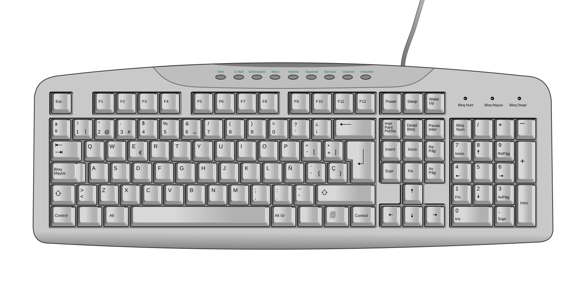
  <figcaption>Distribución española ISO de un teclado de ordenador, con caracteres propios como Ñ, ¿ e ¡. Fuente: Wikimedia Commons, autora original Oona Räisänen (Mysid), obra derivada de PePeEfe, licencia CC0.</figcaption>
</figure>

#### 2.1. Tipos de teclado

| Tipo | Características | Uso habitual |
|---|---|---|
| **Membrana** | Económico, silencioso y ligero. | Aula, oficina y equipos básicos. |
| **Mecánico** | Cada tecla usa un interruptor independiente. | Escritura intensiva, juegos y usuarios exigentes. |
| **Chiclet** | Teclas bajas y separadas, habitual en portátiles. | Portátiles y teclados compactos. |
| **Inalámbrico** | Usa Bluetooth o receptor USB. | Puestos limpios, movilidad y escritorios compartidos. |
| **Ergonómico** | Diseño orientado a reducir posturas forzadas. | Trabajo prolongado con escritura frecuente. |

En un teclado de **membrana**, la pulsación presiona una cúpula de goma o una capa flexible hasta cerrar un contacto eléctrico sobre una membrana. Es una solución barata, ligera y suficiente para muchos puestos, pero suele ofrecer menos precisión táctil y menor facilidad de reparación tecla a tecla.

<figure markdown>
  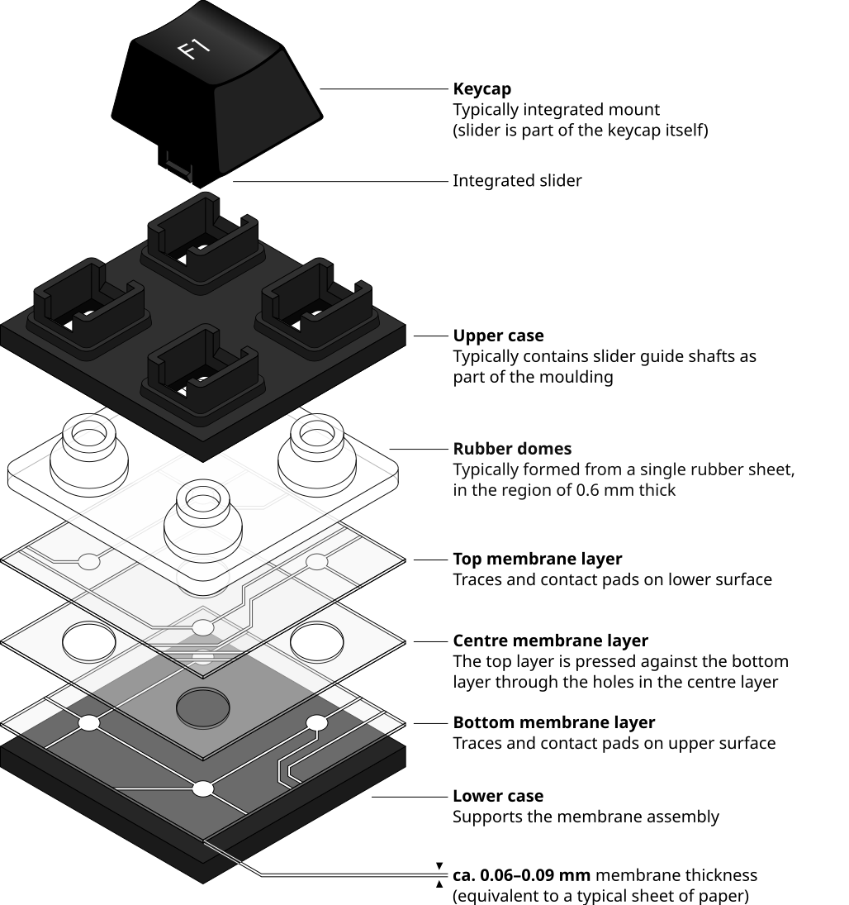
  <figcaption>Esquema explotado de un teclado de membrana con cúpula de goma. Se aprecia cómo la tecla presiona la cúpula hasta cerrar el contacto sobre la membrana. Fuente: Wikimedia Commons, autor Daniel Beardsmore, dominio público.</figcaption>
</figure>

En un teclado **mecánico**, cada tecla tiene un interruptor independiente formado por carcasa, muelle, vástago y contactos. Esto permite una sensación de pulsación más definida y facilita sustituir teclas o mecanismos en algunos modelos. También suele aumentar el precio, el peso y el ruido, aunque depende del tipo de interruptor.

<figure markdown>
  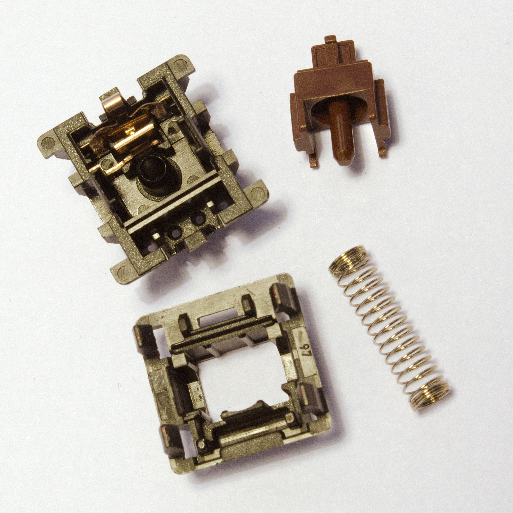
  <figcaption>Interruptor mecánico Cherry MX Brown desmontado. Se observan piezas internas como carcasa, muelle, vástago y contactos. Fuente: Wikimedia Commons, autor Multicherry, licencia CC BY-SA 4.0.</figcaption>
</figure>

#### 2.2. Características importantes

- **Distribución**: En España es habitual la distribución ISO española, con tecla Ñ y símbolos propios.
- **Tamaño**: Puede ser completo, compacto, TKL sin bloque numérico o reducido.
- **Conexión**: USB, Bluetooth o receptor inalámbrico.
- **Retroiluminación**: Útil en entornos con poca luz, aunque aumenta consumo.
- **Teclas multimedia**: Facilitan volumen, reproducción o brillo.
- **Anti-ghosting**: Evita pérdidas de pulsaciones simultáneas en determinados usos.

Al elegir un teclado para un aula o un taller conviene priorizar robustez, facilidad de limpieza, coste de reposición y distribución correcta. Para puestos de administración o programación pesa más la comodidad de escritura y la ergonomía. En equipos compartidos, un teclado sencillo y lavable puede ser mejor elección que uno avanzado pero difícil de mantener.

#### 2.3. Fallos frecuentes

| Síntoma | Posible causa | Comprobación inicial |
|---|---|---|
| No escribe | Cable desconectado, receptor USB sin detectar o batería agotada. | Probar otro puerto, revisar batería o cambiar cable. |
| Algunas teclas fallan | Suciedad, desgaste o líquido derramado. | Limpiar con cuidado y probar en otro equipo. |
| Escribe caracteres incorrectos | Distribución de idioma mal configurada. | Revisar idioma del teclado en el sistema operativo. |
| Se repiten letras | Tecla atascada o ajuste de repetición muy sensible. | Comprobar físicamente la tecla y la configuración. |

En teclados inalámbricos también hay que revisar distancia al receptor, interferencias, estado de las pilas y emparejamiento. En teclados mecánicos pueden aparecer fallos de un interruptor concreto; en teclados de membrana, si falla una zona completa, puede existir daño en la lámina interna o en la matriz de contactos.

### 3. Ratón y touchpad

El **ratón** permite mover el puntero, seleccionar elementos y ejecutar acciones. El **touchpad** cumple una función similar en portátiles, usando una superficie táctil.

<figure markdown>
  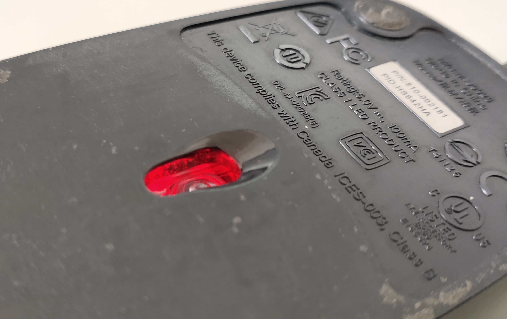
  <figcaption>Sensor óptico de un ratón, con emisor de luz y detector. El dispositivo compara pequeñas variaciones de la superficie para calcular el movimiento. Fuente: Wikimedia Commons, autor Harikrishnanskt, licencia CC BY-SA 4.0.</figcaption>
</figure>

#### 3.1. Conceptos clave

| Concepto | Explicación |
|---|---|
| **Sensor óptico** | Usa luz y un sensor para detectar movimiento sobre una superficie. |
| **Sensor láser** | Variante capaz de trabajar en más superficies, aunque depende del modelo. |
| **DPI** | Indica sensibilidad del movimiento. Más DPI no siempre significa más precisión. |
| **Polling rate** | Frecuencia con la que el ratón informa al equipo de su posición. |
| **Ergonomía** | Forma, tamaño y peso adecuados para evitar molestias en uso prolongado. |

El ratón no mide una distancia real como una regla. Su sensor toma muchas capturas de la superficie por segundo y compara pequeñas variaciones para deducir el desplazamiento. Por eso la alfombrilla, el brillo de la mesa, la suciedad del sensor o una superficie transparente pueden provocar saltos o movimientos imprecisos.

El valor de **DPI** debe interpretarse con cuidado. Un DPI alto permite mover el puntero más distancia con menos movimiento físico, pero no siempre mejora la precisión. Para diseño o trabajo fino puede interesar una sensibilidad moderada y estable; para videojuegos o varios monitores puede ser útil ajustar perfiles.

#### 3.2. Funcionamiento óptico y láser: luz, reflexión y sensor

El funcionamiento de un ratón óptico se basa en una idea sencilla de óptica: **emitir luz sobre una superficie, recoger la luz reflejada y comparar imágenes consecutivas**. La parte inferior del ratón no “ve” la mesa como una cámara normal, pero sí captura patrones microscópicos de textura, polvo, fibras o pequeñas irregularidades.

<figure markdown>
  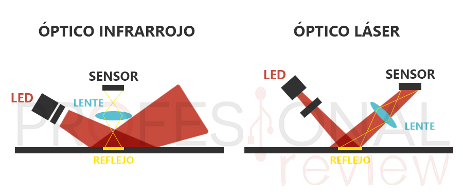
  <figcaption>Comparación entre ratón óptico infrarrojo y ratón óptico láser. En ambos casos la luz se emite hacia la superficie, se refleja, atraviesa una lente y llega al sensor. Fuente: Profesional Review, imagen proporcionada para uso educativo en esta unidad.</figcaption>
</figure>

La imagen permite relacionar el funcionamiento del ratón con tres conceptos de la teoría de la luz:

- **Emisión**: Un LED infrarrojo, LED rojo o láser emite un haz de luz hacia la superficie.
- **Reflexión**: La luz rebota en la mesa o alfombrilla. Si la superficie es mate y tiene textura, el sensor recibe patrones claros; si es cristal o muy brillante, puede perder referencias.
- **Enfoque**: Una lente concentra la luz reflejada sobre el sensor para que el procesador interno pueda comparar las imágenes.

El funcionamiento básico puede resumirse así:

1. Un LED o láser ilumina la superficie.
2. Una lente concentra la imagen sobre un pequeño sensor.
3. El procesador interno compara imágenes consecutivas.
4. El ratón calcula el desplazamiento en los ejes X e Y.
5. El sistema operativo transforma ese desplazamiento en movimiento del puntero.

La diferencia principal entre un ratón óptico infrarrojo y uno láser no está en que uno “mida mejor” por norma general, sino en **cómo ilumina la superficie**. El óptico infrarrojo suele iluminar una zona más amplia y funciona muy bien sobre alfombrillas y superficies mates. El láser concentra más la luz y puede detectar más detalle en superficies lisas o brillantes, pero ese exceso de detalle también puede provocar lecturas menos estables en algunos casos.

Desde el punto de vista del mantenimiento, esto explica varios síntomas habituales:

- Si el cursor salta, conviene limpiar la lente y probar una alfombrilla mate.
- Si el ratón falla sobre cristal o una mesa brillante, no siempre está averiado: puede ser un problema de reflexión.
- Si un ratón láser parece moverse de forma irregular, puede estar leyendo microdetalles de la superficie que no aportan movimiento útil.
- Si el sensor está tapado por polvo, pelo o grasa, la luz reflejada llega peor al sensor y el seguimiento empeora.

En un touchpad, el principio es distinto: la superficie detecta cambios eléctricos producidos por el dedo. El controlador interpreta esos cambios como posición, movimiento o gesto. Por eso un touchpad puede detectar varios dedos, pero también puede fallar si hay humedad, grasa o una configuración de sensibilidad inadecuada.

#### 3.3. Touchpad

El touchpad detecta el movimiento de los dedos sobre una superficie, normalmente mediante tecnología capacitiva. Permite gestos como desplazamiento con dos dedos, zoom o cambio de escritorio.

En mantenimiento conviene revisar:

- Si está desactivado por tecla de función.
- Si el controlador está instalado.
- Si hay suciedad o humedad en la superficie.
- Si un ratón externo cambia el comportamiento del touchpad.

En portátiles modernos, el touchpad puede depender de controladores específicos del fabricante o de controladores de precisión del sistema operativo. Cuando el cursor se mueve solo, se bloquea o no reconoce gestos, no siempre hay avería física: puede haber una configuración de sensibilidad, rechazo de palma, controlador incompleto o humedad en la superficie.

### 4. Escáneres

El **escáner** convierte documentos físicos en archivos digitales. Puede capturar texto, fotografías, formularios, facturas o documentación administrativa.

<figure markdown>
  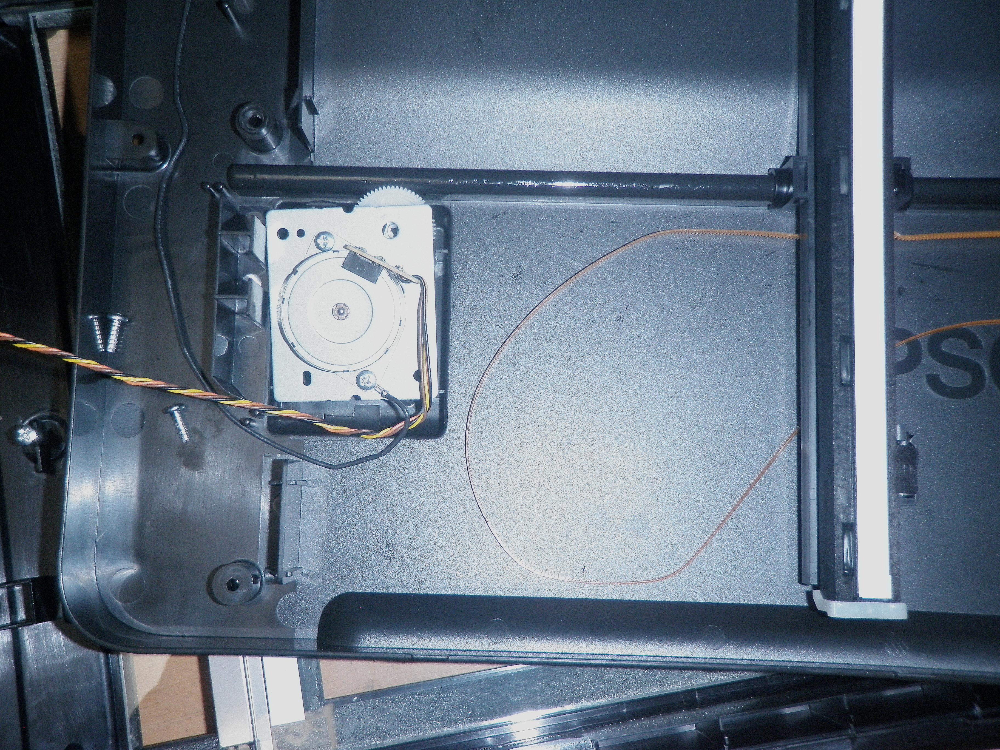
  <figcaption>Interior de un escáner plano. Se aprecia el mecanismo de desplazamiento y el cabezal lector que recorre el documento. Fuente: Wikimedia Commons, autor Jstapko, licencia CC BY-SA 3.0.</figcaption>
</figure>

<figure markdown>
  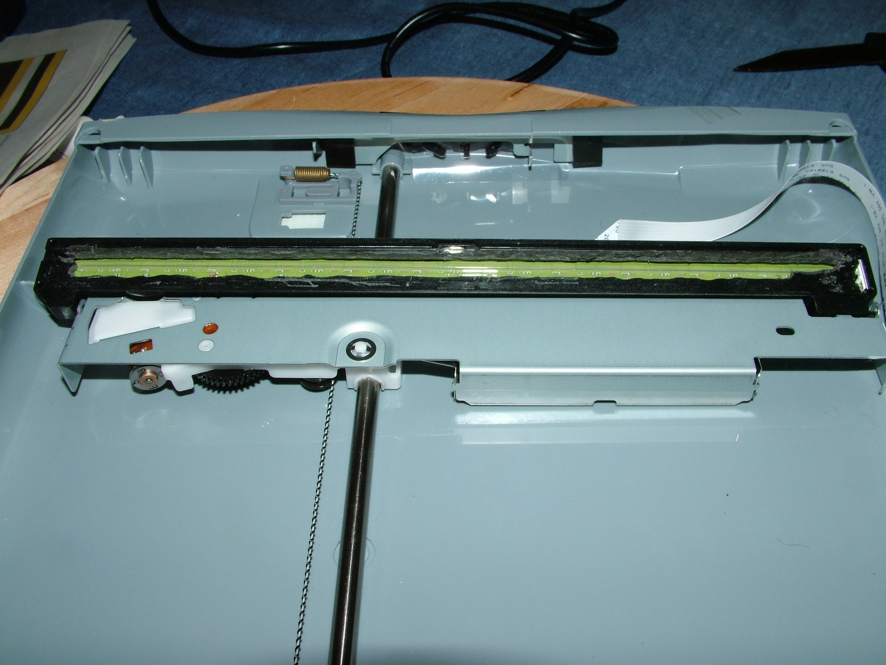
  <figcaption>Barra sensora CIS de un escáner plano. Este componente integra iluminación y sensores para capturar la línea del documento que se va desplazando durante el escaneo. Fuente: Wikimedia Commons, autor Michele M. F., licencia CC BY-SA 2.0.</figcaption>
</figure>

#### 4.1. Tipos habituales

| Tipo | Características | Uso habitual |
|---|---|---|
| **Plano** | El documento se coloca sobre un cristal. | Documentos sueltos, fotos y material delicado. |
| **ADF** | Alimentador automático de documentos. | Oficinas con muchas páginas. |
| **Portátil** | Tamaño reducido y alimentación por USB. | Movilidad y digitalización ocasional. |
| **Integrado en multifunción** | Comparte equipo con impresora. | Aulas, despachos y uso general. |

Un escáner plano desplaza un cabezal lector bajo el cristal. Ese cabezal ilumina el documento y capta la luz reflejada. En documentos sueltos funciona muy bien, pero resulta lento para lotes grandes. Un escáner con **ADF** permite introducir varias páginas de forma automática, aunque exige que el papel esté en buen estado y bien alineado.

También existen diferencias entre sensores **CCD** y **CIS**. Los CCD suelen ofrecer buena profundidad de campo y calidad, mientras que los CIS permiten equipos más finos y de menor consumo. Para uso general de aula u oficina, lo importante es que el escáner sea fiable, tenga controladores disponibles y permita el flujo de trabajo necesario.

El funcionamiento básico de un escáner plano es:

1. El documento se coloca sobre el cristal.
2. Una fuente de luz ilumina una línea del documento.
3. El sensor capta la luz reflejada por esa línea.
4. El motor desplaza el cabezal o el documento.
5. El software reconstruye la imagen línea a línea.
6. Si se usa OCR, la imagen se analiza para reconocer caracteres.

#### 4.2. Características técnicas

- **Resolución óptica**: Determina el detalle real que puede capturar el sensor.
- **Profundidad de color**: Influye en la riqueza de tonos capturados.
- **Velocidad**: Importante si se digitalizan muchas páginas.
- **ADF dúplex**: Permite escanear ambas caras de forma automática.
- **OCR**: Convierte imagen en texto editable, siempre que la calidad del documento sea suficiente.

La resolución debe elegirse según el objetivo. Para texto administrativo suele bastar una resolución moderada; para fotografías o detalles pequeños puede ser necesario aumentarla. Escanear siempre al máximo no es buena práctica, porque genera archivos más grandes, tarda más y no siempre aporta información útil.

El **OCR** no “entiende” el documento como una persona. Detecta formas de letras y las convierte en texto. Por eso falla más con documentos torcidos, manchas, fuentes poco claras, baja resolución o mala compresión. Antes de culpar al software, conviene revisar la calidad del escaneo.

#### 4.3. Problemas frecuentes

| Síntoma | Posible causa | Solución inicial |
|---|---|---|
| Rayas en la imagen | Cristal sucio o sensor con polvo. | Limpiar el cristal y repetir la prueba. |
| Documento torcido | Guías mal ajustadas o papel doblado. | Ajustar guías y alisar el documento. |
| OCR con errores | Baja resolución, mala iluminación o texto borroso. | Aumentar resolución y mejorar el original. |
| No detecta el escáner | Controlador, cable o servicio de escaneo. | Probar cable, revisar drivers y reiniciar servicio. |

En escáneres de red hay que añadir otras comprobaciones: dirección IP, permisos de carpeta compartida, credenciales, firewall y compatibilidad con el protocolo de escaneo. En equipos multifunción, a veces imprime correctamente pero no escanea porque son funciones con controladores y permisos distintos.

### 5. Micrófonos y audio de entrada

El **micrófono** transforma ondas sonoras en una señal eléctrica. Si el micrófono es USB, suele integrar su propio conversor analógico-digital. Si usa jack analógico, depende de la tarjeta de sonido del equipo.

<figure markdown>
  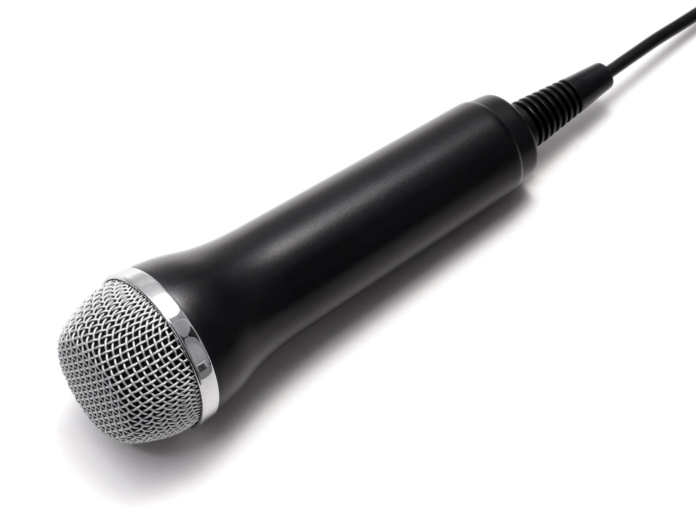
  <figcaption>Micrófono USB. Este tipo de periférico suele integrar electrónica propia para entregar audio digital directamente al sistema operativo. Fuente: Wikimedia Commons, autor Evan-Amos, dominio público.</figcaption>
</figure>

#### 5.1. Tipos básicos

| Tipo | Características | Uso habitual |
|---|---|---|
| **Integrado** | Incluido en portátiles, webcams o auriculares. | Videollamadas y uso básico. |
| **De condensador** | Sensible y con buena respuesta. | Grabación de voz, podcast y clases en línea. |
| **Dinámico** | Robusto y menos sensible al ruido ambiente. | Voz cercana y entornos menos controlados. |
| **USB** | Incluye electrónica propia y se instala como dispositivo de audio. | Uso sencillo en ordenadores. |
| **Jack analógico** | Depende de la entrada de micrófono del equipo. | Auriculares con micrófono y equipos básicos. |

Un micrófono analógico entrega una señal eléctrica débil que debe amplificarse y digitalizarse. Esa conversión la hace la tarjeta de sonido del equipo. En cambio, un micrófono USB integra su propia electrónica y aparece ante el sistema como un dispositivo de audio independiente. Esto suele simplificar la instalación y mejorar la estabilidad entre equipos distintos.

La elección depende del uso. Para videollamadas basta un micrófono integrado o de auriculares. Para grabar explicaciones, podcast o clases, conviene un micrófono con mejor cápsula, soporte estable y control de ganancia. En un aula con ruido, a menudo es mejor acercar el micrófono a la boca que comprar un modelo más caro situado lejos.

<figure markdown>
  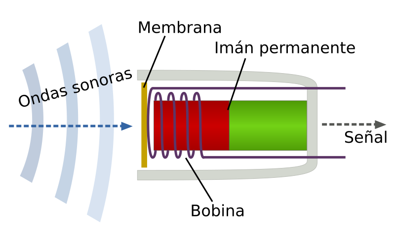
  <figcaption>Funcionamiento de un micrófono dinámico. La onda sonora mueve una membrana unida a una bobina situada en un campo magnético, generando una señal eléctrica. Fuente: Wikimedia Commons, obra derivada de Banco, licencia CC BY-SA 3.0.</figcaption>
</figure>

<figure markdown>
  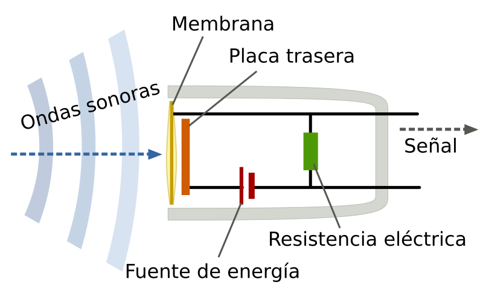
  <figcaption>Funcionamiento de un micrófono de condensador. La vibración modifica la distancia entre placas y produce una variación eléctrica que después se amplifica. Fuente: Wikimedia Commons, autor Kevin, licencia CC BY-SA 3.0.</figcaption>
</figure>

El recorrido de la voz hasta la aplicación suele ser:

1. La voz mueve una membrana o cápsula.
2. El micrófono convierte ese movimiento en señal eléctrica.
3. La señal se amplifica si es necesario.
4. Un conversor analógico-digital la transforma en datos.
5. El sistema operativo entrega esos datos a la aplicación.

#### 5.2. Ajustes importantes

- **Dispositivo predeterminado**: El sistema puede tener varios micrófonos disponibles.
- **Ganancia**: Si es muy baja no se escucha; si es muy alta puede distorsionar.
- **Permisos**: El navegador o la aplicación deben tener permiso para usar el micrófono.
- **Cancelación de ruido**: Puede mejorar la voz, pero también producir artefactos.
- **Distancia**: Un micrófono demasiado lejos capta más ruido ambiente.

Un problema muy común es tener seleccionado el micrófono equivocado. Por ejemplo, el sistema puede estar usando el micrófono del portátil aunque el usuario tenga conectado un micrófono USB. También es frecuente que el navegador tenga permisos bloqueados aunque el sistema operativo detecte bien el dispositivo.

### 6. Auriculares y altavoces

Los **auriculares** y **altavoces** son periféricos de salida de audio. Permiten escuchar notificaciones, clases, vídeos, música, llamadas o sistemas de ayuda.

<figure markdown>
  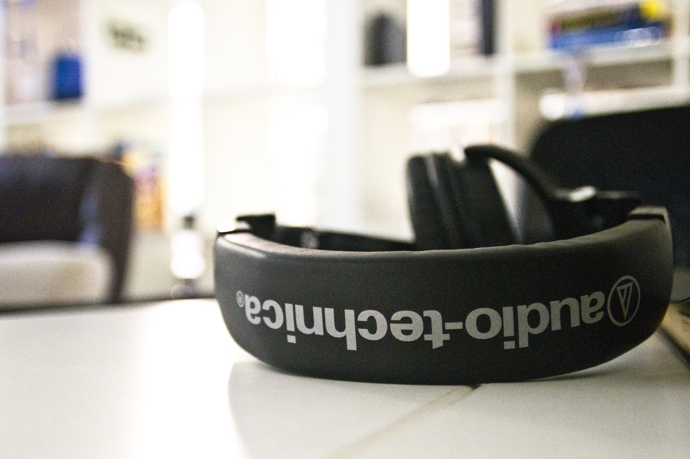
  <figcaption>Auriculares de diadema. En mantenimiento conviene distinguir entre problemas del periférico, del conector, del controlador y de la aplicación que reproduce el sonido. Fuente: Wikimedia Commons, autor Tony Webster, licencia CC BY 2.0.</figcaption>
</figure>

#### 6.1. Conexiones habituales

| Conexión | Características |
|---|---|
| **Jack 3,5 mm** | Señal analógica. Puede separar auriculares y micrófono o usar un conector combinado. |
| **USB** | El propio dispositivo actúa como tarjeta de sonido. |
| **Bluetooth** | Evita cables, pero depende de batería, emparejamiento y códecs. |
| **HDMI o DisplayPort** | Puede transportar audio hacia monitor, televisor o proyector. |

Los auriculares con jack dependen de la salida analógica del equipo. Si usan USB o Bluetooth, el sistema los trata como un dispositivo de audio independiente. Esta diferencia es importante al diagnosticar: puede que el conector esté bien, pero el sistema esté enviando el sonido al monitor por HDMI, a unos auriculares Bluetooth antiguos o a una salida USB.

En altavoces externos hay que revisar también alimentación eléctrica, volumen físico, entrada seleccionada y cableado. En muchos modelos, el fallo no está en el ordenador, sino en un mando de volumen, un adaptador, una regleta apagada o un cable jack parcialmente conectado.

<figure markdown>
  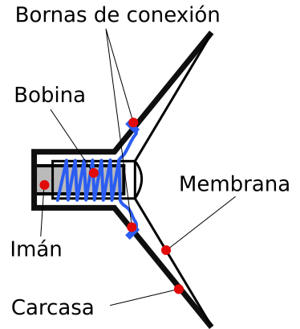
  <figcaption>Esquema de un altavoz dinámico. La señal eléctrica atraviesa una bobina, interactúa con un imán y mueve el cono para producir ondas sonoras. Fuente: Wikimedia Commons, obra procedente de Enciclopedia Libre, licencia CC BY-SA 3.0/GFDL.</figcaption>
</figure>

El funcionamiento de una salida de audio sigue el camino contrario al micrófono:

1. La aplicación genera audio digital.
2. El sistema lo envía al dispositivo de salida seleccionado.
3. Un conversor digital-analógico transforma los datos en señal eléctrica.
4. Un amplificador aumenta la potencia si hace falta.
5. El altavoz o auricular mueve una membrana y produce sonido.

#### 6.2. Diagnóstico básico de audio

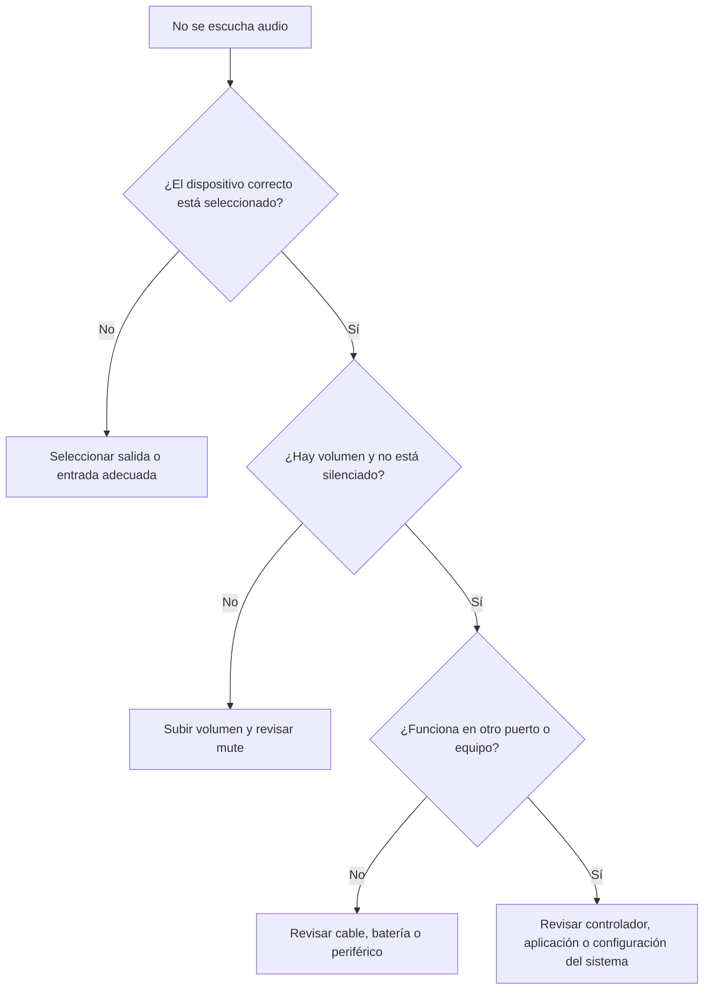
```mermaid
flowchart TD
    A["No se escucha audio"] --> B{"¿El dispositivo correcto está seleccionado?"}
    B -- "No" --> C["Seleccionar salida o entrada adecuada"]
    B -- "Sí" --> D{"¿Hay volumen y no está silenciado?"}
    D -- "No" --> E["Subir volumen y revisar mute"]
    D -- "Sí" --> F{"¿Funciona en otro puerto o equipo?"}
    F -- "No" --> G["Revisar cable, batería o periférico"]
    F -- "Sí" --> H["Revisar controlador, aplicación o configuración del sistema"]
```

En equipos compartidos, el audio puede fallar por cambios realizados por otros usuarios: volumen al mínimo, salida cambiada, auriculares emparejados, navegador silenciado o aplicación usando un dispositivo distinto al del sistema. Por eso conviene seguir un orden de comprobación y no empezar reinstalando controladores.

### 7. Lectores de tarjetas y DNIe

Los **lectores de tarjetas** permiten acceder a tarjetas con chip o tarjetas de memoria. En esta unidad nos interesan especialmente los lectores de **smart card**, usados con tarjetas de identificación, certificados digitales o control de acceso.

<figure markdown>
  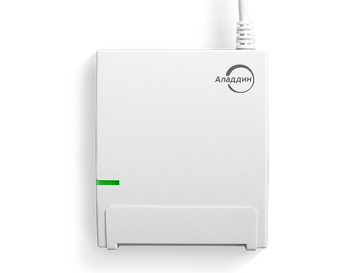
  <figcaption>Lector de tarjeta inteligente. Dispositivos de este tipo pueden usarse para autenticación, firma digital o acceso a servicios que requieren certificado. Fuente: Wikimedia Commons, autora Lenakrapik, licencia CC BY-SA 4.0.</figcaption>
</figure>

<figure markdown>
  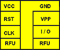
  <figcaption>Contactos de una tarjeta inteligente según la familia ISO/IEC 7816. El lector usa estos contactos para alimentar la tarjeta e intercambiar datos. Fuente: Wikimedia Commons, autor Prometeo, licencia indicada en Wikimedia Commons.</figcaption>
</figure>

#### 7.1. Usos habituales

- Lectura de DNIe o tarjetas de identificación.
- Firma electrónica con certificado.
- Acceso seguro a aplicaciones corporativas.
- Control de presencia o permisos.
- Lectura de tarjetas de memoria mediante lectores SD o microSD.

Un lector de **smart card** no solo lee datos como si fuera una memoria. La tarjeta puede contener claves, certificados o información protegida. En operaciones como firma digital o autenticación, el sistema necesita comunicarse con la tarjeta de forma segura y solicitar un PIN o autorización.

El **DNIe** es un ejemplo cercano: requiere lector compatible, documento válido, certificados operativos, PIN conocido, software adecuado y navegador compatible. Si cualquiera de esos elementos falla, el usuario puede recibir mensajes confusos aunque el lector esté correctamente conectado.

El funcionamiento básico de una tarjeta inteligente con contacto es:

1. El usuario introduce la tarjeta en el lector.
2. El lector alimenta el chip a través de los contactos.
3. El sistema operativo detecta el lector y la tarjeta.
4. El software solicita datos, certificado o autenticación.
5. La tarjeta responde sin exponer directamente claves privadas sensibles.

#### 7.2. Elementos que deben funcionar

Para que un lector de tarjeta inteligente funcione correctamente suelen intervenir:

1. El lector físico.
2. El controlador del lector.
3. La tarjeta o documento.
4. El certificado o middleware necesario.
5. El navegador o aplicación que solicita la autenticación.

Si falla uno de esos elementos, el usuario puede interpretar que “el lector no funciona”, aunque el problema esté en el certificado, el navegador o el PIN.

En mantenimiento conviene separar el problema en capas. Primero se comprueba si el lector aparece en el sistema. Después, si detecta la tarjeta. Luego, si el software reconoce el certificado. Por último, se prueba la aplicación concreta que necesita usarlo.

### 8. Lectores de códigos, RFID y NFC

Los **lectores de códigos** convierten información visual o inalámbrica en datos que el sistema puede procesar. Son muy frecuentes en comercio, almacenes, bibliotecas, logística y control de inventario.

<figure markdown>
  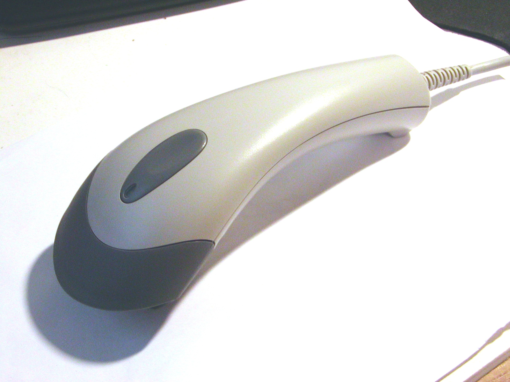
  <figcaption>Lector de código de barras CCD. Muchos lectores se comportan como un teclado: leen el código y escriben los caracteres en la aplicación activa. Fuente: Wikimedia Commons, autor Network.nt, dominio público.</figcaption>
</figure>

<figure markdown>
  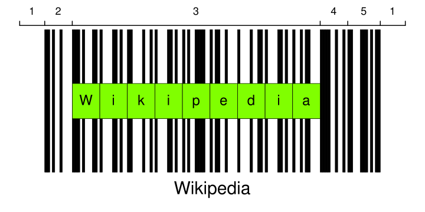
  <figcaption>Estructura de un código de barras Code 128: zona silenciosa, inicio, datos, control y parada. Fuente: Wikimedia Commons, autor Gringer, dominio público.</figcaption>
</figure>

#### 8.1. Código de barras y QR

| Tipo | Características | Uso habitual |
|---|---|---|
| **Código de barras 1D** | Líneas verticales que representan números o texto. | Productos, almacén e inventario. |
| **Código QR** | Código bidimensional con más capacidad de datos. | Enlaces, entradas, pagos, identificación rápida. |
| **Lector tipo teclado** | Envía el código como si se hubiera escrito. | TPV y aplicaciones sencillas. |
| **Lector con software propio** | Requiere aplicación o controlador específico. | Sistemas industriales o corporativos. |

Muchos lectores de códigos funcionan como dispositivos HID, igual que un teclado. Al leer un código, “escriben” el valor en el campo activo y a veces añaden una tecla final, como Intro o Tabulador. Esto facilita su uso en TPV y formularios, pero también puede causar confusión si el cursor no está situado en el campo correcto.

Los códigos **1D** son adecuados para identificadores sencillos, como productos o referencias. Los códigos **QR** almacenan más información y toleran mejor ciertos daños gracias a corrección de errores. Aun así, si están impresos con poco contraste, deformados o demasiado pequeños, la lectura puede fallar.

Un lector de código de barras funciona de forma general así:

1. Ilumina el código con luz LED o láser.
2. Las barras oscuras absorben más luz y los espacios claros reflejan más.
3. Un sensor convierte esas variaciones de luz en una señal.
4. La electrónica interpreta anchos, patrones y dígitos de control.
5. El resultado se envía al ordenador como texto o como dato de una aplicación.

#### 8.2. RFID y NFC

RFID y NFC permiten leer información sin contacto directo. NFC es una tecnología de muy corto alcance, usada en tarjetas, móviles y dispositivos de identificación. Según el NFC Forum, NFC puede trabajar en modos como emulación de tarjeta, lectura/escritura o comunicación entre dispositivos.

Ejemplos de uso:

- Tarjetas de acceso.
- Etiquetas de inventario.
- Pagos y transporte.
- Identificación de equipamiento.
- Emparejamiento rápido de dispositivos.

La diferencia práctica más importante es la distancia y el contexto de uso. RFID puede utilizarse en etiquetas de inventario o control de acceso, mientras que NFC está pensado para interacciones muy cercanas, tipo “tocar” o “acercar”. En ambos casos no basta con tener el lector: también se necesita que la etiqueta, tarjeta o dispositivo use una tecnología compatible.

<figure markdown>
  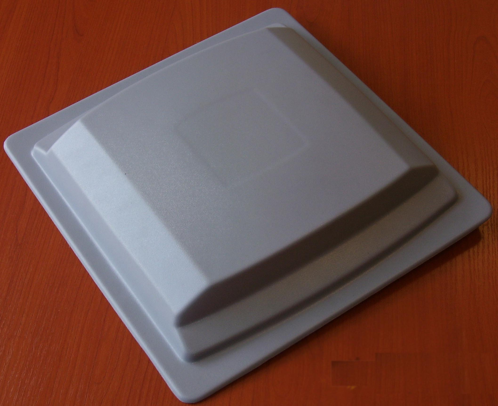
  <figcaption>Antena RFID. En sistemas RFID/NFC, el lector crea un campo de radiofrecuencia y la etiqueta o tarjeta responde mediante su antena. Fuente: Wikimedia Commons, autora Lvova, dominio público.</figcaption>
</figure>

En RFID y NFC, el lector no necesita ver físicamente un código. Genera un campo de radiofrecuencia; la etiqueta recibe energía o señal, responde con sus datos y el sistema interpreta esa respuesta. En NFC, el alcance es muy corto y la experiencia está pensada para acercar voluntariamente tarjeta, móvil o etiqueta.

### 9. Biometría

La **biometría** usa rasgos físicos o de comportamiento para identificar o verificar a una persona. En informática de usuario, lo más habitual es la huella dactilar o el reconocimiento facial.

<figure markdown>
  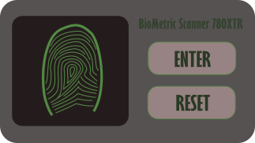
  <figcaption>Representación de un lector de huella dactilar. La biometría no guarda simplemente una foto de la huella: el sistema suele trabajar con características extraídas y plantillas biométricas. Fuente: Wikimedia Commons, autor j4p4n / Openclipart, licencia CC0.</figcaption>
</figure>

<figure markdown>
  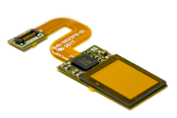
  <figcaption>Sensor óptico de huella dactilar. El lector captura una imagen o patrón de la huella y el sistema extrae características para compararlas con una plantilla registrada. Fuente: Wikimedia Commons, autor Synaptics, licencia CC BY-SA 4.0.</figcaption>
</figure>

#### 9.1. Identificación y verificación

| Concepto | Explicación |
|---|---|
| **Identificación** | El sistema intenta responder quién es una persona dentro de un conjunto de usuarios. |
| **Verificación** | El sistema comprueba si una persona es quien dice ser. |
| **Plantilla biométrica** | Representación digital de características biométricas, usada para comparar. |
| **Falso rechazo** | El sistema rechaza a una persona autorizada. |
| **Falsa aceptación** | El sistema acepta a una persona no autorizada. |

En biometría hay una diferencia importante entre **identificar** y **verificar**. Identificar consiste en buscar a una persona dentro de una base de datos. Verificar consiste en comprobar si una persona coincide con una identidad concreta. Para desbloquear un portátil, normalmente se verifica: el sistema comprueba si la huella coincide con la cuenta del usuario.

Los lectores de huella pueden ser ópticos, capacitivos o ultrasónicos. En todos los casos, el sistema no debería guardar simplemente una fotografía de la huella, sino una plantilla biométrica derivada de características relevantes. Aun así, la biometría requiere especial cuidado porque una huella no se puede “cambiar” con la misma facilidad que una contraseña.

El funcionamiento general de un lector biométrico es:

1. El sensor captura una muestra, como una huella o rasgo facial.
2. El sistema mejora la muestra y elimina ruido.
3. Se extraen características relevantes.
4. Se genera o compara una plantilla biométrica.
5. El sistema decide si la coincidencia supera el umbral configurado.

Ese umbral es importante: si es demasiado estricto, habrá muchos rechazos de usuarios legítimos; si es demasiado permisivo, aumenta el riesgo de aceptar a una persona no autorizada.

#### 9.2. Buenas prácticas

- Usar biometría como parte de un sistema de autenticación bien configurado.
- Mantener siempre un método alternativo de acceso, como PIN o contraseña.
- Evitar registrar biometría en equipos compartidos sin política clara.
- Proteger el equipo con cifrado y bloqueo de sesión.
- Actualizar sistema operativo y firmware para corregir fallos de seguridad.

También hay que considerar el entorno. Manos mojadas, suciedad, heridas, guantes, iluminación deficiente o cámaras de baja calidad pueden afectar al reconocimiento. Por eso los sistemas bien diseñados combinan comodidad con alternativas seguras de acceso.

### 10. Instalación, controladores y compatibilidad

Muchos periféricos actuales se detectan automáticamente, sobre todo si siguen clases estándar como USB HID o audio USB. Aun así, en mantenimiento no conviene confiar solo en “conectar y listo”.

Comprobaciones recomendadas:

- Revisar si el periférico aparece en el administrador de dispositivos o herramienta equivalente.
- Probar otro puerto USB o cable.
- Comprobar si necesita controlador del fabricante.
- Verificar permisos de cámara, micrófono, Bluetooth o seguridad.
- Revisar batería o emparejamiento en dispositivos inalámbricos.
- Probar el periférico en otro equipo para aislar el fallo.

La compatibilidad depende de varias capas: conector físico, protocolo, controlador, permisos del sistema y aplicación. Un dispositivo puede encenderse y aun así no funcionar si el controlador no está instalado, si la aplicación no tiene permiso o si el sistema lo detecta como un perfil incorrecto.

En dispositivos Bluetooth hay que distinguir entre estar emparejado y estar conectado. Un teclado o auricular puede aparecer recordado por el sistema, pero no estar conectado en ese momento. También puede existir conflicto si se emparejó previamente con otro equipo cercano.

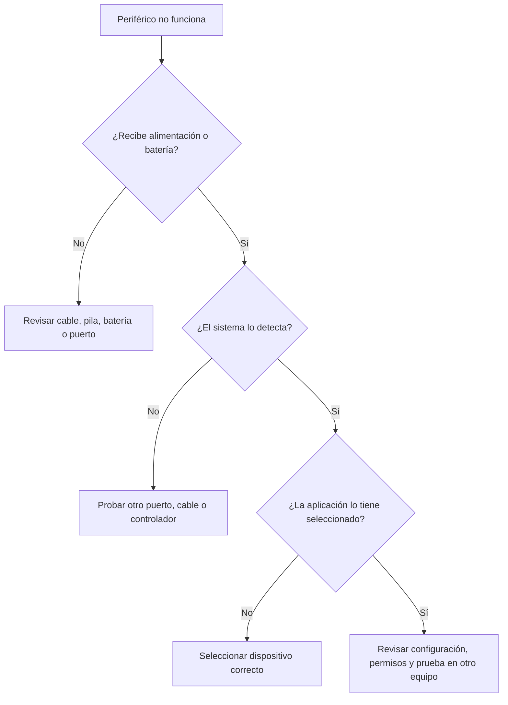
```mermaid
flowchart TD
    A["Periférico no funciona"] --> B{"¿Recibe alimentación o batería?"}
    B -- "No" --> C["Revisar cable, pila, batería o puerto"]
    B -- "Sí" --> D{"¿El sistema lo detecta?"}
    D -- "No" --> E["Probar otro puerto, cable o controlador"]
    D -- "Sí" --> F{"¿La aplicación lo tiene seleccionado?"}
    F -- "No" --> G["Seleccionar dispositivo correcto"]
    F -- "Sí" --> H["Revisar configuración, permisos y prueba en otro equipo"]
```

### 11. Criterios para elegir periféricos

| Necesidad | Periférico recomendado | Criterio principal |
|---|---|---|
| Escritura frecuente | Teclado cómodo y duradero | Distribución, tamaño y ergonomía. |
| Trabajo de precisión | Ratón adecuado o touchpad de calidad | Sensor, agarre y superficie de uso. |
| Digitalizar documentos | Escáner plano o ADF | Resolución, velocidad y OCR. |
| Videollamadas o grabación de voz | Micrófono USB o auriculares con micrófono | Claridad, ruido y facilidad de configuración. |
| Aula o puesto compartido | Auriculares resistentes | Higiene, cableado y reposición sencilla. |
| Firma digital | Lector de smart card compatible | Controladores, sistema operativo y navegador. |
| Inventario o TPV | Lector de códigos | Tipo de código, alcance y modo de entrada. |
| Control de acceso | Biometría o tarjeta | Seguridad, privacidad y método alternativo. |

### 12. Mantenimiento y limpieza

El mantenimiento de periféricos suele ser sencillo, pero evita muchas incidencias:

- Limpiar teclado y ratón con el equipo apagado.
- Evitar líquidos cerca de teclados y dispositivos de audio.
- Limpiar el cristal del escáner con producto adecuado y paño suave.
- Guardar auriculares y micrófonos sin tensión en el cable.
- Revisar conectores USB y jack sin forzarlos.
- Sustituir pilas o recargar baterías antes de diagnosticar fallos complejos.
- Mantener actualizados controladores y software de seguridad.
- Desinfectar periféricos compartidos en aulas o laboratorios.

En un centro educativo es útil definir un pequeño protocolo: etiquetar periféricos, evitar mezclas de receptores inalámbricos, guardar repuestos básicos, revisar periódicamente cables dañados y retirar dispositivos con fallos intermitentes. Los fallos intermitentes son especialmente problemáticos porque consumen mucho tiempo de diagnóstico.

### Resumen final

- Los periféricos de entrada permiten al usuario introducir órdenes, texto, movimiento, sonido o documentos.
- Teclado, ratón y touchpad son dispositivos básicos, pero su ergonomía y configuración influyen mucho en la comodidad.
- Escáneres y OCR convierten documentos físicos en información digital, con calidad dependiente del sensor y del original.
- El audio requiere revisar dispositivo seleccionado, volumen, permisos, controlador y tipo de conexión.
- Lectores de tarjetas, códigos, RFID, NFC y biometría conectan el equipo con sistemas de identificación y seguridad.

### Fuentes consultadas

- [USB-IF - Human Interface Devices Specifications and Tools](https://www.usb.org/hid)
- [TWAIN Working Group](https://twain.org/)
- [Bluetooth SIG - Specifications and documents](https://www.bluetooth.com/specifications/specs/)
- [NFC Forum - NFC Technology](https://nfc-forum.org/learn/nfc-technology/)
- [ISO - ISO/IEC 19794-4:2011 Finger image data](https://www.iso.org/standard/50866.html)
- [W3C - Web Authentication Level 2](https://www.w3.org/TR/webauthn-2/)

### Fuentes de imágenes

- [Computer keyboard ES layout](https://commons.wikimedia.org/wiki/File:Computer_keyboard_ES_layout.svg). Autoría: Oona Räisänen (Mysid), obra derivada de PePeEfe. Licencia: CC0.
- [Rubber dome over membrane, exploded](https://commons.wikimedia.org/wiki/File:Rubber_dome_over_membrane,_exploded.svg). Autor: Daniel Beardsmore. Licencia: dominio público.
- [Cherry MX Brown switch disassembled](https://commons.wikimedia.org/wiki/File:Cherry_MX_Brown_switch_(disassembled).jpg). Autor: Multicherry. Licencia: CC BY-SA 4.0.
- [Optical mouse sensor](https://commons.wikimedia.org/wiki/File:Optical_mouse_sensor.jpg). Autor: Harikrishnanskt. Licencia: CC BY-SA 4.0.
- [Cómo funciona un ratón óptico](https://www.profesionalreview.com/2019/12/01/como-funciona-un-raton-optico/). Autora: Ana Alejandra Romero. Fuente de la imagen comparativa óptico infrarrojo frente a óptico láser: Profesional Review.
- [Inside a flatbed scanner](https://commons.wikimedia.org/wiki/File:Inside_a_flatbed_scanner.jpg). Autor: Jstapko. Licencia: CC BY-SA 3.0.
- [Flatbed scanner CIS sensor bar](https://commons.wikimedia.org/wiki/File:Flatbed_scanner_CIS_sensor_bar.jpg). Autor: Michele M. F. Licencia: CC BY-SA 2.0.
- [USB-Microphone](https://commons.wikimedia.org/wiki/File:USB-Microphone.jpg). Autor: Evan-Amos. Licencia: dominio público.
- [Tauchspulenmikrofon-es](https://commons.wikimedia.org/wiki/File:Tauchspulenmikrofon-es.svg). Obra derivada de Banco. Licencia: CC BY-SA 3.0.
- [Kondensatormikrofon-es](https://commons.wikimedia.org/wiki/File:Kondensatormikrofon-es.svg). Autor: Kevin. Licencia: CC BY-SA 3.0.
- [Audio-Technica Headphones](https://commons.wikimedia.org/wiki/File:Audio-Technica_Headphones_(5360847859).jpg). Autor: Tony Webster. Licencia: CC BY 2.0.
- [Loudspeaker side es](https://commons.wikimedia.org/wiki/File:Loudspeaker_side_es.svg). Fuente: Enciclopedia Libre. Licencia: CC BY-SA 3.0/GFDL.
- [Smart card reader JCR721 white](https://commons.wikimedia.org/wiki/File:Smart_card_reader_JCR721_white.png). Autora: Lenakrapik. Licencia: CC BY-SA 4.0.
- [Contactos-Chip-Tarjeta-Inteligente](https://commons.wikimedia.org/wiki/File:Contactos-Chip-Tarjeta-Inteligente.PNG). Autor: Prometeo. Licencia indicada en Wikimedia Commons.
- [CCD Barcode Scanner](https://commons.wikimedia.org/wiki/File:CCD_Barcode_Scanner.jpg). Autor: Network.nt. Licencia: dominio público.
- [Barcode diagram](https://commons.wikimedia.org/wiki/File:Barcode_diagram.svg). Autor: Gringer. Licencia: dominio público.
- [Rfid-antenna](https://commons.wikimedia.org/wiki/File:Rfid-antenna.JPG). Autora: Lvova. Licencia: dominio público.
- [Fingerprint scanner](https://commons.wikimedia.org/wiki/File:Fingerprint_scanner.svg). Autor: j4p4n / Openclipart. Licencia: CC0.
- [Synaptics Clear ID optical fingerprint sensor](https://commons.wikimedia.org/wiki/File:Synaptics_Clear_ID_optical_fingerprint_sensor.png). Autor: Synaptics. Licencia: CC BY-SA 4.0.

**Fecha de actualización:** 30/04/2026
