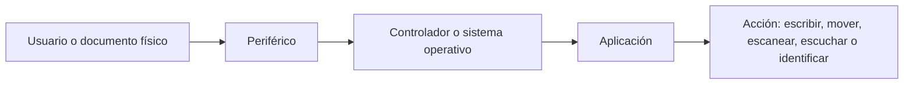
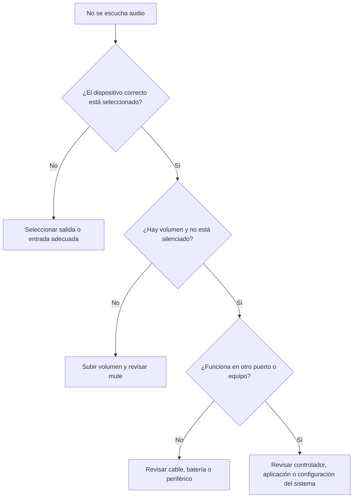
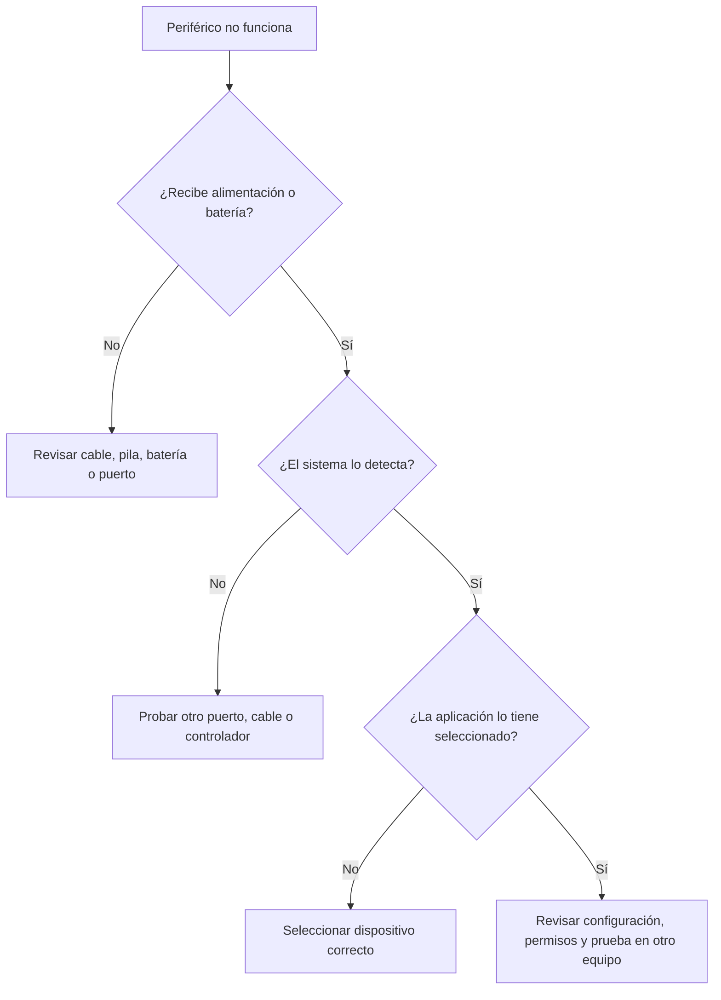

## 14.1. Periféricos de entrada, audio e identificación

Los periféricos amplían las posibilidades de un equipo informático. Algunos permiten introducir datos, otros reproducen sonido, otros capturan documentos y otros identifican personas, tarjetas o productos. En mantenimiento informático interesa conocerlos porque muchos problemas del usuario no están dentro de la torre, sino en los dispositivos que usa a diario.

Esta unidad se centra en periféricos que no se han tratado como tema principal en unidades anteriores: teclado, ratón, touchpad, escáneres, micrófonos, auriculares, altavoces, lectores de tarjetas, lectores de códigos y biometría.

### Objetivos de aprendizaje

- Diferenciar periféricos de entrada, salida, audio e identificación.
- Interpretar características básicas como distribución de teclado, DPI, resolución de escaneo, tipo de conexión o compatibilidad.
- Reconocer fallos habituales y aplicar comprobaciones sencillas.
- Elegir periféricos adecuados según el puesto de trabajo.
- Valorar aspectos de ergonomía, mantenimiento, privacidad y seguridad.

### 0. Vocabulario básico

| Concepto | Significado |
|---|---|
| **Periférico** | Dispositivo conectado al equipo para ampliar sus funciones. |
| **Entrada** | Dispositivo que envía información al ordenador. |
| **Salida** | Dispositivo que recibe información del ordenador y la muestra, reproduce o transforma. |
| **HID** | Clase de dispositivos de interfaz humana, como teclados, ratones o lectores sencillos que actúan como entrada. |
| **DPI** | Puntos por pulgada. En ratones se asocia a sensibilidad; en escáneres, a resolución de captura. |
| **Polling rate** | Frecuencia con la que un periférico informa al equipo de su estado. |
| **OCR** | Reconocimiento óptico de caracteres para convertir imagen escaneada en texto editable. |
| **ADC** | Conversor analógico-digital, usado para convertir señales como la voz en datos digitales. |
| **DAC** | Conversor digital-analógico, usado para convertir audio digital en señal reproducible. |
| **Smart card** | Tarjeta con chip usada para identificación, firma o acceso seguro. |
| **RFID** | Identificación por radiofrecuencia, normalmente sin contacto directo. |
| **NFC** | Comunicación de corto alcance usada en tarjetas, móviles y lectores sin contacto. |
| **Biometría** | Identificación o verificación mediante rasgos físicos, como huella dactilar o rostro. |

### 1. Clasificación de los periféricos de la unidad

Aunque muchos periféricos combinan varias funciones, podemos agruparlos por su uso principal:

| Grupo | Dispositivos | Función principal |
|---|---|---|
| Entrada manual | Teclado, ratón, touchpad | Introducir órdenes, texto y movimientos. |
| Captura documental | Escáner | Convertir documentos físicos en archivos digitales. |
| Audio | Micrófono, auriculares, altavoces | Capturar o reproducir sonido. |
| Identificación y lectura | Lectores de tarjetas, DNIe, códigos, RFID, NFC, biometría | Reconocer personas, credenciales, productos o etiquetas. |

### 2. Teclado

El **teclado** es un periférico de entrada diseñado para introducir texto, atajos y órdenes. Sigue siendo esencial en ofimática, programación, administración de sistemas y uso general.

<figure markdown>
  
  <figcaption>Distribución española ISO de un teclado de ordenador, con caracteres propios como Ñ, ¿ e ¡. Fuente: Wikimedia Commons, autora original Oona Räisänen (Mysid), obra derivada de PePeEfe, licencia CC0.</figcaption>
</figure>

#### 2.1. Tipos de teclado

| Tipo | Características | Uso habitual |
|---|---|---|
| **Membrana** | Económico, silencioso y ligero. | Aula, oficina y equipos básicos. |
| **Mecánico** | Cada tecla usa un interruptor independiente. | Escritura intensiva, juegos y usuarios exigentes. |
| **Chiclet** | Teclas bajas y separadas, habitual en portátiles. | Portátiles y teclados compactos. |
| **Inalámbrico** | Usa Bluetooth o receptor USB. | Puestos limpios, movilidad y escritorios compartidos. |
| **Ergonómico** | Diseño orientado a reducir posturas forzadas. | Trabajo prolongado con escritura frecuente. |

#### 2.2. Características importantes

- **Distribución**: En España es habitual la distribución ISO española, con tecla Ñ y símbolos propios.
- **Tamaño**: Puede ser completo, compacto, TKL sin bloque numérico o reducido.
- **Conexión**: USB, Bluetooth o receptor inalámbrico.
- **Retroiluminación**: Útil en entornos con poca luz, aunque aumenta consumo.
- **Teclas multimedia**: Facilitan volumen, reproducción o brillo.
- **Anti-ghosting**: Evita pérdidas de pulsaciones simultáneas en determinados usos.

#### 2.3. Fallos frecuentes

| Síntoma | Posible causa | Comprobación inicial |
|---|---|---|
| No escribe | Cable desconectado, receptor USB sin detectar o batería agotada. | Probar otro puerto, revisar batería o cambiar cable. |
| Algunas teclas fallan | Suciedad, desgaste o líquido derramado. | Limpiar con cuidado y probar en otro equipo. |
| Escribe caracteres incorrectos | Distribución de idioma mal configurada. | Revisar idioma del teclado en el sistema operativo. |
| Se repiten letras | Tecla atascada o ajuste de repetición muy sensible. | Comprobar físicamente la tecla y la configuración. |

### 3. Ratón y touchpad

El **ratón** permite mover el puntero, seleccionar elementos y ejecutar acciones. El **touchpad** cumple una función similar en portátiles, usando una superficie táctil.

<figure markdown>
  
  <figcaption>Sensor óptico de un ratón, con emisor de luz y detector. El dispositivo compara pequeñas variaciones de la superficie para calcular el movimiento. Fuente: Wikimedia Commons, autor Harikrishnanskt, licencia CC BY-SA 4.0.</figcaption>
</figure>

#### 3.1. Conceptos clave

| Concepto | Explicación |
|---|---|
| **Sensor óptico** | Usa luz y un sensor para detectar movimiento sobre una superficie. |
| **Sensor láser** | Variante capaz de trabajar en más superficies, aunque depende del modelo. |
| **DPI** | Indica sensibilidad del movimiento. Más DPI no siempre significa más precisión. |
| **Polling rate** | Frecuencia con la que el ratón informa al equipo de su posición. |
| **Ergonomía** | Forma, tamaño y peso adecuados para evitar molestias en uso prolongado. |

#### 3.2. Touchpad

El touchpad detecta el movimiento de los dedos sobre una superficie, normalmente mediante tecnología capacitiva. Permite gestos como desplazamiento con dos dedos, zoom o cambio de escritorio.

En mantenimiento conviene revisar:

- Si está desactivado por tecla de función.
- Si el controlador está instalado.
- Si hay suciedad o humedad en la superficie.
- Si un ratón externo cambia el comportamiento del touchpad.

### 4. Escáneres

El **escáner** convierte documentos físicos en archivos digitales. Puede capturar texto, fotografías, formularios, facturas o documentación administrativa.

<figure markdown>
  
  <figcaption>Interior de un escáner plano. Se aprecia el mecanismo de desplazamiento y el cabezal lector que recorre el documento. Fuente: Wikimedia Commons, autor Jstapko, licencia CC BY-SA 3.0.</figcaption>
</figure>

#### 4.1. Tipos habituales

| Tipo | Características | Uso habitual |
|---|---|---|
| **Plano** | El documento se coloca sobre un cristal. | Documentos sueltos, fotos y material delicado. |
| **ADF** | Alimentador automático de documentos. | Oficinas con muchas páginas. |
| **Portátil** | Tamaño reducido y alimentación por USB. | Movilidad y digitalización ocasional. |
| **Integrado en multifunción** | Comparte equipo con impresora. | Aulas, despachos y uso general. |

#### 4.2. Características técnicas

- **Resolución óptica**: Determina el detalle real que puede capturar el sensor.
- **Profundidad de color**: Influye en la riqueza de tonos capturados.
- **Velocidad**: Importante si se digitalizan muchas páginas.
- **ADF dúplex**: Permite escanear ambas caras de forma automática.
- **OCR**: Convierte imagen en texto editable, siempre que la calidad del documento sea suficiente.

#### 4.3. Problemas frecuentes

| Síntoma | Posible causa | Solución inicial |
|---|---|---|
| Rayas en la imagen | Cristal sucio o sensor con polvo. | Limpiar el cristal y repetir la prueba. |
| Documento torcido | Guías mal ajustadas o papel doblado. | Ajustar guías y alisar el documento. |
| OCR con errores | Baja resolución, mala iluminación o texto borroso. | Aumentar resolución y mejorar el original. |
| No detecta el escáner | Controlador, cable o servicio de escaneo. | Probar cable, revisar drivers y reiniciar servicio. |

### 5. Micrófonos y audio de entrada

El **micrófono** transforma ondas sonoras en una señal eléctrica. Si el micrófono es USB, suele integrar su propio conversor analógico-digital. Si usa jack analógico, depende de la tarjeta de sonido del equipo.

<figure markdown>
  
  <figcaption>Micrófono USB. Este tipo de periférico suele integrar electrónica propia para entregar audio digital directamente al sistema operativo. Fuente: Wikimedia Commons, autor Evan-Amos, dominio público.</figcaption>
</figure>

#### 5.1. Tipos básicos

| Tipo | Características | Uso habitual |
|---|---|---|
| **Integrado** | Incluido en portátiles, webcams o auriculares. | Videollamadas y uso básico. |
| **De condensador** | Sensible y con buena respuesta. | Grabación de voz, podcast y clases en línea. |
| **Dinámico** | Robusto y menos sensible al ruido ambiente. | Voz cercana y entornos menos controlados. |
| **USB** | Incluye electrónica propia y se instala como dispositivo de audio. | Uso sencillo en ordenadores. |
| **Jack analógico** | Depende de la entrada de micrófono del equipo. | Auriculares con micrófono y equipos básicos. |

#### 5.2. Ajustes importantes

- **Dispositivo predeterminado**: El sistema puede tener varios micrófonos disponibles.
- **Ganancia**: Si es muy baja no se escucha; si es muy alta puede distorsionar.
- **Permisos**: El navegador o la aplicación deben tener permiso para usar el micrófono.
- **Cancelación de ruido**: Puede mejorar la voz, pero también producir artefactos.
- **Distancia**: Un micrófono demasiado lejos capta más ruido ambiente.

### 6. Auriculares y altavoces

Los **auriculares** y **altavoces** son periféricos de salida de audio. Permiten escuchar notificaciones, clases, vídeos, música, llamadas o sistemas de ayuda.

<figure markdown>
  
  <figcaption>Auriculares de diadema. En mantenimiento conviene distinguir entre problemas del periférico, del conector, del controlador y de la aplicación que reproduce el sonido. Fuente: Wikimedia Commons, autor Tony Webster, licencia CC BY 2.0.</figcaption>
</figure>

#### 6.1. Conexiones habituales

| Conexión | Características |
|---|---|
| **Jack 3,5 mm** | Señal analógica. Puede separar auriculares y micrófono o usar un conector combinado. |
| **USB** | El propio dispositivo actúa como tarjeta de sonido. |
| **Bluetooth** | Evita cables, pero depende de batería, emparejamiento y códecs. |
| **HDMI o DisplayPort** | Puede transportar audio hacia monitor, televisor o proyector. |

#### 6.2. Diagnóstico básico de audio

### 7. Lectores de tarjetas y DNIe

Los **lectores de tarjetas** permiten acceder a tarjetas con chip o tarjetas de memoria. En esta unidad nos interesan especialmente los lectores de **smart card**, usados con tarjetas de identificación, certificados digitales o control de acceso.

<figure markdown>
  
  <figcaption>Lector de tarjeta inteligente. Dispositivos de este tipo pueden usarse para autenticación, firma digital o acceso a servicios que requieren certificado. Fuente: Wikimedia Commons, autora Lenakrapik, licencia CC BY-SA 4.0.</figcaption>
</figure>

#### 7.1. Usos habituales

- Lectura de DNIe o tarjetas de identificación.
- Firma electrónica con certificado.
- Acceso seguro a aplicaciones corporativas.
- Control de presencia o permisos.
- Lectura de tarjetas de memoria mediante lectores SD o microSD.

#### 7.2. Elementos que deben funcionar

Para que un lector de tarjeta inteligente funcione correctamente suelen intervenir:

1. El lector físico.
2. El controlador del lector.
3. La tarjeta o documento.
4. El certificado o middleware necesario.
5. El navegador o aplicación que solicita la autenticación.

Si falla uno de esos elementos, el usuario puede interpretar que “el lector no funciona”, aunque el problema esté en el certificado, el navegador o el PIN.

### 8. Lectores de códigos, RFID y NFC

Los **lectores de códigos** convierten información visual o inalámbrica en datos que el sistema puede procesar. Son muy frecuentes en comercio, almacenes, bibliotecas, logística y control de inventario.

<figure markdown>
  
  <figcaption>Lector de código de barras CCD. Muchos lectores se comportan como un teclado: leen el código y escriben los caracteres en la aplicación activa. Fuente: Wikimedia Commons, autor Network.nt, dominio público.</figcaption>
</figure>

#### 8.1. Código de barras y QR

| Tipo | Características | Uso habitual |
|---|---|---|
| **Código de barras 1D** | Líneas verticales que representan números o texto. | Productos, almacén e inventario. |
| **Código QR** | Código bidimensional con más capacidad de datos. | Enlaces, entradas, pagos, identificación rápida. |
| **Lector tipo teclado** | Envía el código como si se hubiera escrito. | TPV y aplicaciones sencillas. |
| **Lector con software propio** | Requiere aplicación o controlador específico. | Sistemas industriales o corporativos. |

#### 8.2. RFID y NFC

RFID y NFC permiten leer información sin contacto directo. NFC es una tecnología de muy corto alcance, usada en tarjetas, móviles y dispositivos de identificación. Según el NFC Forum, NFC puede trabajar en modos como emulación de tarjeta, lectura/escritura o comunicación entre dispositivos.

Ejemplos de uso:

- Tarjetas de acceso.
- Etiquetas de inventario.
- Pagos y transporte.
- Identificación de equipamiento.
- Emparejamiento rápido de dispositivos.

### 9. Biometría

La **biometría** usa rasgos físicos o de comportamiento para identificar o verificar a una persona. En informática de usuario, lo más habitual es la huella dactilar o el reconocimiento facial.

<figure markdown>
  
  <figcaption>Representación de un lector de huella dactilar. La biometría no guarda simplemente una foto de la huella: el sistema suele trabajar con características extraídas y plantillas biométricas. Fuente: Wikimedia Commons, autor j4p4n / Openclipart, licencia CC0.</figcaption>
</figure>

#### 9.1. Identificación y verificación

| Concepto | Explicación |
|---|---|
| **Identificación** | El sistema intenta responder quién es una persona dentro de un conjunto de usuarios. |
| **Verificación** | El sistema comprueba si una persona es quien dice ser. |
| **Plantilla biométrica** | Representación digital de características biométricas, usada para comparar. |
| **Falso rechazo** | El sistema rechaza a una persona autorizada. |
| **Falsa aceptación** | El sistema acepta a una persona no autorizada. |

#### 9.2. Buenas prácticas

- Usar biometría como parte de un sistema de autenticación bien configurado.
- Mantener siempre un método alternativo de acceso, como PIN o contraseña.
- Evitar registrar biometría en equipos compartidos sin política clara.
- Proteger el equipo con cifrado y bloqueo de sesión.
- Actualizar sistema operativo y firmware para corregir fallos de seguridad.

### 10. Instalación, controladores y compatibilidad

Muchos periféricos actuales se detectan automáticamente, sobre todo si siguen clases estándar como USB HID o audio USB. Aun así, en mantenimiento no conviene confiar solo en “conectar y listo”.

Comprobaciones recomendadas:

- Revisar si el periférico aparece en el administrador de dispositivos o herramienta equivalente.
- Probar otro puerto USB o cable.
- Comprobar si necesita controlador del fabricante.
- Verificar permisos de cámara, micrófono, Bluetooth o seguridad.
- Revisar batería o emparejamiento en dispositivos inalámbricos.
- Probar el periférico en otro equipo para aislar el fallo.

### 11. Criterios para elegir periféricos

| Necesidad | Periférico recomendado | Criterio principal |
|---|---|---|
| Escritura frecuente | Teclado cómodo y duradero | Distribución, tamaño y ergonomía. |
| Trabajo de precisión | Ratón adecuado o touchpad de calidad | Sensor, agarre y superficie de uso. |
| Digitalizar documentos | Escáner plano o ADF | Resolución, velocidad y OCR. |
| Videollamadas o grabación de voz | Micrófono USB o auriculares con micrófono | Claridad, ruido y facilidad de configuración. |
| Aula o puesto compartido | Auriculares resistentes | Higiene, cableado y reposición sencilla. |
| Firma digital | Lector de smart card compatible | Controladores, sistema operativo y navegador. |
| Inventario o TPV | Lector de códigos | Tipo de código, alcance y modo de entrada. |
| Control de acceso | Biometría o tarjeta | Seguridad, privacidad y método alternativo. |

### 12. Mantenimiento y limpieza

El mantenimiento de periféricos suele ser sencillo, pero evita muchas incidencias:

- Limpiar teclado y ratón con el equipo apagado.
- Evitar líquidos cerca de teclados y dispositivos de audio.
- Limpiar el cristal del escáner con producto adecuado y paño suave.
- Guardar auriculares y micrófonos sin tensión en el cable.
- Revisar conectores USB y jack sin forzarlos.
- Sustituir pilas o recargar baterías antes de diagnosticar fallos complejos.
- Mantener actualizados controladores y software de seguridad.
- Desinfectar periféricos compartidos en aulas o laboratorios.

### Resumen final

- Los periféricos de entrada permiten al usuario introducir órdenes, texto, movimiento, sonido o documentos.
- Teclado, ratón y touchpad son dispositivos básicos, pero su ergonomía y configuración influyen mucho en la comodidad.
- Escáneres y OCR convierten documentos físicos en información digital, con calidad dependiente del sensor y del original.
- El audio requiere revisar dispositivo seleccionado, volumen, permisos, controlador y tipo de conexión.
- Lectores de tarjetas, códigos, RFID, NFC y biometría conectan el equipo con sistemas de identificación y seguridad.

### Fuentes consultadas

- [USB-IF - Human Interface Devices Specifications and Tools](https://www.usb.org/hid)
- [TWAIN Working Group](https://twain.org/)
- [Bluetooth SIG - Specifications and documents](https://www.bluetooth.com/specifications/specs/)
- [NFC Forum - NFC Technology](https://nfc-forum.org/learn/nfc-technology/)
- [ISO - ISO/IEC 19794-4:2011 Finger image data](https://www.iso.org/standard/50866.html)
- [W3C - Web Authentication Level 2](https://www.w3.org/TR/webauthn-2/)

### Fuentes de imágenes

- [Computer keyboard ES layout](https://commons.wikimedia.org/wiki/File:Computer_keyboard_ES_layout.svg). Autoría: Oona Räisänen (Mysid), obra derivada de PePeEfe. Licencia: CC0.
- [Optical mouse sensor](https://commons.wikimedia.org/wiki/File:Optical_mouse_sensor.jpg). Autor: Harikrishnanskt. Licencia: CC BY-SA 4.0.
- [Inside a flatbed scanner](https://commons.wikimedia.org/wiki/File:Inside_a_flatbed_scanner.jpg). Autor: Jstapko. Licencia: CC BY-SA 3.0.
- [USB-Microphone](https://commons.wikimedia.org/wiki/File:USB-Microphone.jpg). Autor: Evan-Amos. Licencia: dominio público.
- [Audio-Technica Headphones](https://commons.wikimedia.org/wiki/File:Audio-Technica_Headphones_(5360847859).jpg). Autor: Tony Webster. Licencia: CC BY 2.0.
- [Smart card reader JCR721 white](https://commons.wikimedia.org/wiki/File:Smart_card_reader_JCR721_white.png). Autora: Lenakrapik. Licencia: CC BY-SA 4.0.
- [CCD Barcode Scanner](https://commons.wikimedia.org/wiki/File:CCD_Barcode_Scanner.jpg). Autor: Network.nt. Licencia: dominio público.
- [Fingerprint scanner](https://commons.wikimedia.org/wiki/File:Fingerprint_scanner.svg). Autor: j4p4n / Openclipart. Licencia: CC0.

**Fecha de actualización:** 30/04/2026
