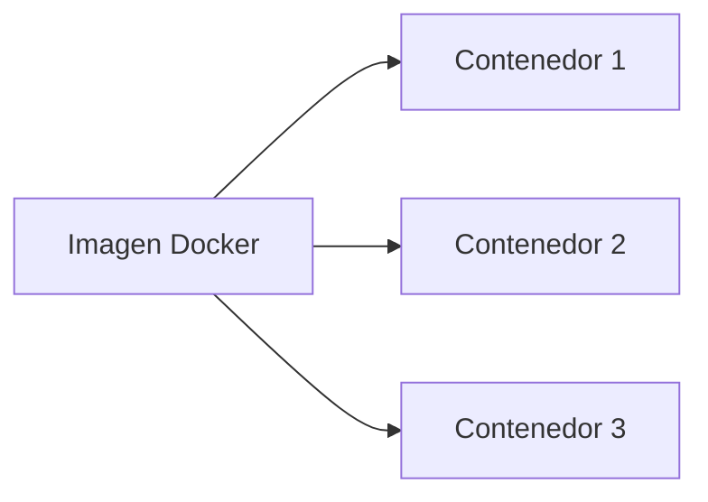
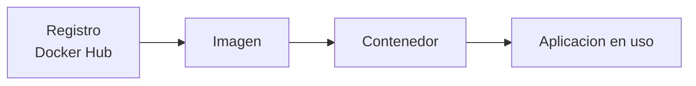
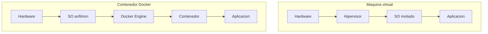
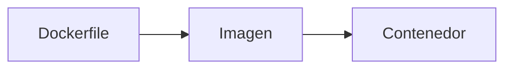

## 3.1. Docker

Docker es una tecnologia muy usada en administracion de sistemas, desarrollo de aplicaciones y despliegue de servicios. Su importancia no esta solo en los comandos, sino en la idea que hay detras: **empaquetar una aplicacion con todo lo necesario para ejecutarse siempre de forma parecida**.

### Introducción

Cuando una aplicacion funciona en un equipo, pero falla en otro, suele deberse a diferencias de versiones, librerias, configuraciones o servicios instalados. Docker intenta reducir ese problema usando **contenedores**.

> Docker es una plataforma para desarrollar, distribuir y ejecutar aplicaciones en contenedores.

Dicho de forma sencilla:

- **Docker** es la herramienta o plataforma.
- **La imagen** es la plantilla.
- **El contenedor** es la ejecucion real de esa plantilla.

En esta unidad tendremos presentes dos plataformas:

- **Linux**, donde Docker trabaja de forma muy natural porque los contenedores comparten el kernel Linux del sistema anfitrion.
- **Windows**, donde en la practica suele usarse **Docker Desktop** y, muy a menudo, **WSL 2** para trabajar con contenedores Linux de forma comoda.

### 1. Que es Docker

Docker es una plataforma que permite **crear, descargar, compartir y ejecutar contenedores**. Un contenedor es un entorno aislado que incluye una aplicacion y los archivos necesarios para que funcione.

La idea clave es esta:

- La aplicacion no depende tanto de lo que haya instalado en el sistema anfitrion.
- El entorno de ejecucion queda mas controlado.
- Es mas facil repetir el mismo comportamiento en desarrollo, pruebas y produccion.

#### 1.1. Una comparacion sencilla

Una forma util de entender Docker es pensar en una **fiambrera**:

- La aplicacion es la comida.
- Las librerias y dependencias son los cubiertos y complementos.
- El contenedor es la fiambrera cerrada.

Mientras la fiambrera este bien preparada, puedes llevarla a distintos sitios y el contenido seguira siendo el mismo.

#### 1.2. Por que se usa tanto

Docker se usa mucho porque ayuda a:

- Evitar diferencias entre equipos.
- Probar aplicaciones de forma rapida.
- Levantar servicios en pocos segundos.
- Separar componentes, por ejemplo web, base de datos y cache.
- Desplegar aplicaciones con mas orden y repetibilidad.

### 2. Que es un contenedor

Un contenedor es una **instancia en ejecucion** de una imagen. Se comporta como un proceso aislado que tiene sus propios archivos, su red y, en parte, su entorno.

#### 2.1. Idea fundamental

Un contenedor **no es una maquina completa**, sino un entorno aislado para ejecutar una aplicacion o servicio concreto.

Por ejemplo:

- Un contenedor puede ejecutar **Nginx**.
- Otro contenedor puede ejecutar **MySQL**.
- Otro contenedor puede ejecutar una **API en Python**.

Cada uno hace su tarea y puede comunicarse con los demas si lo configuramos.

#### 2.2. Caracteristicas de un contenedor

- Es ligero comparado con una maquina virtual.
- Se puede crear y eliminar con rapidez.
- Comparte el kernel del sistema anfitrion.
- Suele encargarse de una funcion concreta.

### 3. Que es una imagen

Una imagen es una **plantilla inmutable** que contiene lo necesario para crear contenedores.

Incluye, por ejemplo:

- El sistema base o parte de el.
- Archivos de la aplicacion.
- Librerias y dependencias.
- Configuracion inicial.

#### 3.1. Imagen y contenedor no son lo mismo

La diferencia mas importante de toda la unidad es esta:

- **Imagen**: plantilla preparada, pero sin ejecutar.
- **Contenedor**: imagen funcionando en ese momento.

Una misma imagen puede servir para lanzar varios contenedores.



#### 3.2. Ejemplo sencillo

Si descargas una imagen de `nginx`, esa imagen contiene lo necesario para arrancar un servidor web. Cuando ejecutas:

```bash
docker run -d -p 8080:80 nginx
```

no estas creando la aplicacion desde cero, sino **levantando un contenedor a partir de la imagen `nginx`**.

### 4. Docker, imagen, contenedor y registro

Estos cuatro conceptos suelen confundirse, asi que conviene separarlos muy bien:

| Concepto | Idea clave |
|---|---|
| Docker | Plataforma y herramientas para trabajar con contenedores |
| Imagen | Plantilla lista para crear contenedores |
| Contenedor | Instancia en ejecucion de una imagen |
| Registro | Lugar donde se almacenan y comparten imagenes |

#### 4.1. Que es un registro

Un **registro** es un servicio donde se guardan imagenes. El ejemplo mas conocido es **Docker Hub**.

Su funcion es parecida a la de un almacen:

- Alli se publican imagenes.
- Desde alli se descargan.
- Alli se pueden compartir con otros usuarios o equipos.

#### 4.2. Flujo normal de trabajo

El flujo mas habitual es este:

1. Buscar o crear una imagen.
2. Guardarla en un registro o descargarla desde uno.
3. Ejecutarla como contenedor.
4. Parar, borrar o volver a lanzar el contenedor cuando sea necesario.



### 5. Docker y maquinas virtuales

Docker y las maquinas virtuales no son exactamente lo mismo.

#### 5.1. Maquina virtual

Una maquina virtual simula un equipo completo:

- Tiene su propio sistema operativo.
- Tiene su propio kernel.
- Necesita mas recursos.

#### 5.2. Contenedor

Un contenedor:

- Comparte el kernel del sistema anfitrion.
- No necesita arrancar un sistema operativo completo.
- Suele iniciar mucho mas rapido.
- Consume menos recursos en muchos casos.

#### 5.3. Comparacion clara

| Aspecto | Maquina virtual | Contenedor Docker |
|---|---|---|
| Sistema operativo completo | Si | No |
| Kernel propio | Si | No |
| Peso y consumo | Mayor | Menor |
| Arranque | Mas lento | Mas rapido |
| Uso habitual | Aislamiento de sistemas completos | Aislamiento de aplicaciones |



### 6. Arquitectura basica de Docker

Docker no es solo el comando `docker`. Internamente intervienen varios elementos.

#### 6.1. Docker Engine

Docker Engine es el motor que crea y gestiona imagenes, contenedores, redes y volumenes.

#### 6.2. Docker CLI

Es la herramienta de linea de comandos que usamos al escribir instrucciones como:

```bash
docker ps
docker images
docker run hello-world
```

#### 6.3. Docker daemon

Es el servicio que realiza el trabajo real en segundo plano.

#### 6.4. Docker Desktop

En muchos equipos de escritorio se usa Docker Desktop, que ofrece interfaz grafica y herramientas adicionales para trabajar con Docker.

#### 6.5. Linux y Windows en Docker

Aunque los conceptos de imagen y contenedor son los mismos, el entorno de uso cambia segun la plataforma:

| Aspecto | Linux | Windows |
|---|---|---|
| Forma habitual de uso | Docker Engine y terminal | Docker Desktop y terminal |
| Integracion natural con contenedores Linux | Muy alta | Normalmente mediante WSL 2 |
| Terminal frecuente | Bash, Zsh | PowerShell, CMD o terminal WSL |
| Rutas de ejemplo | `/home/alumno/proyecto` | `C:\\Users\\Alumno\\proyecto` o rutas de WSL |

La idea clave es que **Docker funciona en ambas plataformas**, pero en Windows suele haber una capa adicional de integracion para ejecutar contenedores Linux de forma comoda.

### 7. Instalacion de Docker en Linux y Windows

No todos los equipos se preparan igual. Conviene distinguir:

#### 7.1. Instalacion en Linux

En Linux se suele instalar **Docker Engine** desde los repositorios oficiales del proyecto o desde los repositorios de la distribucion.

En distribuciones Debian o Ubuntu, el proceso habitual incluye:

1. Actualizar repositorios.
2. Instalar prerequisitos.
3. Añadir la clave del repositorio oficial de Docker.
4. Añadir el repositorio de Docker.
5. Instalar Docker Engine y sus complementos.

Ejemplo orientativo:

```bash
sudo apt-get update
sudo apt-get install ca-certificates curl gnupg
sudo apt-get install docker-ce docker-ce-cli containerd.io docker-buildx-plugin docker-compose-plugin
```

Despues es habitual añadir el usuario al grupo `docker` para no depender siempre de `sudo`.

#### 7.2. Instalacion en Windows

En Windows, la opcion mas comun es **Docker Desktop**.

De forma general:

1. Se instala Docker Desktop.
2. Se habilita la virtualizacion si el equipo la necesita.
3. Se configura el uso de **WSL 2** cuando se van a usar contenedores Linux.
4. Se comprueba desde PowerShell, CMD o una terminal WSL que Docker responde.

En Windows es importante entender esto:

- Docker Desktop ofrece la interfaz y el entorno de integracion.
- WSL 2 permite trabajar mejor con contenedores Linux.
- Muchos materiales de clase usan comandos identicos, pero cambian las rutas, el terminal y algunos detalles de permisos.

#### 7.3. Comprobacion inicial

Tanto en Linux como en Windows, una comprobacion basica es:

```bash
docker --version
docker info
```

Si estos comandos responden correctamente, Docker esta instalado y accesible.

### 8. Primer contacto: hello-world

Uno de los ejemplos clasicos para verificar Docker consiste en ejecutar la imagen `hello-world`.

```bash
docker run hello-world
```

Cuando se ejecuta este comando, Docker hace varias cosas:

1. Comprueba si la imagen existe en el equipo.
2. Si no existe, la descarga desde un registro.
3. Crea un contenedor a partir de la imagen.
4. Ejecuta el proceso definido por esa imagen.
5. Muestra el resultado y el contenedor termina.

Este ejemplo es muy util porque deja clara una idea esencial:

- La **imagen** es el recurso descargado.
- El **contenedor** es la ejecucion temporal de esa imagen.

### 9. Comandos basicos para empezar

Estos comandos ayudan a entender el flujo inicial:

| Comando | Funcion |
|---|---|
| `docker pull nginx` | Descarga una imagen |
| `docker images` | Muestra las imagenes locales |
| `docker run nginx` | Crea y arranca un contenedor |
| `docker ps` | Lista contenedores en ejecucion |
| `docker ps -a` | Lista todos los contenedores |
| `docker stop nombre` | Detiene un contenedor |
| `docker rm nombre` | Elimina un contenedor |

#### 9.1. Primer ejemplo real

```bash
docker pull nginx
docker run -d -p 8080:80 --name mi_nginx nginx
docker ps
```

Que ocurre aqui:

1. Se descarga la imagen `nginx`.
2. Se crea un contenedor llamado `mi_nginx`.
3. Se publica el puerto `80` del contenedor en el `8080` del equipo.
4. El servicio web queda accesible en `http://localhost:8080`.

#### 9.2. Ver contenedores e imagenes

Dos comandos basicos para orientarse son:

```bash
docker ps -a
docker images
```

El primero muestra contenedores y su estado. El segundo muestra las imagenes descargadas en el equipo.

#### 9.3. Contenedores interactivos

Algunos contenedores se usan de forma interactiva, es decir, entrando en una terminal dentro del propio contenedor.

Ejemplo:

```bash
docker run -it ubuntu bash
```

Que hace este comando:

- `-i` mantiene la entrada interactiva.
- `-t` crea una terminal.
- `ubuntu` es la imagen base.
- `bash` es el proceso que queremos arrancar.

Esto es util tanto en Linux como en Windows. La diferencia real suele estar en la terminal desde la que lo lanzas:

- En **Linux**, normalmente Bash o Zsh.
- En **Windows**, PowerShell, CMD o una terminal WSL.

#### 9.4. Contenedores en segundo plano

Muchos servicios no se ejecutan de forma interactiva, sino en segundo plano.

```bash
docker run -d --name web -p 8080:80 nginx
```

Aqui `-d` significa que el contenedor se queda funcionando como servicio.

Para comprobarlo:

```bash
docker ps
docker logs web
```

#### 9.5. Variables de entorno

Las variables de entorno permiten configurar contenedores sin modificar la imagen.

Ejemplo:

```bash
docker run -d --name mi_mysql \
  -e MYSQL_ROOT_PASSWORD=secreto \
  -e MYSQL_DATABASE=midb \
  mysql:8
```

La misma idea sirve en Linux y Windows, aunque en Windows puede cambiar la forma de escribir comandos largos segun el terminal utilizado.

Lo importante es comprender que:

- La imagen define que variables acepta.
- El contenedor usa esas variables al arrancar.
- Asi se personaliza el comportamiento sin reconstruir la imagen.

#### 9.6. Ciclo de vida de un contenedor

Un contenedor pasa por distintas fases:

1. **Crear**: `docker create`
2. **Iniciar**: `docker start`
3. **Ejecutar creando**: `docker run`
4. **Pausar**: `docker pause`
5. **Reanudar**: `docker unpause`
6. **Detener**: `docker stop`
7. **Eliminar**: `docker rm`

Entender este ciclo ayuda a no pensar que los contenedores son permanentes por defecto. En muchos casos se crean, se prueban, se detienen y se eliminan con rapidez.

### 10. Dockerfile

Hasta ahora hemos trabajado sobre todo con imagenes ya hechas, como `nginx`, `ubuntu` o `mysql`. Pero en muchos proyectos necesitamos **crear nuestra propia imagen**. Para eso se usa el archivo `Dockerfile`.

#### 10.1. Que es un Dockerfile

Un `Dockerfile` es un archivo de texto con instrucciones que indican como construir una imagen.

Permite definir:

- La imagen base.
- Los archivos que se copian al contenedor.
- Las dependencias que se instalan.
- El comando con el que arrancara la aplicacion.

#### 10.2. Ejemplo sencillo

```dockerfile
FROM nginx:latest
COPY ./web /usr/share/nginx/html
```

Este ejemplo indica:

1. Partir de la imagen `nginx`.
2. Copiar los archivos de una carpeta local al directorio web del contenedor.

Para construir la imagen:

```bash
docker build -t mi_web .
```

#### 10.3. Idea importante

Un `Dockerfile` **no es un contenedor** ni una imagen. Es la receta para construir la imagen.

El flujo correcto es:



### 11. Volumenes y persistencia

Uno de los errores mas comunes al empezar con Docker es pensar que todo lo que hay dentro de un contenedor permanece para siempre. No es asi. Si el contenedor se elimina, sus datos internos pueden perderse.

Para evitarlo se usan los **volumenes**.

#### 11.1. Que es un volumen

Un volumen es un mecanismo de Docker para guardar datos de forma persistente fuera del ciclo de vida normal del contenedor.

Esto es muy util en servicios como:

- Bases de datos
- Servidores web
- Aplicaciones que generan archivos
- Herramientas que guardan configuracion

#### 11.2. Ejemplo basico

```bash
docker volume create datos_mysql
docker run -d --name bd -v datos_mysql:/var/lib/mysql mysql:8
```

En este caso, aunque el contenedor se elimine, los datos almacenados en el volumen pueden mantenerse.

#### 11.3. Linux y Windows con volumenes

La idea del volumen es la misma en ambos sistemas, pero al montar carpetas del equipo anfitrion hay diferencias de rutas:

- En **Linux** es habitual usar rutas como `/home/alumno/proyecto`.
- En **Windows** es habitual usar rutas como `C:\\Users\\Alumno\\proyecto`.

Cuando se trabaja con Docker Desktop y WSL 2, conviene tener claro desde que entorno se lanza el comando, porque eso afecta a las rutas que se van a montar.

### 12. Redes en Docker

Los contenedores pueden comunicarse entre si y tambien con el exterior. Para ello Docker gestiona redes.

#### 12.1. Idea basica

Cada contenedor puede:

- Estar aislado.
- Publicar puertos hacia el equipo anfitrion.
- Compartir una red con otros contenedores.

Por eso es posible tener, por ejemplo:

- Un contenedor con una aplicacion web.
- Otro con una base de datos.
- Otro con un proxy.

#### 12.2. Publicacion de puertos

Cuando usamos algo como:

```bash
docker run -d -p 8080:80 nginx
```

estamos diciendo que el puerto `80` del contenedor se hace accesible desde el `8080` del equipo anfitrion.

#### 12.3. Redes entre contenedores

Docker puede crear redes para que varios contenedores se comuniquen por nombre.

```bash
docker network create mi_red
docker run -d --name web --network mi_red nginx
docker run -d --name bd --network mi_red mysql:8
```

Si estan en la misma red, un contenedor puede localizar al otro usando su nombre.

#### 12.4. Linux y Windows en red

Los conceptos de red son comunes, pero en **Windows con Docker Desktop** hay que recordar que parte del trafico pasa por la capa de integracion de Docker Desktop y su maquina virtual Linux ligera. Esto no cambia el concepto, pero ayuda a entender por que algunas configuraciones de red o firewall pueden comportarse de forma distinta respecto a Linux.

### 13. Docker Compose

Cuando una aplicacion necesita varios contenedores, escribir comandos `docker run` uno a uno puede resultar incomodo. Para eso existe **Docker Compose**.

#### 13.1. Que es Docker Compose

Docker Compose permite definir y arrancar aplicaciones multicontenedor mediante un archivo YAML, normalmente llamado `compose.yaml` o `docker-compose.yml`.

#### 13.2. Ejemplo sencillo

```yaml
services:
  web:
    image: nginx:latest
    ports:
      - "8080:80"

  bd:
    image: mysql:8
    environment:
      MYSQL_ROOT_PASSWORD: secreto
```

Con este archivo, los servicios se levantan con:

```bash
docker compose up -d
```

#### 13.3. Ventajas de Compose

- Reune la configuracion en un solo archivo.
- Facilita trabajar con varios servicios a la vez.
- Hace mas reproducible el entorno.
- Resulta muy util en desarrollo y pruebas.

#### 13.4. Linux y Windows con Compose

El uso conceptual es igual en ambos sistemas. Lo que suele cambiar es:

- La terminal desde la que se ejecuta.
- Las rutas montadas en volumenes.
- Algunas diferencias del sistema de archivos anfitrion.

En ambos casos, el comando moderno es:

```bash
docker compose up -d
```

### 14. Ideas clave para no confundirse

- Docker **no es** el contenedor.
- Una imagen **no se ejecuta sola**.
- Un contenedor **nace de una imagen**.
- Un registro **guarda imagenes**, no contenedores en ejecucion.
- Docker **no sustituye siempre** a las maquinas virtuales, pero resuelve muy bien el despliegue de aplicaciones.
- En **Linux** y **Windows** los conceptos son los mismos, aunque cambien la instalacion, el terminal y algunas rutas.
- Un `Dockerfile` sirve para **construir imagenes**.
- Los **volumenes** permiten guardar datos persistentes.
- Las **redes** permiten comunicar contenedores.
- `docker compose` ayuda a gestionar varios servicios a la vez.

### 15. Conclusion

Si tuviera que resumirse Docker en una sola idea, seria esta:

> Docker permite empaquetar una aplicacion con lo necesario para ejecutarla de manera consistente en distintos equipos.

Comprender esta idea es mas importante que memorizar comandos. Cuando queda claro que una **imagen es la plantilla** y que un **contenedor es la ejecucion de esa plantilla**, el resto de conceptos encajan con mucha mas facilidad.

Ademas, al trabajar con Docker conviene recordar siempre en que plataforma estamos:

- En **Linux**, Docker suele integrarse de forma mas directa con el sistema.
- En **Windows**, Docker Desktop y WSL 2 suelen ser piezas importantes del entorno de trabajo.

Pero en ambos casos el concepto esencial no cambia: **Docker ayuda a ejecutar aplicaciones de forma consistente usando contenedores**.

### Fuentes consultadas

- [Docker Docs. What is Docker?](https://docs.docker.com/engine/docker-overview/)
- [Docker Docs. What is a container?](https://docs.docker.com/get-started/docker-concepts/the-basics/what-is-a-container/)
- [Docker Docs. What is an image?](https://docs.docker.com/get-started/docker-concepts/the-basics/what-is-an-image/)
- [Docker Docs. What is a registry?](https://docs.docker.com/get-started/docker-concepts/the-basics/what-is-a-registry/)
- [Docker Docs. Docker Engine](https://docs.docker.com/engine/)
- [Docker Docs. Dockerfile overview](https://docs.docker.com/build/concepts/dockerfile/)
- [Docker Docs. Volumes](https://docs.docker.com/engine/storage/volumes/)
- [Docker Docs. Networking](https://docs.docker.com/desktop/features/networking/)
- [Docker Docs. Docker Compose](https://docs.docker.com/compose/)
- [R Z O. UD 2 - 2.1 Introducción a los contenedores Docker](https://revilofe.github.io/section4/u02/teoria/DAW-U2.1.-IntroduccionDocker/)

**Fecha de actualización:** 07/04/2026
