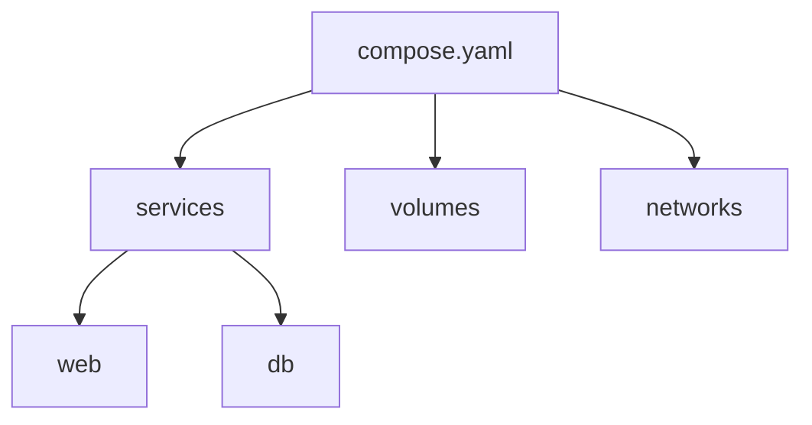
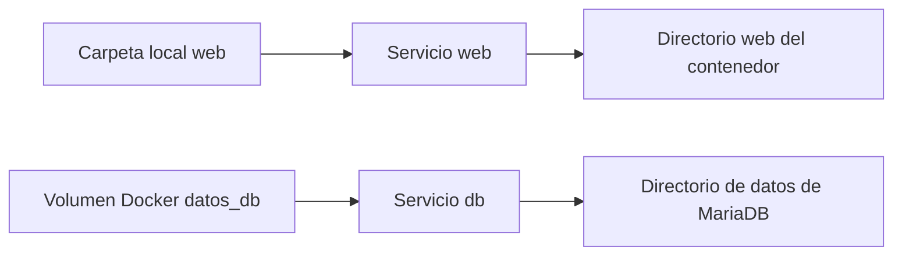
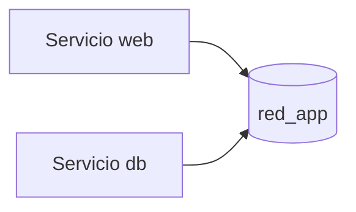
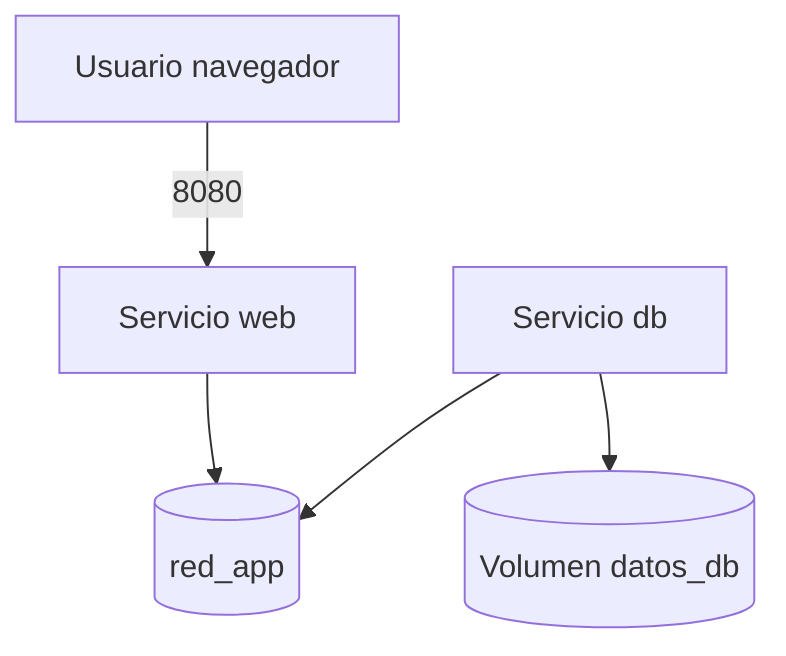

<div class="u03-destacados" markdown="1">

## 3.2. Docker Compose

Cuando una aplicacion necesita varios contenedores, trabajar solo con comandos `docker run` puede resultar poco comodo y dificil de mantener. Docker Compose resuelve este problema permitiendo definir el entorno completo en un solo archivo.

### Introducción

Docker Compose se usa para describir aplicaciones multicontenedor mediante un fichero YAML, normalmente llamado `compose.yaml`.

La idea clave es esta:

- Con `docker run` describes un contenedor cada vez.
- Con `docker compose` describes una aplicacion completa.

Esto permite guardar en un archivo:

- Los servicios
- Los puertos
- Los volumenes
- Las variables de entorno
- Las redes
- Las dependencias entre contenedores

### 1. Que es Docker Compose

Docker Compose es una herramienta que permite **definir y arrancar varios servicios Docker con una sola configuracion**.

Su ventaja principal es la **reproducibilidad**: el entorno queda escrito en un fichero y no depende de recordar un conjunto largo de comandos.

#### 1.1. Idea practica

Sin Compose, una aplicacion web con base de datos puede requerir:

- Un comando para el servidor web
- Otro comando para la base de datos
- Otro para la red
- Otro para los volumenes

Con Compose, todo esto se concentra en un `compose.yaml`.

#### 1.2. Comando principal

El comando mas habitual es:

```bash
docker compose up -d
```

Y para desmontar el entorno:

```bash
docker compose down
```

### 2. Estructura general de un fichero compose.yaml

Un ejemplo sencillo seria este:

```yaml
services:
  web:
    image: nginx:latest
    ports:
      - "8080:80"

  db:
    image: mariadb:11
    environment:
      MARIADB_ROOT_PASSWORD: secreto

volumes:
  datos_db:

networks:
  red_app:
```

Las secciones mas frecuentes son:

- `services`
- `volumes`
- `networks`



#### 2.1. Como leer el fichero de arriba abajo

Una forma practica de leer un `compose.yaml` es esta:

1. Primero mirar **que servicios existen**
2. Despues revisar **que puertos publica cada servicio**
3. Luego comprobar **si monta carpetas o volumenes**
4. Finalmente revisar **redes, variables de entorno y dependencias**

Si el alumnado sigue siempre este orden, el fichero resulta mucho mas facil de entender.

### 3. Seccion services

La seccion `services` es la mas importante del fichero. Define los contenedores que forman la aplicacion.

Cada servicio representa un contenedor o, de forma mas precisa, la configuracion con la que ese contenedor sera creado.

```yaml
services:
  web:
    image: nginx:latest

  db:
    image: mariadb:11
```

#### 3.1. Nombre del servicio

El nombre del servicio, como `web` o `db`, es importante porque:

- Identifica el servicio dentro del archivo
- Sirve como nombre de red interno entre contenedores

Por ejemplo, si un servicio PHP necesita conectarse a MariaDB, normalmente usara `db` como host si el servicio se llama asi.

### 4. Claves principales dentro de un servicio

Dentro de cada servicio pueden aparecer muchas claves. Estas son las mas importantes para empezar.

Antes de verlas una por una, conviene quedarse con esta idea:

- Algunas claves indican **que imagen usar**
- Otras indican **como se ejecuta el contenedor**
- Otras indican **como se conecta con el exterior o con otros servicios**
- Y otras indican **donde guarda los datos**

#### 4.1. image

Indica la imagen que se va a utilizar.

```yaml
image: nginx:latest
```

Se usa cuando no necesitas construir una imagen propia y te basta una imagen ya publicada.

#### 4.2. build

Sirve para construir la imagen a partir de un `Dockerfile`.

```yaml
build: .
```

O de forma mas detallada:

```yaml
build:
  context: .
  dockerfile: Dockerfile
```

Se usa cuando el proyecto necesita una imagen personalizada.

#### 4.3. container_name

Permite dar un nombre concreto al contenedor.

```yaml
container_name: mi_web
```

Es util para identificarlo mejor, aunque en muchos casos Compose puede generar nombres automaticamente.

#### 4.4. ports

Publica puertos del contenedor hacia el equipo anfitrion.

```yaml
ports:
  - "8080:80"
```

Aqui:

- `8080` es el puerto del equipo anfitrion
- `80` es el puerto del contenedor

#### 4.5. volumes

Monta carpetas o volumenes persistentes.

Ejemplo con carpeta local:

```yaml
volumes:
  - ./web:/var/www/html
```

Ejemplo con volumen gestionado por Docker:

```yaml
volumes:
  - datos_db:/var/lib/mysql
```

#### 4.6. environment

Define variables de entorno.

```yaml
environment:
  MARIADB_ROOT_PASSWORD: secreto
  MARIADB_DATABASE: ejemplo
```

Estas variables permiten configurar el contenedor en el arranque.

#### 4.7. depends_on

Indica dependencias entre servicios.

```yaml
depends_on:
  - db
```

Esto expresa que el servicio actual depende de `db`. Ayuda a ordenar el arranque, aunque no garantiza por si mismo que la aplicacion dependiente ya este completamente lista.

#### 4.8. restart

Permite indicar una politica de reinicio.

```yaml
restart: unless-stopped
```

Muy util cuando queremos que el contenedor se reinicie automaticamente si se detiene por error.

#### 4.9. command

Sobrescribe el comando por defecto del contenedor.

```yaml
command: python app.py
```

#### 4.10. working_dir

Define el directorio de trabajo dentro del contenedor.

```yaml
working_dir: /app
```

#### 4.11. stdin_open y tty

Se usan cuando hace falta un comportamiento mas interactivo.

```yaml
stdin_open: true
tty: true
```

### 5. Resumen rapido de claves habituales

La siguiente tabla sirve como chuleta inicial para saber **que clave usar segun lo que se quiere conseguir**:

| Si quieres... | Clave habitual |
|---|---|
| Usar una imagen ya existente | `image` |
| Construir una imagen propia | `build` |
| Dar nombre al contenedor | `container_name` |
| Publicar un puerto | `ports` |
| Montar una carpeta o volumen | `volumes` |
| Pasar configuracion al contenedor | `environment` |
| Indicar que depende de otro servicio | `depends_on` |
| Reiniciar automaticamente | `restart` |
| Cambiar el comando por defecto | `command` |
| Elegir directorio de trabajo | `working_dir` |
| Hacer el contenedor mas interactivo | `stdin_open`, `tty` |

### 6. Primer ejemplo progresivo

Antes de ver un entorno completo con web y base de datos, conviene empezar por un caso minimo.

#### 6.1. Un solo servicio

```yaml
services:
  web:
    image: nginx:latest
    ports:
      - "8080:80"
```

Este archivo ya describe una aplicacion muy simple:

- Un solo servicio llamado `web`
- Una imagen `nginx`
- Un puerto publicado para acceder desde el navegador

Para ponerlo en marcha:

```bash
docker compose up -d
```

#### 6.2. Que aprender de este ejemplo

Con este caso minimo ya pueden entenderse tres ideas muy importantes:

1. Un archivo Compose puede arrancar una aplicacion con muy poca configuracion.
2. La seccion `services` es el centro del fichero.
3. El servicio queda definido por sus claves internas.

### 7. Volumenes en Compose

La seccion superior `volumes` sirve para declarar volumenes gestionados por Docker.

```yaml
volumes:
  datos_db:
```

Luego se usan dentro del servicio:

```yaml
services:
  db:
    image: mariadb:11
    volumes:
      - datos_db:/var/lib/mysql
```

#### 7.1. Carpeta local o volumen Docker

Conviene distinguir:

- **Carpeta local**: buena para desarrollo y edicion directa de archivos
- **Volumen Docker**: muy util para datos persistentes de servicios como bases de datos



#### 7.2. Regla practica

Como orientacion para clase:

- Si quieres **editar archivos del proyecto**, suele interesar montar una carpeta local.
- Si quieres **guardar datos internos de un servicio**, suele interesar un volumen Docker.

### 8. Redes en Compose

Compose puede crear redes automaticamente, pero tambien permite definirlas de forma explicita.

```yaml
networks:
  red_app:
```

Y luego asociarlas a los servicios:

```yaml
services:
  web:
    networks:
      - red_app

  db:
    networks:
      - red_app
```

Si dos servicios comparten red, pueden comunicarse entre si usando sus nombres.



#### 8.1. Error muy frecuente

Uno de los errores mas habituales al empezar es intentar que un contenedor se conecte a otro usando `localhost`.

En Compose, si dos servicios estan en la misma red, normalmente se usa el **nombre del servicio**:

- `db`
- `web`
- `phpmyadmin`

### 9. Ejemplo completo comentado

```yaml
services:
  web:
    image: php:8.2-apache
    container_name: app_web
    ports:
      - "8080:80"
    volumes:
      - ./web:/var/www/html
    depends_on:
      - db
    networks:
      - red_app

  db:
    image: mariadb:11
    container_name: app_db
    environment:
      MARIADB_ROOT_PASSWORD: secreto
      MARIADB_DATABASE: ejemplo
      MARIADB_USER: alumno
      MARIADB_PASSWORD: alumno123
    volumes:
      - datos_db:/var/lib/mysql
    networks:
      - red_app

volumes:
  datos_db:

networks:
  red_app:
```

Este fichero define:

1. Un servicio web con Apache y PHP
2. Un servicio de base de datos MariaDB
3. Un volumen persistente para la base de datos
4. Una red compartida para que ambos servicios se comuniquen

#### 9.1. Como estudiarlo sin perderse

Para entender un fichero como este, conviene dividirlo en capas:

1. **Servicios**: que contenedores existen
2. **Puertos**: que se expone al exterior
3. **Volumenes**: que datos se guardan
4. **Redes**: como se comunican entre si



### 10. Comandos mas usados con Compose

| Comando | Funcion |
|---|---|
| `docker compose up -d` | Levanta los servicios en segundo plano |
| `docker compose ps` | Muestra el estado de los servicios |
| `docker compose logs` | Muestra logs |
| `docker compose stop` | Detiene servicios |
| `docker compose start` | Inicia servicios ya creados |
| `docker compose down` | Detiene y elimina contenedores y red |
| `docker compose down -v` | Elimina tambien los volumenes |
| `docker compose exec web bash` | Entra en un servicio en ejecucion |

### 11. Linux y Windows con Compose

El concepto de Compose es el mismo en ambos sistemas, pero hay diferencias practicas.

#### 11.1. Rutas

- En **Linux** se usan rutas como `/home/alumno/proyecto`
- En **Windows** se usan rutas como `C:\\Users\\Alumno\\proyecto`

Cuando el montaje se hace con rutas relativas, como `./web:/var/www/html`, Compose suele resultar mas comodo y portable.

#### 11.2. Terminal

- En **Linux** lo normal es usar Bash o Zsh
- En **Windows** se puede usar PowerShell, CMD o terminal WSL

#### 11.3. WSL 2

En Windows, si se trabaja con contenedores Linux, es muy frecuente que Docker Desktop use **WSL 2** como base de integracion.

### 12. Errores frecuentes al escribir compose.yaml

Los errores mas comunes son:

- Confundir espacios y tabuladores en YAML
- Escribir mal la indentacion
- Publicar mal los puertos
- Montar una ruta local incorrecta
- Usar `localhost` entre contenedores en lugar del nombre del servicio
- Olvidar crear o declarar volumenes y redes cuando son necesarios

### 13. Buenas practicas iniciales

- Usar nombres de servicio claros
- Preferir rutas relativas en proyectos de clase
- Separar los servicios por funcion
- Guardar datos importantes en volumenes
- No meter contraseñas reales en ejemplos compartidos
- Comprobar siempre el estado con `docker compose ps` y `docker compose logs`

### 14. Conclusión

Docker Compose es una pieza clave cuando Docker deja de usarse con un solo contenedor y pasa a describir una aplicacion completa.

Si el alumnado entiende bien estas ideas:

- que `services` define los contenedores
- que `volumes` sirve para persistencia
- que `networks` permite comunicacion
- y que claves como `image`, `build`, `ports`, `environment` o `depends_on` controlan el comportamiento del servicio

entonces ya tiene una base muy solida para configurar entornos reales con Docker.

La idea final que debe quedar clara es esta:

> Un fichero `compose.yaml` describe como se levanta una aplicacion completa formada por uno o varios contenedores.

Si el alumnado sabe leer un Compose por servicios, puertos, volumenes y redes, ya puede interpretar muchos entornos reales sin necesidad de memorizar todas las claves de golpe.

### Fuentes consultadas

- [Docker Docs. Docker Compose](https://docs.docker.com/compose/)
- [Docker Docs. Compose file reference](https://docs.docker.com/reference/compose-file/)
- [Docker Docs. Define and run multi-container applications](https://docs.docker.com/compose/intro/features-uses/)

**Fecha de actualización:** 09/04/2026

</div>
